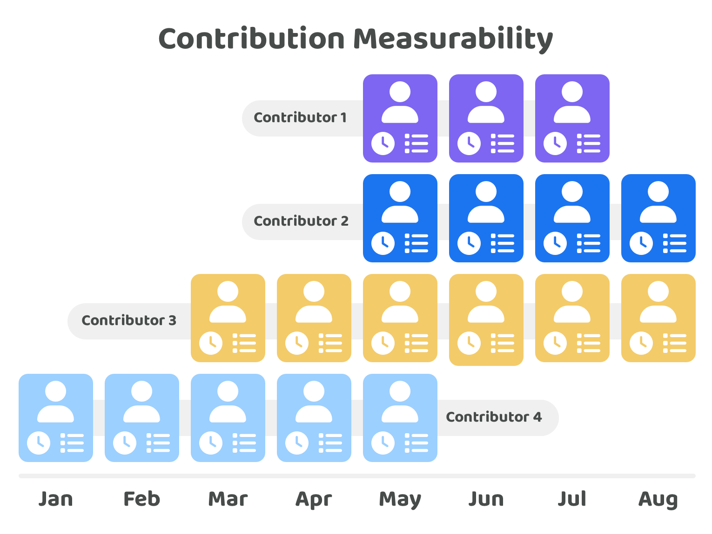

# Importance of contribution measurability

Making contribution efforts measurable means that any contribution outputs can be more easily quantified and compared with other peoples execution outputs.

<figure><figcaption></figcaption></figure>

Increasing the measurability of contribution logs provides a range of advantages:

* **Easier contribution verification** - If the scope and time period involved in a contribution log are kept the same the ease of verification is reduced. This is achieved as moderators can now easily compare the differences between contribution logs made by people who are performing similar roles. The easier it is to compare the contribution efforts made across an ecosystem the easier it becomes to identify where the best and worst performers are. A larger amount of effort is required to understand and assess whether an individual or team's contribution outputs are acceptable if they are not able to easily compare those outputs with other examples. The main outcome an ecosystem is trying to achieve with these contribution verification checks is to identify the bad actors if they exist. The community can then ensure those base actors don’t receive future funding or even halt their existing funding. Secondary to this it is also important to identify poor performers so that support can be provided to rectify any issues where possible.
* **Insightful historical comparisons** - Making contribution logs easy to measure and compare means that historical comparisons become even more useful for an ecosystem. Now an ecosystem can look at how the performance of contributors changes over time as different factors change such as the amount of compensation provided, the total number of contributors in the ecosystem or the length of contribution history. Making this easy to measure and compare makes it far easier for an ecosystem to identify the trends that are most correlated with improving contributor performance. As one example, if a new incentive was introduced to improve the performance of contributors, having a way to measure the change in output over time due to that incentive will produce insightful data in determining whether that new incentive was actually effective or not.
* **Improved decision making** - Measurable contribution output logs will make it easier for voters to spot the best and worst performers amongst a group of contributors. The easier and more reliable these comparisons are, the easier it becomes to surface this information to voters to make more informed decisions on who should be selected in future disbursement decisions.
* **Higher self awareness & accountability** - If contributors can easily see their own performance against others contributors they become aware and accountable for trying to achieve a similar level of contribution output as the other contributors in the ecosystem.
* **Performance incentives** - Making it easy to measure and compare the contribution outputs made by different individuals and teams will make it much easier for performance based incentives to be introduced to help with more reliably rewarding high performing contributors.
