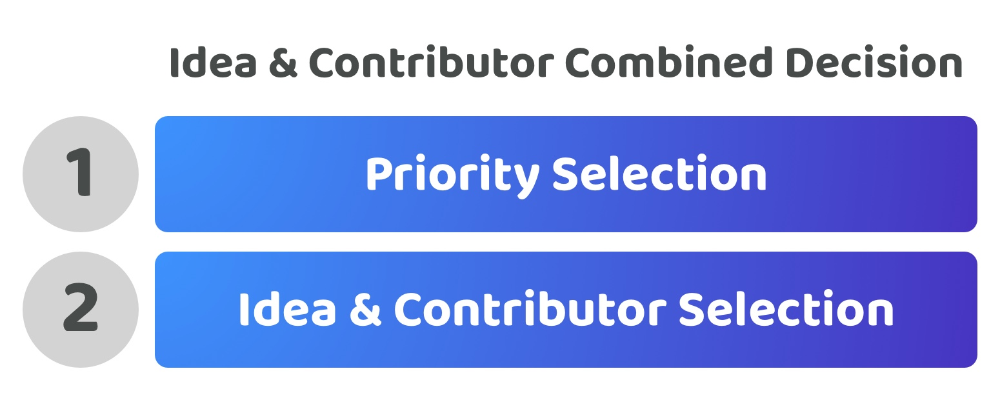

# Idea & contributor combined decision

**Overview**

An idea and contributor combined decision means that selection of ideas and contributors are combined into the same decision. Contributors would submit an idea along with who is contributing to that idea at the same time, voters would then decide between these ideas. The priority selection process would happen separately.

<figure><figcaption></figcaption></figure>

**High voter participation time required (Score - 2)**

Voters are able to participate in the priority selection decision and ideas and contribution selection decision separately. This means they could decide to participate in just one of those votes instead of both. This reduces the amount of context and information required to participate in the disbursement process as they can decide where and how they participate. Some voters may only want to participate in voting on the priority setting process which would mean they don’t need to review all of the ideas and contributor combined proposals.

**High voter decision complexity (Score - 2)**

The number of potential ideas can often have the largest variety of options for voters to choose from. When combining this with the contributor selection the voter complexity is increased as voters now must both understand and compare the tradeoffs with each combination of ideas and contributors with all of the others. This is instead of the more simple separate decision of which ideas are the most promising and then separately which contributors are the most suited.

**Moderate voter expressiveness (Score - 3)**

Voters would be able to select the exact priorities that they believe are the most important for the ecosystem. Voters would need to pick from the idea and contributor combinations presented to them meaning they would not be able to easily influence which ideas and contributors are selected individually. As the number of ideas and contributors would represent the larger part of the decision complexity this can limit the flexibility and options available to voters. Community members who wanted to contribute ideas but not execute them, and contributors who wanted to execute ideas but didn’t have an existing idea, would both currently have a higher difficulty in participating with this approach. This complexity could then result in further limiting the voters choices as some of these potential ideas and contributors might not get submitted for consideration.

**Very high disbursement outcome influence (Score - 5, Multiply by importance of 4/5 or 0.8, Final Score - 4)**

The voter's decision will influence exactly what priorities are preferred and exactly how contribution efforts are being directed through the selection of proposals that define the idea and contributors involved.

**Moderate voter decision change complexity (Score - 3)**

Voters can reuse the same system and process to vote on any of the priorities set and then vote again in the future to change those priorities using the same process. For updating which are the most promising ideas or contributors an ecosystem could reuse the same process and just update the idea or contributors as needed but this then adds bloat to the process due to the repeated information. Alternatively the ecosystem could introduce independent processes for updating the ideas or contributors however this then adds in more complexity by increasing the total amount of processes being used in the ecosystem to manage potential future changes.

**Total score = 14 / 24**
