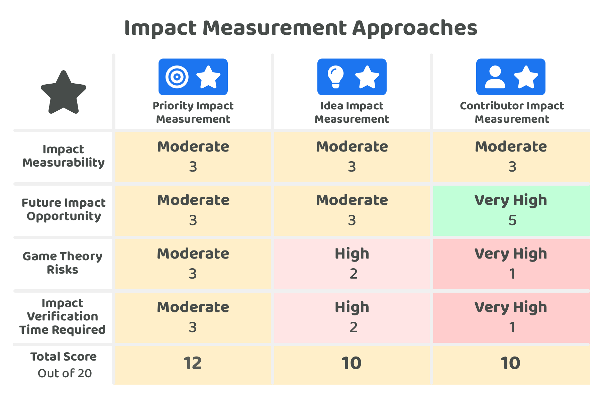

# Impact measurement approaches

<figure><figcaption></figcaption></figure>

A disbursement process should help with allocating funds to initiatives that can help to generate impact for the ecosystem. Ecosystems benefit from being able to reliably identify and understand which initiatives are helping to generate the most impact. The better an ecosystem can achieve this the more they can then apply this information during disbursement to make better decisions about where to allocate future funding.

Many parts of the disbursement process could be measured to determine what impact has been generated. Priorities that get addressed, ideas that are executed and contributors who make execution efforts to support the ecosystem can all be relevant areas that could be measured to determine how impact was generated due to the disbursement process.

This impact measurement approach comparison is not suggesting the adoption of one approach over another. Instead this comparison helps to identify some of the complexities involved in impact measurement across these different areas. All of these measurement approaches can be an important part of an ecosystems strategy to better understand how they can consistently generate for their ecosystem through disbursement.

There are many different ecosystem areas and contributor areas that could be tracked to help with understanding and measuring what impact is being generated. For ecosystem areas and contributor areas there are a number of quantitative and qualitative examples that can be considered:


[ecosystem-areas-for-impact-measurement.md](ecosystem-areas-for-impact-measurement.md)



[contributors-areas-for-impact-measurement.md](contributors-areas-for-impact-measurement.md)


## Approaches for measuring impact

There are three main approaches that have been compared to consider how impact could be measured in the disbursement process:

* [Priority impact measurement](priority-impact-measurement.md) - Addressed priorities can be measured to determine which priorities helped to generate the most impact for the ecosystem.
* [Idea impact measurement](idea-impact-measurement.md) - Executed ideas can be measured to determine how much that idea helped to address any existing priorities and also how it helped to generate any other forms of impact for the ecosystem.
* [Contributor impact measurement](contributor-impact-measurement.md) - Contributors efforts can be measured to determine how much impact they have generated for executing ideas and making any other forms of impact for the ecosystem.

To compare these impact measurement approaches a number of [factors have been considered](impact-measuring-factors-for-consideration.md) and then applied to each approach to better understand the similarities and differences between each approach.

<figure><figcaption></figcaption></figure>

**Key takeaways**

* **Importance & complexity of all approaches** - All of these approaches have measurability complexities, game theory risks and a moderate to high amount of verification time required. Ecosystems can benefit from improving how they measure all of these different areas that are relevant to the ecosystem and its contributors. Increasing the accuracy of impact measurement means creating more insights for the community to consider that can help with improving future prioritisation and funding allocation decisions.
* **Large opportunity to get contributor impact measurement right** - The problem for priorities and ideas in terms of impact measurement is that the priorities and ideas will change over time and new ones will need to be introduced. A disbursement process wouldn’t want to repeatedly fund the exact same priorities and ideas once they have already been addressed and executed. Priorities and ideas should naturally change and evolve over time. Due to this factor, knowing which priorities and ideas have made the most impact does not mean that future disbursement decisions will necessarily be any easier. There might be correlations in allocating future funds to similar ideas and priorities however this will not always create impactful outcomes. Contributor impact measurement does not have this problem. The selected contributors who get compensated by the treasury can continue to support the ecosystem for a long period of time. This means if ecosystems are able to effectively identify which contributors are more consistently making impact for the ecosystem those same contributor can be repeatedly selected by the community to receive future funding. Another opportunity with improving how a contributors impact is measured is that it would mean an ecosystem can more reliably increase the amount of incentives they receive. The increase or decrease in compensation people receive could potentially even be automatically changed over time as their performance and impact gets measured. Increasing the compensation being paid to the most impactful contributors can help with aligning the incentives by increasingly rewarding contributors that are able to make larger amounts of impact.
* **Impact measurement is one of the most complex areas for disbursement** - Measuring impact can be complex and nuanced. Numerous new tools and processes will be needed to help with reducing these complexities involved with impact measurement. There are currently very limited resources and tools that help with accurate impact measurement. A disbursement process that has the right tools and processes for measuring impact should be able to more accurately and reliably identify which initiatives are generating the most impact. Making this knowledge readily available will help save voters time by helping them more quickly become more well informed about what initiatives and contributors could be the most suitable for generating impact in future disbursement decisions. The more effectively a disbursement process is able to measure the impact it generates the more predictable and accurate the compensation can become for rewarding contributors that helped to generate those outcomes.

**Impact measurement approaches analysis**


[impact-measuring-factors-for-consideration.md](impact-measuring-factors-for-consideration.md)



[priority-impact-measurement.md](priority-impact-measurement.md)



[idea-impact-measurement.md](idea-impact-measurement.md)



[contributor-impact-measurement.md](contributor-impact-measurement.md)

