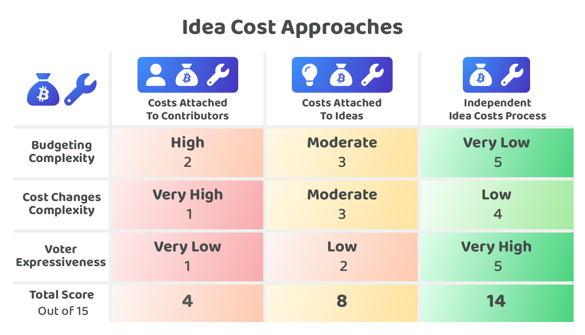

# Idea cost approaches

<figure><figcaption></figcaption></figure>

There are a number of idea related costs that can require funding from the disbursement process. These costs could be handled in a number of different ways.

Some example idea related costs include:

* Hardware
* Production costs
* Real estate
* Rent or lease payments
* Software subscriptions
* Backup & data storage
* Office supplies
* Insurance
* Security services
* Education & training

## Approaches for handling idea costs

The idea cost approaches for comparison include:

* [Costs attached to contributors](costs-attached-to-contributors.md) - The idea related costs are attached to the contributor proposals which request compensation.
* [Costs attached to ideas](costs-attached-to-ideas.md) - The idea related costs are attached to idea proposals where all costs are budgeted costs are covered in a single submission.
* [Independent idea costs process](independent-idea-costs-process.md) - The idea related costs are handled in an independent approval process. This process could occur in parallel to idea and contributor decisions.

To compare these idea cost approaches a number of [factors have been considered](idea-cost-factors-for-consideration.md) and then applied to each approach to try and determine the strengths and weaknesses of each one.

<figure><figcaption></figcaption></figure>

**Key takeaways**

* **Attaching costs to contributors is often unsuitable** - Many of the idea related costs could be integrated into the costs included in a contributor proposals budget such as for some hardware, rent or lease payments, software subscriptions, backup & data storage, office supplies, insurance, utilities, security services and education & training. However this approach could be more problematic when there are larger ideas with group related costs such as around production, real estate, certain software subscriptions and security services. These situations would likely need the costs to be handled and approved separately. To adopt an approach of attaching certain costs to contributor proposals a disbursement process could introduce a policy to prevent the other larger type of costs from being an option if these type of costs were not a need for the ecosystem.
* **Every incentive approach can benefit from an independent idea costs process** - An ecosystem can benefit from an independent idea costs process even when the incentives are attached at the point of idea selection. Using a separate process helps to reduce complexities around cost changes and budget planning whilst also giving the voters more expressiveness in how they can indicate their exact preferences. This is ideal for situations where a group of voters agree with the importance of an idea but disagree with one of the idea related costs that has been suggested. Using an independent process enables voters to quickly indicate their preferences and can help with speeding up the process of encouraging further information when it is needed to better justify certain idea costs that have been suggested.

## Considerations for **adopting an independent idea costs process**

**Increasing speed of idea submissions and feedback**

A separate process for approving idea related costs can help with making it easier to submit and receive feedback for ideas in an ecosystem. An idea could still have its different costs planned out at the beginning but the difference is the actual request for that cost could be delayed. This is useful for situations where it is difficult to achieve an accurate cost at that time or when the idea cost does not need to be paid for in the short term. Removing this complexity can increase the rate in which feedback is given to new ideas as they can more easily be suggested and approved by a community without being fully formed.

**Handles changing costs**

Costs can increase or decrease during different points of an ideas execution. New costs can emerge that were not previously needed due to a change of execution outcome, other costs could potentially be removed due to a change in how the idea is actually being executed. An independent idea cost approval process would enable requests for funding these changes in idea costs at the point that the change occurs. Any evidence required to justify that change would be added to that request. Without a separate process the existing ideas would need to make another idea based proposal using the same process they used to get community support for their original idea to receive any future funding.

**Flexible request timing**

Idea related costs could still be requested immediately at the point of an ideas initial submission with a separate approval process. This can be preferred when contributors are accurately able to calculate and present the costs ahead of time. Alternatively if the idea requires some initial execution efforts before the contributors will know the accurate costs the contributors involved in the execution would benefit from being able to request those costs at that point in which they become more well informed. The contributors could still provide estimates about the costs upfront however the actual commitment to the request only happens at the point of the costs are more accurately known. This flexibility allows for ideas to be planned as much as they can be when they get suggested but then still enables them to evolve and be further planned over time as further experience and the right information becomes available during the execution of an idea.

## Other factors to consider

**Incentive approach considerations**

Attaching idea costs to a single idea suggestion doesn’t change the fact that the costs involved for an idea could change over time or have new costs that emerge. Due to this, any incentive approach can benefit from having an independent cost process so that proposers are able to update these requests and make new ones as their idea evolves over time. If there was no separate process for approving idea related costs the proposer would need to submit a new proposal with the similar information as before to then be considered before receiving funding. If the proposer was allowed to change an idea proposal and idea costs in any way that change the compensation being disbursed it would still require voter approval, if it didn’t then this ability to change what funding a proposer receives could easily be exploited. An ecosystem could prefer to take a rigid approach to cost planning and decide to not support any changing circumstances. However this could easily lead to more conflicts and friction due to under or over estimations of costs. Preventing any changes could mean that projects fail or stagnate during their execution due to a lack of ability to respond to changing factors and environments that were outside of their control.

**Budgeting approach considerations**

Treasuries have a finite amount of assets to disburse. When disbursing these assets an ecosystem may want to limit the amount of assets that get used for idea related costs against what gets used for contribution efforts. For instance, it could be detrimental to have many ideas get approved that have large idea related costs attached to them if that meant that there was little funding left to pay for contribution efforts that help with executing those ideas. If a disbursement process had a fixed release of funds per round or for a period of time they could decide to add a cap to the amount of available budget that is used for idea related costs. This would be easier to track with an independent idea costs process as all costs going through that process would be tagged as idea related costs and the other incentives would be tagged as contribution effort incentives. A percentage split approach between idea costs and contributor costs could be adopted. Budget caps could also work for preventing idea costs from exceeding specific values as a way to safeguard the disbursement process. Budget caps could be useful in earlier stages of development for treasuries whilst they are still testing and experimenting with numerous disbursement approaches. Percentage split or budget cap based approaches could be restrictive for some ideas so these approaches may not be suitable for some ecosystems.

**Contributor fraud and corruption considerations**

Risks around contributor fraud and corruption are important and require consideration regardless of how idea costs are handled. Contributors involved in the execution of ideas could become corrupted or malicious during execution. If those contributors start requesting for idea costs to execute their idea this could be done so in bad faith where their real intention is to take the funds for themselves. One approach that could be adopted to help prevent this, especially for larger payments, is to adopt an escrow contract that has a number of verification and moderation steps to help to slow down and check the disbursement of larger cost requests. These checks could help with identifying the received address and owner, verifying their ownership or control of the address, the value of any assets involved and exactly how any assets involved are being moved or changed in terms of ownership.
