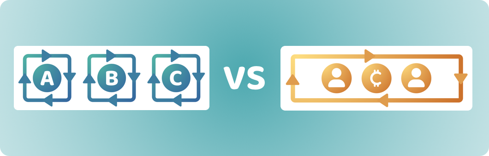

# Token funding vs network funding

<figure><figcaption></figcaption></figure>

Ecosystem contributors need a sustainable way to fund the contribution efforts involved in executing impactful ideas. Two approaches that are worth comparing is token based funding, where projects raise investment from minting a project token and network funding, where a networks treasury can fund contributors directly to work on different ecosystem initiatives.

Token based funding has been a popular way for projects to raise funding to pay for execution efforts across different Web3 ecosystems. In comparison, network funding exists in many ecosystems, however it commonly does not fund contributors directly. The suggested approach of funding contributors directly has emerged after analysing the different ways a networks treasury could operate a funding process. Open source contributor funding emerged as the most promising approach for compensating people that execute different initiatives in a Web3 network. This analysis will assume that the network funding process is adopting a contributor funding approach.

**Circular economies**

Both of these approaches can represent a circular economy. Network treasuries can generate income from network transaction fees or taxes and this can then help to fund initiatives that increase the amount of use cases and adoption. Tokens issued by projects can also introduce token based fees that users would pay when using their protocols and applications. These circular based economies can be an important part of making a sustainable model for generating income over the long term and this can help with maintaining and improving the network itself and any protocols and applications. To better understand why token funding might not always be very suitable as a funding approach it will be worth thinking about some of the ideas that can be implemented in Web3 ecosystems and whether they are suitable ideas that could be implemented as a circular economy:


[circular-economy-ideas.md](circular-economy-ideas.md)


**Existing protocols and software library examples**

Web3 ecosystems can benefit from considering different open source libraries that already exist in Web2 environments such as internet protocols, utility libraries and front end and back end frameworks. These considerations help with thinking about the importance of funding open source initiatives in Web3 ecosystems. These initiatives aren’t intended to generate a financial return on investment. Instead they are focused on generating impact for the ecosystem. Some Web2 protocols and software libraries examples to consider:


[web2-protocols-and-software-library-examples.md](web2-protocols-and-software-library-examples.md)


## **Approaches for funding ecosystem initiatives**

The two main funding approaches we're going to compare include:

* [**Token funding**](token-funding.md) - Projects raise funding by minting a token that is then sold to investors
* [**Network funding**](network-funding.md) - Projects raise funding through the networks treasury and funding pays for contributors directly. Contributors could work on one or multiple ideas at a time.

To compare these ecosystem funding approaches a number of [factors have been considered](ecosystem-funding-factors-for-consideration.md) and then applied to each approach to try and determine any strengths and weaknesses of each one.

<figure><figcaption></figcaption></figure>

To compare these ecosystem funding approaches a number of [factors have been considered](broken-reference) and then applied to each approach to try and determine any strengths and weaknesses of each one.

**Funding the network, protocol and application layers**

These funding approaches can also be considered within the context of the different layers of a Web3 ecosystem. The network and infrastructure represents the base layer of the ecosystem. The network enables the development of a number of protocols that can be deployed on top of the network, this is the protocol layer. Applications can then integrate and use any of the functionality or protocols that are available on the network to create end user experiences, this is the application layer. Read more:


[funding-the-network-protocol-and-application-layers.md](funding-the-network-protocol-and-application-layers.md)


**Key takeaways**

* **Greatly reduced complexities when using network funding** - Token based funding introduces a number of complexities for contributors that commit to minting a token for their project. Network funding gives contributors a large amount of flexibility to execute one or multiple ideas and it also removes the complexity of committing to any long term utility for a token that could result in a more complicated solution for the end user.
* **Many ideas do not need a token -** Many of the software and non software ideas that were previously identified do not need to create a token and attempt to create their own a circular economy. Adding a token that does not have a sufficient justification can increase the amount of governance and economic complexities involved in executing the idea. It also adds a personal burden for the contributors, as they need to maintain this token over time and even in situations where it might not be an impactful initiative to work on anymore. Tokens can make contributors more responsible and attached to a single idea they are working on even though there might be more impactful ideas they could work on that could more effectively benefit the ecosystem.
* **Network funding helps to produce more fully aligned incentives -** Funding that is disbursed from the network's own treasury helps to produce more fully aligned incentives for fully supporting initiatives that could generate impact for the ecosystem. The wider community can support initiatives that best support the network and produce the biggest chance of growing and improving the ecosystem. Network funding incentives help to remove the misaligned and partially aligned incentive problems due to the removal of project tokens. Project token holders are incentivised to defend their own interests at the expense of what might be best for the wider ecosystem.
* **Network funding is more important for funding maintenance and improvement of the network itself** - As highlighted in the analysis above around funding the network, protocol and application layers, the closer the software is to the network and infrastructure the more important it becomes that the code is open source and verifiable by the community. It also becomes more important that the network can sustain these initiatives itself over the long term. Achieving this helps to ensure the network will remain competitive over the long term. Network funding is highly suitable for supporting network and protocol efforts over the long term.

**Ecosystem funding approaches analysis**


[ecosystem-funding-factors-for-consideration.md](ecosystem-funding-factors-for-consideration.md)



[token-funding.md](token-funding.md)



[network-funding.md](network-funding.md)

