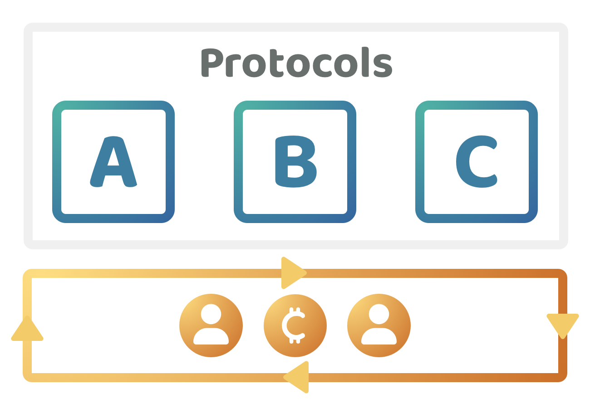

# Network funding

<figure><figcaption></figcaption></figure>

Network funding is when the base network uses the genesis allocation, transaction fees or taxes to generate income for the ecosystems treasury that can then be used to fund impactful initiatives. Ecosystems are able to pay for contributors directly from the treasury. Either the foundation behind the network or the coin holders in the ecosystem will be commonly responsible for determining how treasury assets are allocated.

<figure><figcaption></figcaption></figure>

**Very low funding complexity (Score - 5)**

* **Public goods funding** - Funding that comes from the network itself has very high incentive alignment with supporting open source initiatives that help to maintain and improve the ecosystem. Network funding could greatly increase the amount of funding that is available for supporting open source software over the long term.
* **Upfront commitment complexity** - The funding that is made available from the network can be generated by transaction fees or taxes. The community can benefit from supporting open source initiatives that benefit the wider network and ecosystem. Contributors do not need to make any upfront commitments about what will be developed and can instead change their focus at anytime if the funding process is flexible. This means these contributors do not need to make any upfront commitment like they would be if they issued a token. Contributors could sustain themselves over the long term from network funding and create multiple open source libraries that don’t require a separate token.
* **Investment complexity** - Network income would come from transaction fees or other taxes. This means that the entire community that use the network would be the ones who decide which initiatives they want to support using the fees they’ve paid to the network. If the wider community has the ability to influence how this funding is used then can align the incentives for the community to support any promising contributors and ideas that could generate impact for the ecosystem. This could mean funding initiatives that compete with established projects. Community members benefit from supporting the most promising ideas that could generate the most impact for the ecosystem.

**Very high contribution flexibility (Score - 5)**

* **Contributor commitment complexity** - Contributor network funding can make it highly flexible for contributors to work on many different ideas that can generate impact for the ecosystem. Contributor funding can help to achieve a very high level of contribution flexibility. Contributors funded by network funding would be responsible for generating impact for the ecosystem, contributors would have the flexibility to identify the most impactful ideas to work on themselves. If contributors kept moving between too many ideas they might struggle to make a large enough amount of impact for the ecosystem. Contributors that don’t make enough impact for the ecosystem would be less likely to be selected in future funding decisions. Due to the need for contributors to generate impact they would still be incentivised to focus on one idea, or a handful of ideas, as this will better enable them to focus on the most promising ideas that could generate the most impact.

**Very low collaboration complexity (Score - 5)**

* **Collaboration incentives alignment** - Network funding helps to create fully aligned incentives for collaborating across multiple projects. If contributors are funded by the network itself they would be incentivised to identify any shared problems that other contributors are facing and develop solutions that help to address those problems. This could be a great way for a contributor to generate impact. The more impact a contributor makes the more likely it becomes they get selected in future funding decisions.

**Low varied outcomes complexity (Score - 4)**

* **Contributor stops working on project** - If contributors are funded directly by the network they would be able to stop working on a project whenever they believed it made sense to do so. If they wanted to stop contribution entirely then they should be able to stop receiving funding from the network at anytime. Existing or new contributors could continue to help with the execution of any open source project. Open source initiatives that don’t have a token would have less concerns around the original ownership and who has control over what amount of tokens.  Open source initiatives are mutually beneficial for anyone to work on.
* **Contributor works on another project** - Contributors that are funded directly from the network itself could move between projects and also work on multiple projects at a time. Nothing prevents a contributor from directing their efforts towards more impactful initiatives. It is the responsibility of the contributor to determine which ideas are the most important to work on at a given point in time.
* **Limited ongoing contribution effort is needed** - Contributors could direct their efforts to multiple ideas at a time so this potential situation wouldn’t result in any conflicting problems or misaligned incentives. The incentives for the contributor are that they work on initiatives that can generate impact for the ecosystem. It wouldn’t matter if an idea didn’t need much ongoing effort to maintain and improve it over time as contributors could work across many ideas as long as they focus on generating impact.
* **Small to moderate idea success** - Contributors being paid directly by the network should be able to decide themselves whether it makes sense to continue to allocate more time towards growing a given protocol or application or whether other ideas would be more impactful to work on.
* **Project fails to get adoption** - Contributors could direct their efforts towards another idea whenever they believed the current idea was not going to be likely to succeed or be impactful enough for the ecosystem. The contributor would be assessed based on their ability to generate impact and not solely on whether any of the executed ideas failed or not. No investors would get financially hurt from this decision as no tokens have been issued. A contributor who had numerous failed ideas but then made a lot of impact with another idea could still be one of the most impactful contributors in the ecosystem.

**Moderate governance complexity (Score - 3)**

* **Ownership complexity** - Open source projects that are funded by the network don’t need to have fixed ownership. Numerous contributors in the ecosystem could be interested in supporting these initiatives. Other projects that are owned by a group of people could also still be supported by network funding. Protocols are commonly well suited to being publicly owned where any contributors can be selected to help with working on improvements and new versions.
* **Leadership complexity** - Network funding could support open source initiatives on an ongoing basis. The main complexities for this approach is that talented leadership might be needed to effectively execute an idea. In these situations a project could benefit from electing or enabling someone to lead these projects to better ensure they are executed as intended. Although this adds some selection based complexity the benefit of a contributor funding approach is that leadership can change over time as the needs of a project changes. Contributors aren’t tied to a single idea and could help with leading multiple projects if this was sensible and beneficial to the ecosystem.
* **Governance complexity** - Projects that have no token and that can receive ongoing funding from the networks funding process could benefit from removing the complexities of using token based governance. Many protocols could be versioned and deployed as new immutable smart contracts after each version update. This could be useful for some protocols as it would remove the governance complexity of directly updating a released protocol and instead the efforts are focused on creating a new version whenever this is needed. People can then migrate to newer versions over time. Some of the governance complexities that can exist with contributor network funding are around determining who should be involved with executing different ideas, how software versions get agreed and committed and how elected leadership is decided for ideas that benefit from more stable and competent leadership.

**Very low token utility complexity (Score - 5)**

* **Long term use case complexity** - Projects that are funded by the network do not need to introduce a token to raise funding. Instead the contributors involved in executing any idea can wait until it is very clear that a token is absolutely necessary. Until that point the contributors can execute the idea using the networks funding process. This removes the complexities around identifying and committing to a token with long term utility as the contributors are now able to learn whether the idea actually gets used and whether a token is even necessary for the project to function.

**Very low community usage complexity (Score - 5)**

* **Usage complexity** - Community members that are using projects that do not have a token could benefit from not needing to be concerned with token based governance decisions impacting their usage of the protocol or application. If contributors deploy immutable open source contracts then the community does not need to be concerned with sudden changes to how the code functions. Removing token based governance can also help with reducing the risks around a suddenly emerging group of malicious actors from capturing a large amount of tokens and voting in a way that could be detrimental to the existing users of the protocol or application.

**Total score = 32 / 35**
