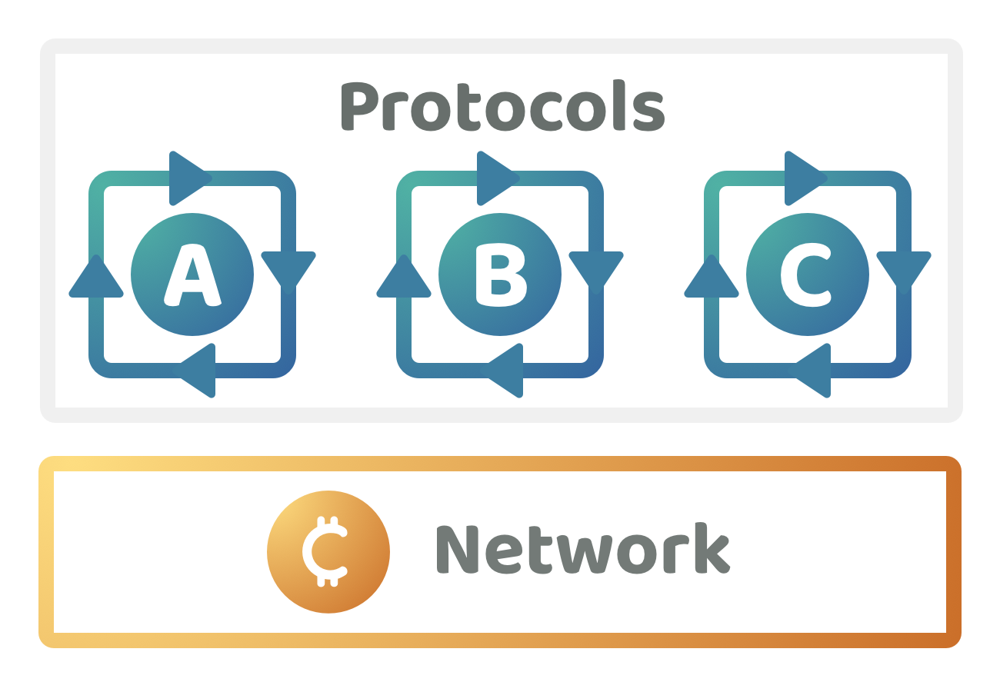

# Token funding

<figure><figcaption></figcaption></figure>

Web3 ecosystem projects could issue a token and try to create their own circular economy. An example could be a DEX where the fees are charged in the project's token and then used to help pay for ongoing development efforts. Ideas that issue a token are able to raise funds from community members or anyone outside that ecosystem that are interested in investing in that project or they just want to support what they’re working on.

<figure><figcaption></figcaption></figure>

**High funding complexity (Score - 2)**

* **Public goods funding** - Ecosystems that lean towards more idea token based funding instead of using network funding could result in a lack of support for public goods initiatives that often don't produce a large financial return for the investor. Relying on project token fundraising means that open source projects without a token could end up relying on donations. This could limit the amount of funding they receive, especially over the long term. Open source software in existing systems already face similar problems of it being difficult to receive a sustainable amount of funding. Some of these projects could create a token to raise funds to pay for the contribution efforts however this might be unnecessary for the project. If new projects start relying on the funding that is available in existing established projects there is a higher complexity around how these projects share the cost of supporting public goods initiatives. These projects would have their own investors and their own incentives to ensure their own project succeeds. If one project is more giving than others this could have a negative impact on their own treasury and expenses. The problem of public goods funding coordination becomes even more complex when there are multiple competitors in an ecosystem as now one project giving away more capital than others could create a financial competitive advantage for the other projects that don’t donate as much of their own funds. This behaviour could be to the detriment of the ecosystem. The shared coordination and funding complexities help to highlight the importance of network funding as it creates more fully aligned incentives for everyone to support open source public goods initiatives that can benefit the entire ecosystem. The incentives are only partially aligned for projects with their own tokens to support other public goods efforts in the ecosystem.
* **Upfront commitment complexity** - A project that issues a token to fundraise is making a moderately large upfront commitment about what the project is focused on, how it is going to function and how it will be sustainable and grow over the long term. This is because any investors in that token need to know what they are investing in and are often looking for investments that have a meaningful return on investment. The token would need to have sufficient long term utility to generate that return on investment. It could be difficult to state with much certainty that the token being suggested will actually be necessary and useful over the long term. It is difficult to remove a token once it has been minted and distributed to investors meaning there is a moderate to high complexity for contributors when committing to using a token in a project to raise funds.
* **Investment complexity** - Without any network funding a project would be more reliant on investors or donations to support the execution of their ideas. Investors are incentivised to identify the projects that have the most potential to make a return on investment. This makes it more problematic for high impact projects such as open source protocols and utility libraries as they generate little to no return on investment. It will be difficult for them to receive as much attention from these investors that understandably decide to allocate their capital elsewhere in more lucrative opportunities.

**Low contribution flexibility (Score - 2)**

* **Contributor commitment complexity -** Issuing a project token is a large commitment for the contributors who are responsible for that project. These contributors would then be responsible for making this token is successful and responding to the investors who have helped to fund the project. Receiving investment for a project that has a specific execution plan can limit the ability of contributors to pivot their contribution efforts to other ideas and areas that do not align with improving the project and its token. The usage of a token could limit how contributors generate impact for the ecosystem as now they have to try and make a return for their investors and token holders which could take precedent over allocating their time to other impactful initiatives that don’t increase the value of the project. Another problem is that contributors could become overly committed to creating a sustainable circular economy in a project that wasn’t well suited to this outcome to begin with. Abandoning a project and its token to work on a more impactful initiative could have negative repercussions from investors and community members due to them abandoning a token that people invested in. Community members may decide to not support this group of contributors again even though they might have acted in the best interests of the ecosystem. The contributors commitment to the token they initially issued could hinder their ability to pivot their contribution efforts towards other efforts.

**High collaboration complexity (Score - 2)**

* **Collaboration incentives alignment -** Projects with their own token based economies have only partially aligned incentives to fund open source initiatives that could generate impact for the wider ecosystem. The complexity of open source initiatives that benefit the wider ecosystem is determining who should help with supporting those initiatives and how much should they donate. Token holders from these projects would each determine the projects they want to support which can add an amount of governance overhead complexity as each project might need to make this same decision on what other initiatives its willing to support. The owners of these projects would need to consider how each open source initiative is beneficial to the project itself and how else it could use that funding. Projects that have limited capital and resources that are under more competition with other projects could be less likely to allocate much of their time and capital towards ecosystem public goods initiatives. Being frugal with their own time and capital could be important for preventing the failure of a project. Project tokens create more of an incentive to compete with other projects rather than collaborate. This is due to the risks around a limited return on investment for the project itself, the risk of failure due to wasting project assets on supporting other initiatives and the risk of giving competitors a financial competitive advantage if they give away assets and others don't. Projects with their own tokens could understandably choose to only focus on their own efforts that help to improve their own project as this will often be the most direct way to increase the value of their token.

**High varied outcomes complexity (Score - 2)**

* **Contributor stops working on project** - Projects in the earlier stages that have not decentralised the project could likely have a larger influence over what happens with any income that is generated by the project. There is a risk that limited impact is generated for that project unless a funding process and incentives are available that can bring in other contributors to work on the project now that the existing contributor is leaving. Projects which are more established could be more likely to have a larger amount of funding available to attract other contributors into the project.
* **Contributor works on another project** - If a project has issued a token it becomes much more difficult for a contributor to work on other projects that aren’t relevant to the projects own token. The larger the number of investors and capital invested the more scrutiny the contributor could face from these investors for not focusing on the project token that they are now responsible for. Contributors could be risking their own reputation and ability to fundraise in the future if they do not solely focus on making their own projects token successful. This can be a bad outcome for the ecosystem in situations where the project token didn’t make sense to begin with and the other projects that a contributor could work on could be far more impactful than what they are currently working on.
* **Limited ongoing contribution effort is needed** - Some projects do not need consistent contribution effort and might instead benefit from periods of little to no contribution effort to allow more time for feedback and usage patterns to emerge. In these situations there is some complexity around how the income that is generated for that project is used. If token income is being used to fund different initiatives that are impactful to the ecosystem, but that are not relevant to the project itself, there is a risk that token holders are conflicted with ongoing support for these efforts. Supporting these other initiatives could come at the cost of reducing the growth and value of the projects own token.
* **Small to moderate idea success** - A project with its own token that has a limited amount of adoption and success has the ongoing incentive for the contributor to continue to try and grow and scale that project. This could be problematic for some projects where there is a limit in how much adoption they might expect over the long term. In these situations the contributors may be able to generate more impact by working on other initiatives, however this could cause conflicts with the exiting token holders.
* **Project fails to get adoption** - Projects that have already issued a token and are showing sign of failure are incentivised to try and improve the project and fix any issues that could make the project succeed. If the contributor gives up too early this could cause conflict with the investors who could even see this as potential theft of their investment capital. If the contributor closes the project down too late then the contributor could have wasted a large amount of time trying to save a project that they already knew was not going to be successful after they learnt more about the market and most likely outcome.

**High governance complexity (Score - 2)**

* **Ownership complexity** - In the earlier stages of the project the original creators of the project would likely have a larger amount of ownership of the projects tokens. This early stage of ownership could be problematic in situations when contributors with a meaningful amount of tokens stop working on the project. Over the long term, if the ownership is distributed between a larger amount of community members there is still a risk around how decentralised this ownership is and what influence these owners could have on the other users of the project.
* **Leadership complexity** - In the earlier stages of the project it would be more difficult for a project with its own token to have a leadership change due to the fact that the original founders would likely have a larger majority of the tokens to vote on who is running the project. This leadership could more easily change over the longer term if the project token can be distributed across more users over time.
* **Governance complexity** - In the short term the main complexities for the project around governance would be if the contributors were looking to stop working on the project or work on other impactful initiatives. They might have a majority share and influence over the project however they could still have a difficult time convincing other people to work on the project and when trying to convince existing token holders that their suggestion makes sense. The longer term governance complexities are that even if the project token is well distributed across many community members there could be an increased complexity with deciding how income is used within that project. The token holders are incentivised to focus on initiatives that improve the tokens own use cases and value however there could be many other initiatives that could be impactful to the wider ecosystem. Community members might need to handle this governance complexity across multiple projects that each have their own token.

**Very high token utility complexity (Score - 1)**

* **Long term use case complexity** - It can be difficult to predict exactly how a project and its token will be used by its intended audience and also how the environment surrounding the project will change over time. A fast moving environment can increase the complexities around finding token utility use cases that will be relevant and useful over the long term. If these tokens become redundant in the future there is a risk of financial loss to the investors. Token based governance is another area of complexity that might not make sense for many projects. Token based governance could result in a small number of community members having a large influence over the direction of a protocol or application that is used by the wider community. This could also be problematic if these token holders could change any parameters such as the fees or how people access features within the protocol or application.

**High community usage complexity (Score - 2)**

* **Usage complexity** - Projects that have introduced a token with different use cases and for governance reasons could create a larger amount of complexity for the end user that they now need to regularly consider. When someone uses the application or protocol they might need to consider how the existing token holders could influence their own usage of that protocol or application. The governance process might be able to influence the amount of fees that these users pay or what features they have access to. This could be a concern for end users who could be unaware of these potentially sudden changes. Users might need to constantly monitor multiple applications and protocols and how these sudden governance changes could occur. Another usage complexity is around how any project income is used as now the users of these projects would be paying for those fees. Community members without any of the projects token might lose the ability to influence how their fees are used to generate further impact and maintain the project.

**Total score = 13 / 35**
