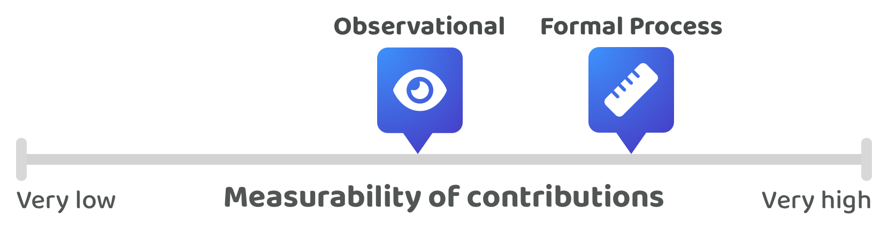

# Current landscape



This page contains the same information that is covered in the above video

***

## **Company contribution measurement**

<figure><figcaption></figcaption></figure>

Each company could approach contribution measurement and verification very differently. On one side of the scale some companies might have no or very few processes in place for verifying employee contribution efforts. These companies often rely more on observations made by leadership and management which can be a faster and simpler approach to get started with. Smaller companies may use more of an observational approach due to its simplicity and when they have a limited number of contribution efforts from different employees to review. Observations have an upper limit for how measurable they are due to the fact that the people doing the observing have a limited amount of time and capacity to observe each and every employee and what they’re working on. Some companies will introduce more formal processes to better record and measure each employees contribution efforts. Formal processes for measuring contribution effort could help a company with identifying and rewarding high performing contributors. Processes for reviewing contribution efforts and performance can become increasingly more important for larger teams and bigger companies due to the complexity of working out how peoples compensation should change over time and which employees have been the most performant and impactful. If top performers are not adequately recognised and rewarded there is a risk they become demotivated or simply move to another company. The problem with making observations about someone's contribution efforts is it requires a higher amount of trust in the management and leadership's decision making. These observations could be deciding what employees are paid based on their contribution efforts. Relying solely on observations can come at the expense of the accuracy in measuring each person's contribution efforts and can introduce the risk that some employees do not get compensated fairly for their performance or that the leadership is biased towards certain individuals over others. Companies that do introduce processes for measuring contribution efforts and performance benefit from making it clearer to employees what efforts and outcomes are most valuable for the company. Rewarding top performers could come in the form of job promotions or salary increases based on skill based pay bands. It could also include bonuses or stock options. Companies with more structure and process could be more accurate with grouping employees into different skill level groupings and performance thresholds however these processes can also be limiting for employees who exceed those expectations or their contributions and overall performance is not well captured in a more rigid process.

**Issues with company contribution measurement**

* **Easier exploitation** - For companies that use more observations and trust in the leadership instead of a formal process for measuring performance and contribution efforts there is an increased risk that employees could be exploited for their skills and performance as they would be relying on another person's judgement rather than a defined performance process. Leadership could try to retain more revenue for the business or inaccurately review someones performance and contributions. Employees might need to dispute the leadership's judgement if they felt like they deserved more compensation due to their performance.
* **Lack of measurement accuracy** - Companies that rely on observations for verifying employee contribution efforts and performance have an increased risk of lower accuracy around compensation decisions due to a lack of awareness and understanding of each person's contributions and performance. A lack of process means the company would be relying heavily on observations and contribution outcomes. These observations could lack the full information and context needed to know what has actually happened.
* **Lack of public and self owned contribution logs** - Contribution efforts that aren’t publicly recorded and owned by the employees mean there is limited value in these contribution logs for the employees. Employees could have benefited from being able to prove that they have made certain contributions for the business that they could then showcase to others across the company or even to other external companies. One obvious reason that companies would not inherently want this openness of competencies and performance is because it would increase the potential risk that other companies try to pouch their top performing talent. That approach might be good for the business, but it is not beneficial for the contributor.
* **Separate process for leadership and management** - Some companies might not apply the same verification process for measuring contribution efforts and performance with management and leadership as they do with employees. This can be unfair for employees as each person's contributions to the company are not being treated equally in terms of how they are recorded, measured and verified. A lack of equal process can lead to inaccurate or unfair compensation outcomes. Employees could have been far more performant and impactful than the leadership roles yet the employees might not receive fair recognition and compensation for their contribution efforts.
* **Rigid incentive process** - Companies that do have a thorough process for measuring and verifying contribution efforts have the risk that their process could be overly rigid. Some employees may exceed the value and expectations of defined compensation thresholds or generate impact in ways that aren’t well accounted for in the current contribution measurement process. Making a process that is flexible enough to handle different outcomes and varied contribution efforts would be an important part of rewarding the top performers fairly and aligning the incentives with the employees who have been the most performant and impactful.

## **Professional sports contribution measurement**

<figure><figcaption></figcaption></figure>

Professional sports can provide a useful comparison to company environments due to how contribution efforts are measured. Sports are inherently far more easy to measure than many employee roles found in company environments. Sports have a clear objective in what efforts often help with generating a winning outcome. Individuals involved in these sports can have their contribution efforts measured accurately to determine how they contributed towards generating a winning outcome. Football, or soccer, is a great example to consider. Each team member's contributions can be measured such as how long they have the ball, the number of passes, the number of shots and shots on target, the number of ball interceptions and then many more different metrics. These numerical measurements can then be paired up with visually recorded data about how these players move around the pitch, how good their awareness is of team mates and competing players and how they interact and collaborate with other players on the pitch. The value in all of these measurements is that these players can be more easily grouped based on their performance. Measurable performance can then lead to an increase in compensation for the top performers. Sports athletes, especially those in team sports, benefit from their contribution measurements being fully public and widely accessible as now every other team and anyone else in the world can easily verify someone's performance and the impact they made whilst playing for a team.

**Top performing contributors**

An important part of making a great team is identifying and retaining the top performing players. Top performing sports athletes can often be paid a meaningful amount more than other athletes. For individual sports the contribution measurement is not as valuable as team environments as the individual is responsible entirely for any wins or losses. Their contribution efforts don’t need to be measured and compared with other team members. For team sports, contribution measurement is highly valuable and important. If a team wins it is beneficial to understand which players have been the most performant and effective at helping that team win. Measuring a players contribution efforts effectively will help with identifying the most impactful players. These players can then be increasingly compensated for their high performance.

## Comparisons between sports teams and company environments

**Sports teams can often have more open data that is highly measurable**

Sports are inherently easier to measure numerically and visually compared to common company roles such as software development, product management, design and marketing. Roles that exist in companies do not have the same simple objective that sports do. Employees can generate impact in a multitude of ways and also can make a wide range of contributions that could have varying implications over the short and long term. However the difference in the ease of contribution measurability does not diminish the fact that increasing contribution measurability can be highly beneficial for more accurately identifying and rewarding the most performant and impactful contributors. Increasing the contribution measurability in any environment will help with more effectively identifying and rewarding the top performers. The less effective a company is at measuring the contribution efforts the more there is a risk of inaccurate compensation outcomes and creating environments where leadership and management could more easily make incorrect, unfair or biased compensation decisions.

**Sports teams often don’t need to do as much skill and competency verification**

Sports player contributions are often accurately recorded and publicly available. This makes it easier for other teams and people across the world to understand and compare the value of each player. This access to reliable and verifiable information means a team could make contract offers to other team players with more confidence due to the fact that they know the potential value of that player for their own team. In company settings the value of an employee is not as publicly shared to a wide audience. A company is not incentivised to make others aware of their top performers. Employees will often have to apply to other companies and prove their skills and competencies each and every time they do this. There are also some situations where companies might decide to not do much upfront skill and competency verification when interviewing employees. Employees who have worked at FAANG companies can often find it easier to get a job elsewhere due to the association with one of these larger tech companies. Other companies are aware of the difficult interview processes that these people must have gone through to be employed at those companies. Companies will sometimes use that information as a proxy to verify that someone has a certain skill level and competency. This is a great example of how public contribution and professional information can be beneficial for employees. The example of public contribution logs from sports environments help to highlight the potential value of making contribution efforts publicly available. For employees this can be an effective way to showcase their contribution history so that other employers can verify their contributions, performance and potential impact they could generate.

**Sports team environments can be more reliable and effective for top performers**

Companies are not incentivised to share how good their employees are publicly as then competing companies could more easily try to poach their top performers. This isn’t a good outcome for the employee as they might be worth much more than they are currently being paid. Top performers benefit from others being able to easily identify and verify that they are highly performant and effective. Public measurement of contribution efforts can help with creating a highly beneficial environment for top performers to thrive as everyone becomes aware of how good they are. Top performing sports team players receive the benefits from their contribution efforts being made public and easily accessible. In sports environments these players can be measured and reviewed by other teams much more easily. Accessible information about top performers helps to give them more ability to work with the teams and people that they want to work with. In company environments this could mean that top performers could more easily work in the teams and on the ideas that they are most interested in. Making this information more public also helps to create a more open and competitive market for contributors as everyone can now see the value of each individual. This is good for top performing contributors as it can help to minimise the influence of other people deciding what their value is. Instead these top performing contributors can now showcase and verify their value to others more easily.

## Comparisons between sports teams and Web3 ecosystems

**Web3 ecosystems also have open data due to open source software**

Web3 ecosystems highly benefit from developing open source software. If projects were predominantly open source the contributors in these projects would have their contribution efforts publicly recorded. Contribution efforts towards open source software would be public by default. This is a great outcome for contributors as now the value of their contributions can now be more easily recorded and showcased to anyone else in the ecosystem and wider industry. This is an improvement over existing company environments where contribution data is often private and not as publicly accessible. Contributors could now more easily build up a public and global reputation based on their contribution efforts and be paid more accurately based on their actual performance and the impact they generate. This openness of data can help with creating an environment that is similar to team sports. Contributions would be public and top performing talent could benefit from being more easily identified and compensated for their skills and competencies.

**Web3 ecosystems can make it easier for contributors to build a public reputation**

Sports team players benefit from their contribution history being measurable and publicly available. Public and measurable contributions make it easier to see how the performance and impact of a player changes over time. Web3 ecosystems could benefit from this same environment if many projects are open source and the contribution history can be made publicly available. Contributors in Web3 ecosystems could build up a reputation based on their contribution logs which demonstrate their performance and the impact they generate. This reputation can help to empower contributors and make it easier for them to work with who they want to work with and to be paid fairly.

**Web3 ecosystem contributions are far more difficult to measure**&#x20;

Similar to company environments, Web3 ecosystem contributions are still inherently much more difficult to measure for performance and impact. Contributors could support and improve an ecosystem in many different ways and their contributions could generate impact over the short and long term. It is currently difficult to have any reason to believe that contributions in Web3 ecosystems will ever be as measurable as they are for player contributions in sports teams. However this does not diminish the opportunity and benefit of increasing contribution measurability where possible. Contribution logs could help with pushing more power to the edges as contributors could now have more control and influence over building up their own reputation that can showcase their performance and impact.
