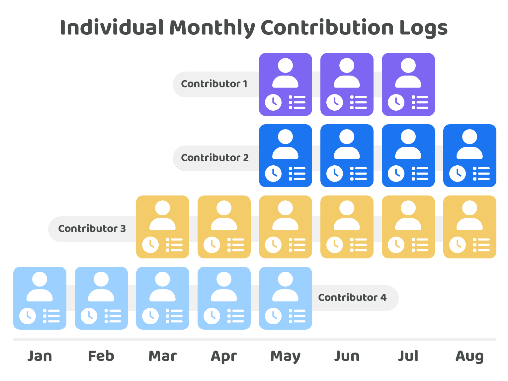

# Individual monthly contribution logs



This page contains the same information that is covered in the above video

***

Exploring how to make [contribution efforts more measurable](recording-and-measuring-contribution-efforts.md) and comparing different [contribution verification approaches](../../disbursement-approaches/contribution-verification-approaches/) led to the conclusion that individual monthly contribution logs could be a highly effective approach for recording, measuring and verifying contribution efforts. This approach can help with making it far easier to compare peoples contribution efforts across an ecosystem and also compare how the performance of each individual changes over time as more contribution logs get submitted.

<figure><figcaption></figcaption></figure>

## **Individual contribution measurement is often unavoidable**

Applications, protocols, community initiatives and many other ideas can often require a number of different contributors to help with execution. The key problem with group based contribution logs is that groups of contributors that are executing ideas would still need to fairly determine how compensation is distributed between the contributors working on that idea. This is one reason why individual contribution measurement and verification is often unavoidable. If contribution efforts are not recorded through contribution logs this group of contributors will be doing it through observational measurement. Making it easier to record, measure, verify and present individual contribution logs can help with more accurately rewarding contributors within a group based on the merits of their contribution efforts rather than it becoming a popularity contest or being influenced by biased decisions that might benefit certain individuals over others.

If individual contribution efforts are not measured in any capacity it will be difficult to know who has done what work and who has done the most work overall. It would also be difficult to know who has performed the most effectively when executing the idea and who has made the most impactful contributions. This outcome is problematic as this could mean hard working and high performing contributors aren’t correctly rewarded for their effort. These top performers could simply decide to not work with this group of contributors in the future. Alternatively they might just decide to not work as hard as their efforts are not being recognised and rewarded. A lack of recorded and measured contribution efforts could also make it more difficult to spot which contributors are not performing well.

When contribution efforts are not recorded the process of verifying and measuring peoples contribution efforts can become more time consuming and end up being handled by project owners in the group. Observational measurement from project owners gives them more power and influence over what each individual will be compensated. Alternatively, if the decision process for what people get paid was democratic then the main issue with a lack of recorded contribution efforts is that people would need to observe other contributors and be much more aware of what everyone has been working on to make an informed decision on what is fair and reasonable in terms of compensation.

Recording individual contribution logs improves both of these scenarios. If a small group of individuals have more influence over how much contributors get paid the recorded contribution logs would provide more evidence that can help with fairly determining the value of each persons contribution efforts. Using individual contribution logs can mean that contributors have a more reliable way to prove their own value. In a democratic decision process for distributing compensation the contributors would all benefit from having more access to accurate contribution logs as now they can showcase what each of them have been working on. Understanding how people have contributed towards an idea can be a foundational source of information for making more informed decisions about who has been the most performant and effective in the team.

## **Steps for recording individual contributions**

**1. Automatically recorded contributions**

Automatically recorded contributions are a great foundation for creating contribution logs. Digital contributions such as code commits, designs and written submissions can be automatically tracked and tied to an individual account holder who made those contributions. Digital contributions such as these can be recorded and verified the most easily. Automatically recorded contribution logs alone could be very insightful for understanding what each contributor has been working on.

**2. Manually recorded contributions**

Contributions that are more difficult to automatically record and verify could be added as a manual submission. Manually added contributions could include in person event attendance, collaboration efforts or research efforts that don’t produce a digitally recorded outcome that can be easily verified. Self reported contribution efforts will either need to have some evidence to support the claim or those contributions should have been observed by other contributors or community members. If contribution efforts cannot be verified their usefulness and reliability would be much lower.

**3. Observationally recorded contributions**

Contributors will often work with a number of other contributors when they collaborate to execute ideas. These contributors will be able to observe the contribution efforts of others. These observations are important as contributors will be able to more easily identify mistakes or purposefully incorrect claims in someone else’s contribution logs.

**4. Peer to peer attestations**

At this point contribution efforts should now mostly be observed and recorded. The next step is focussed on peer to peer attestations. Contributors should now be able to make attestations about other peoples contribution efforts that they have observed and verified themselves. These attestations could help with creating a clearer image on how contributors have been working together and how each person's contributions have impacted others. Peer to peer attestations could add more clarity and evidence about the relevance and impact of different peoples contribution efforts. Peer to peer attestations do have the risk of people trying to game this system to try and financially benefit themselves by lying about what they have worked on and then trying to get misleading and incorrect attestations from others. Checks and balances along with the right incentives would be needed to try and mitigate these risks as much as possible.

**5. Community reviews**

As a final step, community reviews could help with verifying peoples contribution logs and any attestations that are attached to those logs. Individuals that don’t actively work with the contributors in an ecosystem could still have relevant expertise and experience that might be useful for reviewing peoples contribution logs. Community reviews of peoples contribution efforts could help to highlight opportunities for improvement, new ideas and also help with identifying bad actors that could be trying to abuse the system. Impact could be generated slowly over time and it might not be obvious how an executed idea will make impact across the ecosystem. Community reviews could also be done over a longer time period to review what impact has been generated by different contributors over time. Community reviews of other people's contribution efforts could help with improving the communities ability to more accurately identify the top performers. These contributors could then be more fairly compensated for their performance and impact.

## **Advantages of individual monthly contribution logs**

**Effective contribution verification**

In group based contribution logs it can be easier to hide poor performance as the contribution logs won’t necessarily break down who has been working on what with enough evidence. Logging an individual's contribution efforts can be a more effective solution for verifying that each individual involved in a project is actually making sufficient contribution efforts towards executing that idea. If contribution efforts are recorded every month this can also make it easier to compare those outcomes with other contributors. Monthly contribution logs help to make these logs more measurable, which can help with making it easier to identify the best and weakest performers. Support could be provided to contributors that need to improve their performance. If the performance of a contributor doesn’t improve or the individual is purposefully being a bad actor then it would be unlikely that they receive future funding due to the evidence of poor performance shown in their contribution logs.

**Improved decision making**

Measurable contribution logs can help with making it easier for voters to spot the best and worst performers amongst a group of contributors. It can also help with identifying trends in the performance of contributors as a whole or where certain skill sets might be missing. This information can help with improving future funding decisions about where to allocate more resources and focus. Individual monthly contribution logs also become increasingly useful over time where a contributor will build up a reputation based on their contribution history. These logs can help with making voting decisions even easier over time as the community will simply be able to repeatedly select and fund the most performant contributors in the ecosystem.

**Retaining top performers**

Every idea won’t be successful and some teams won’t perform well together. Individual contribution logs can help with identifying the most performant contributors in those situations where an idea fails or where there is a breakdown in a team's communication. Contribution logs would help to provide evidence of which contributors were the most effective in those teams. If those contributors can more easily prove they were effective at executing ideas it will be easier for them to be considered as a good candidate to help with other better performing ideas and teams.

**Higher self awareness & accountability**

If contributors can easily see their own performance against other contributors they are able to become more aware and self accountable for trying to achieve a similar or higher level of contribution output as the other contributors in the ecosystem.

**Empowers individual contributors**

Being able to demonstrate high performance or impactful contribution outcomes is empowering for building a contributors reputation. Competent and high performing contributors that are able to easily demonstrate their capabilities and performance should be able to more easily receive fair compensation for their efforts. Rewarding contributors who are working harder or more effectively than others is an important way that the available incentives can be more effectively aligned with generating impact for the ecosystem. Another way that evidence of contribution efforts can help to empower the individual is that it provides a public facing record that demonstrates what a contributor has achieved and what skill sets they are most competent at. This can make it easier for different teams and projects to verify that a contributor is well suited to help them with their own execution efforts. The easier it is for an individual to prove their ability and competencies the more control and influence they will have on being able to pick the most suitable initiatives to work on that they are most interested in. Their reputation will also help with ensuring that they will get paid fairly for their skill level.

**Removed intermediaries**

Web3 ecosystems have the opportunity to make a more democratic and peer reviewed process for assessing performance and impact. Achieving this can help to reduce the need for intermediaries such as management and leadership positions and prevent them from having excessive amounts of control and influence over determining someone’s compensation. Effective contribution measurement can help with creating a more open and free market for individuals to compete in. Self ownership of contribution data can more easily be used by contributors to influence the compensation they receive and their career trajectory. More self ownership of contribution data can help with preventing individuals or small groups of individuals from being able to unfairly determine someone else’s value. Self owned contribution data can help with pushing more power to the edges by enabling contributors to have more control over their data and reputation.

**Flexible information usage**

Information about an idea being executed can be highlighted in someones contribution log. This can also include which milestone would be relevant to the contribution efforts. This added context means that an aggregate of different peoples individual contribution logs can help to create project based information such as the total contribution efforts towards an idea in the last month or the amount of contribution efforts that have been made towards a certain project milestone. This flexibility in information composition means it becomes much easier to view contribution efforts in a format that is most useful to the viewer.

## **Opportunities for Web3 ecosystems**

**Open source contribution data**

Open source data could help with creating highly insightful information for better understanding the performance of a contributor or cohort of contributors. Public contribution data could help with identifying skills gaps and areas of improvement that the contributors could work on to become more performant or to generate more impact. Measurable contribution data will become increasingly valuable over time as now historical comparisons can be made and these learnings can then lead to more experiments that identify system and process improvements.

**Self sovereign identity adoption**

Contribution logs could be attached to the identity of the contributors who submit these logs. These logs could be a great use case that helps with building up useful identity tooling within an ecosystem. Contributors could start submitting contribution logs to start building their own reputation at any time. Permissionless identity tooling with verifiable contribution logs could really help with enabling emerging talent from anywhere in the world with getting recognised and rewarded for their efforts.

**Trust based networks**

Verifiable contribution data could be used to initiate some form of a trust based network that people use to prove someone's competency and reliability. Communities could start using this information as a form of identification and a way to trust certain individuals due to the reputation they’ve built and the common connections they share. These networks of provable contribution effort could lead to new working arrangements between contributors based on the trust in these verified contributions. These emerging networks could also result in the development of number of new identity related use cases that build on top of these connections and data.
