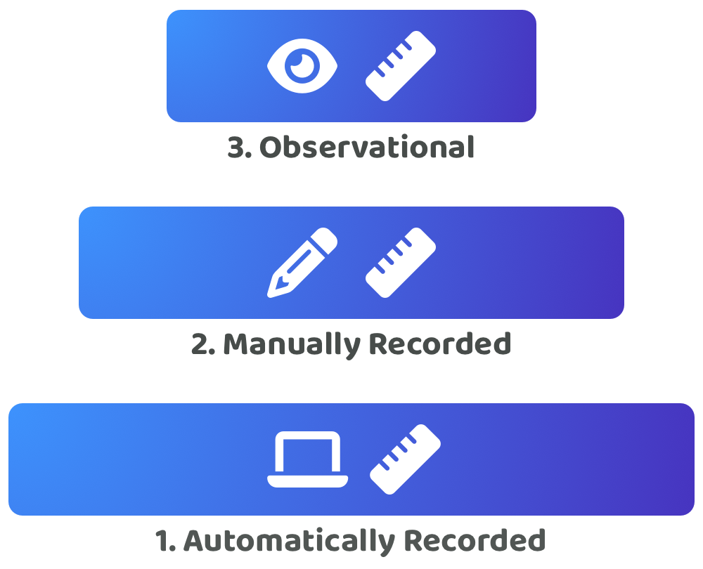

# Recording & measuring contribution efforts

Making contribution logs more measurable can help with drastically improving their usefulness and long term value. Increased measurability means making it easier to compare the contribution efforts from each contributor. It also means it should become easier to make historical comparisons to see who has been the most performant and whether individuals or groups of contributors are getting more performant or not over time. Higher measurability can help with increasing the accuracy in identifying the top performers who can then be rewarded for their high performance and impact they generate.

## **Contribution effort recording approaches**

<figure><figcaption></figcaption></figure>

**Observationally recorded contributions**

Leadership and management as well as other contributors that work with a contributor are able to observe the contribution efforts and outcomes that another contributor is responsible for. These observed contribution efforts might not be written down or digitally recorded. Instead the people who observe these efforts may just try to remember what each contributor has been working on. Companies may often use an observational approach as a simple way to monitor what contribution efforts each person is making and how performant those people are. Leadership and management would look to observe the efforts and outcomes that people are generating over time. The problem with this approach can emerge when the people doing these observations are given a lot of control over the performance and impact measurement. They could be given a large amount of influence and power over determining other peoples compensation. Observationally recorded contributions rely on people making accurate and fair observations about someones contributions. This approach can be highly time consuming for those that are responsible for making these observations as they will need to record and verify each persons contribution efforts themselves.

<figure><figcaption></figcaption></figure>

**Manually recorded contributions**

Contributors could manually make a submission about the contribution efforts they make and provide any evidence that supports those claims. Manually recorded contributions are necessary for situations where it is not easy to automatically record and verify someones contributions. In person events, meetings or other forms of mentorship and leadership could all be examples of contributions that are more difficult to record without using a manual submission process. Contributions that are added manually by a contributor or by other community members could benefit from having attestations attached to those claims. Other community members could vouch for the contributions made by others. This could be a useful addition to manually recorded contribution efforts to make it easier to verify that a contributor has done what they say they did. Peer to peer attestations can introduce the risk that this process will be abused by malicious actors. The identities of the community members giving these attestations would ideally need to be verified and trusted for these attestations to become more reliable.

<figure><figcaption></figcaption></figure>

**Automatically recorded contributions**

A number of contribution efforts can be recorded automatically and provide evidence about what a contributor has been working on. Digital contributions can be easier to record and verify. Examples include code contributions, designs, articles, blogs and documentation changes. These digital contributions can be tied to an individual account which makes it easier to verify who made certain contributions. Online recorded meetings could even be eventually automatically transcribed and verified to prove someone's attendance and the contributions they made towards a discussion. Automatically recorded contributions can be highly useful for contributors as it can make it effortless for them to record and showcase the contributions they have made.

## Ranked preference of contribution recording approaches

<figure><figcaption></figcaption></figure>

All the contribution recording approaches mentioned previously could be used in combination to help with recording someone's contribution efforts. These approaches can also be ranked in preference.

**1. Automatically recorded contributions**

Automatically recorded contribution efforts are the preferred approach to help with making it easier and faster to create and verify contribution logs. Automatically recorded contributions can help with reducing the risks around incorrect or exaggerated efforts that could have been manually recorded. Automatic contribution records can also help to reduce or even remove the time needed for a contributor to record their contribution efforts. Where possible contribution efforts should be automatically recorded.

**2. Manually recorded contributions**

Manually recorded contributions are useful to fill in the gaps for contribution areas that are not as easy to automatically record. Manually recorded contribution efforts can help with providing the full information about someone's contributions. Processes will be needed that introduce the right checks and balances and the right incentive design to make sure these self recorded contributions get verified. There will always be a risk that someone tries to game this system in an attempt to unfairly improve their own reputation and future chance of receiving funding.

**3. Observationally recorded contributions**

Observationally verified contribution efforts would be the most time consuming approach to scale to a large number of people. This approach can also be more easily abused if certain individuals are given more influence over deciding other peoples compensation. Observational recording and verification of contribution efforts will happen naturally as contributors work with each other and as community members look at what the funded contributors have been working on.  Observations will be useful for community members to more thoroughly understand and verify the contribution logs and efforts that people have been making. These observations should also help with identifying bad actors in the ecosystem.

## **Contribution measurability complexities**

**Short vs long term outcomes**

The value and impact generated by contribution efforts is not always obvious. Some contributions can have longer term implications that benefit an ecosystem over time.

**Wide impact potential**

Contribution efforts could help with producing a variety of different outcomes that each could make an impact in a number of ways. Contribution efforts could make impact through improved ecosystem functionality, usability and experience or they could be generate impact in the wider community and positively influence how community members think, discuss and collaborate. It can be difficult to fully understand the full potential of what impact someone's contributions could make in the ecosystem.

**Contribution variability**

A contributor could make a wide variety of different contributions to generate impact for an ecosystem. Each of these different types of contribution effort could require very different skills approaches for those efforts to be recorded, measured and verified.

**Leadership based contributions**

Some contribution efforts could be focussed on inspiring and aligning the efforts of a group of contributors. These types of contributions can be more difficult to record and measure due to the fact that each individual could respond very differently to these leadership efforts.

**Social based contributions**

How contributors interact with one another on a social level can have a big impact on the team's rapport and the overall cohesion and alignment between a group of contributors. Positive contributions to social environments are harder to record and verify accurately yet these contributions could be highly valuable to an ecosystem by making a more welcoming and enjoyable place for people to collaborate and solve complex problems.

**Peer to peer measurement & verification**

Self-reported manual contributions and group based social and leadership contributions are all example contribution areas that can benefit from peer to peer attestations to determine what happened in a group working environment and what impact was generated by different peoples contribution efforts. There is a complexity in ensuring that these attestations are legitimate and not purposefully incorrect or biased as there is an incentive for people to try and exploit this system to financially benefit themselves.

**Peer to peer measurement & verification**

Self-reported manual contributions and group based social and leadership contributions are all example contribution areas that can benefit from peer to peer attestations to determine what happened in a group working environment and what impact was generated by different peoples contribution efforts. There is a complexity in ensuring that these attestations are legitimate and not purposefully incorrect or biassed in an attempt to exploit a system to financially benefit a certain group of individuals.

## **Making contribution logs more measurable**

**Execution scope**

Grouping the type of work that is being completed is one way to try and increase measurability. Keeping a contribution log focused on a certain skill set such as coding or design could help with making it easier to compare and understand how different contributors have executed certain outcomes versus other contributors. The challenge with trying to make the execution scope more measurable is that each idea being executed is usually different from other ideas and thus can require different skills and expertise to execute them. Executing these different ideas can also produce very different outcomes. Infrastructure and protocol development for instance could have a lot of variation in how the different problems are solved and what skills are required when developing the code.

**Time**

Contribution outcomes could be recorded within a certain time period so that there is more consistency in the amount of work that is being completed within each contribution log. This helps to increase measurability as now individuals can be more easily compared based on the same duration of contribution time.

**Number of people**

If the contribution outcomes come from multiple people and are being combined into the same contribution log this would make it more difficult to understand who did what and how performant and impactful each of their contributions were. Keeping contribution outcomes recorded separately as individual contributions can help with making it easier to measure the differences between one person's contribution outputs with other contributors.

**Summary**

Recording one person's contribution efforts at a time and recording contributions within a fixed time period, such as monthly, are the two stand out approaches mentioned above that could consistently help with making contribution efforts more measurable. In terms of execution scope, it is more difficult to separate out every type of contribution effort into a separate submission. However the execution scope could at least be improved by tagging the skills that are being used when recording any contribution efforts. For instance, design and code contributions could be recorded separately or correctly tagged to make it clearer about what different skill sets have been used.
