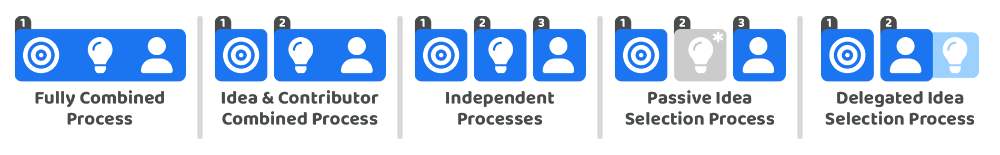

# Contributor incentives

<figure><figcaption></figcaption></figure>

## Applicable disbursement approaches

<figure><figcaption></figcaption></figure>

All of the disbursement approaches are applicable for considering how execution is incentivised. The fully combined process and idea & contributor combined process both attach ideas and/or priorities to the proposals about execution. The applicable disbursement approaches include:

* Fully combined process
* Idea & contributor combined process
* Independent processes
* Passive idea selection process
* Delegated idea selection process

## Contributor submission process

Contributor proposal submissions can be seen as something similar to the submission of a CV or job application. Selected contributors will usually be paid for their contribution efforts to help with the execution of different ideas. This creates a natural incentive for people to submit proposals that cover any information about themselves so that they could be selected and become a compensated contributor. Incentives could potentially be used to help with a referral process to further attract the submission of contributor proposals. Incentives could also be used to reward voters that participate in the selection process.

**Desirable outcomes**

* **Inclusive** - High quality contributors could come from any background and geographic location. The process for submitting contributor proposals can benefit from inviting submissions from a full diversity of different people with different skill sets so that the voters are able to select from a range of potential candidates. Ensuring that the incentives are made available to a wider amount of potential contributors will help with increasing the chances that the contributors that get selected are more representative of the diversity that exists in the community and their preferences.
* **Attracts quality contributors** - The incentives available should be meaningful enough to attract and retain high quality contributors to the ecosystem.

**Concerns**

* **Available skill sets** - The incentives and processes used for contributor submission and selection will determine what skill sets will be available for the execution of ideas. Incentives will need to take into account the different skill sets and skill levels that may want to participate and provide meaningful amounts of compensation to cater for those factors. The process and incentives involved will also need to balance the need for different amounts of each skill set to most effectively execute the most promising ideas.
* **Accurately described skill sets** - Contributors have an incentive to exaggerate their own skill level and ability to increase the chances that they get selected for being selected and compensated. The submission process will need to think about how the claims submitted by proposers can be verified and whether other forms of incentives are needed to moderate this process or how verification steps could be incorporated that help to better automate these checks.

**Potential proposal submission incentive approaches**

* **No incentive** - There is a natural incentive for contributors to submit their professional information and be considered as a potential candidate to help with the execution of ideas. Having no incentives for the submission process could be the simplest and most suitable option.
* **Selection incentive** - A selection incentive may be useful for situations where contributors are referred by other people when joining the submission process. There are risks this process is gamed by people to only extract this compensation. This risk would be more problematic in situations where contributors are not identity checked as this referral incentive could then be more easily and repeatedly abused.

## Contributor **information maintenance**

Selected contributors that start executing different ideas will have new information about them that builds up over time that is relevant to their contribution history and profile information. Monthly contribution reports are one piece of information that could be attached to the contributors information to keep voters informed about the exact contributions made by different people in the ecosystem. There is a natural incentive for contributors to keep this information up to date as it could likely influence how successful they are in future votes where contributors are being selected by the community voters.

**Desirable outcomes**

* **Well maintained information** - The systems and processes in place should ideally help with encouraging and incentivising contributors to keep their information up to date with any contributions they make or any other changes to their personal and professional information. One system level example could be providing some indicator of how up to date someones information is which could then be shown to voters when selecting contributors. This type of awareness could help with better aligning the the incentives for contributors to keep their information up to date.
* **Improved decision making** - The better that contributor information is kept up to date on what contributors have achieved and what they are most interested in working on the easier it should become for voters to decide which contributors could be the most effective at executing different initiatives for the ecosystem.

**Concerns**

* **Biased & missing information** - Contributors have an incentive to exaggerate their competencies or the impact they have generated so far for the ecosystem to help them secure future funding from the treasury. The process for selecting contributors will benefit from making it clear who added the information and which pieces of information are factual or not and how those sources have been verified if at all.

**Potential proposal submission incentive approaches**

* **No incentives** - Contributors have a natural incentive to keep their information up to date to maximise their chances of being selected and compensated for future execution efforts. There isn’t a large amount of information required to keep contributor information up to date which supports an approach of not involving an incentive at this stage.
* **Task incentives** - Task incentives could be suitable if it made sense to have a wider amount of the community being active in updating contributor information instead of just the contributors themselves. Contributors could also receive an incentive for updating this information but this might not make sense if they are already receiving compensation when they are selected for execution efforts. A task incentive could also potentially be used to moderate the information that is being added by contributors.
* **Time incentives** - The accuracy and correctness of the information being added to a contributors profile could be moderated and verified by people who are paid to moderate the information being added. This could be a necessary way to better identify when contributors have been lying or exaggerating about their contributions.

## Contributor execution

Contributor execution involves any of the efforts made by contributors that help with the execution of ideas and measuring the impact of those executed ideas. Incentives for contributor execution handle how peoples contribution efforts are compensated.

**Desirable outcomes**

* **Quality contributors are participating** - The amount of incentives involved in attracting contributors will need to be meaningful enough to attract quality contributors to the ecosystem. These incentives will influence the amount of contributor participation an ecosystem achieves and the diversity of skills available to the ecosystem due to that participation.
* **Tracked contribution outcomes** - Voters benefit from seeing the contribution outcomes made by the different contributors that have been selected to help with execution. The incentives adopted could attach a responsibility for the contributors to provide these contribution updates.
* **Flexibility** - Incentives being attached to the contributor directly instead of ideas can help with giving the contributor the flexibility to contribute to the most impactful ideas.
* **Rewarding good performance** - Contributors can have different skill sets and different amounts of time they want to commit to executing certain ideas. Those with higher skill sets and that offer more time commitment could often be able to execute faster or to a higher quality. An ecosystem benefits from retaining the talent that is most effective at generating impact. Incentives can be used to reward contributors who have exhibited good performance.

**Concerns**

* **Replacing poor contributors** - How contributors are incentivised and the terms of engagement that get adopted will influence how easy it is for ecosystem to remove poor contributors over time. If an ecosystem elected people in perpetuity to receive compensation for their contribution efforts there would be the problem where a vote would be needed to remove that contributor. This can be a reason why term based contribution periods can be beneficial however if these term lengths are too short this reduces financial stability. The approach for incentives will need to balance the need to attract high quality contributors with sufficient income stability against ensuring the ecosystem has an easy and effective ability to remove and replace existing contributors who aren’t performing.
* **Team synergy** - Incentives and where they are attached in the disbursement process can influence how teams are formed and how contributors work together. Incentive design will involve thinking about how collaboration is encouraged through the incentives being used.

**Potential execution incentive approaches**

* **Time incentives** - The simplest way to incentivise peoples contribution efforts is to pay them based on the time they have provided towards executing different ideas. The contributor could suggest the rate in which they are paid for their skill sets and ability or this could be handled by some ecosystem agreed set of value ranges. Time incentives could also offer the flexibility for some contributors to participate for differing amounts of time such as one, two, three or four days per week instead of five days per week.
* **Performance incentives** - Performance incentives can play an important role in responding to situations where some contributors have out performed others in their execution of ideas. It can be difficult to predict the performance of people ahead of time and peoples performance can also change over time. Performance incentives can be an effective way to respond to what actually happened in terms of the outputs that each contributor helped to generate.
* **Task incentives** - Certain areas of execution may require certain skill sets with a defined scope of execution. Some examples could be video or image editing, bug fixes or paid feedback processes. Execution tasks with more limited or well defined scope could be suitable for task based incentives.
* **No incentive** - Some situations could exist where people decide to provide their contribution efforts for free. This could be because it is a charitable gesture or they are incentivised through other reasons. The larger that the time commitment or complexity is for the contribution efforts provided the less likely this approach may make sense over the long term for the many of the available contributors who may likely need financial income and stability. If other forms of incentives were adopted such as universal basic income there may be a growing number of reasons why a larger amount of people have the time and capacity to allocate their time to execute impactful things without needing to be concerned about the securing a certain amount of income.
