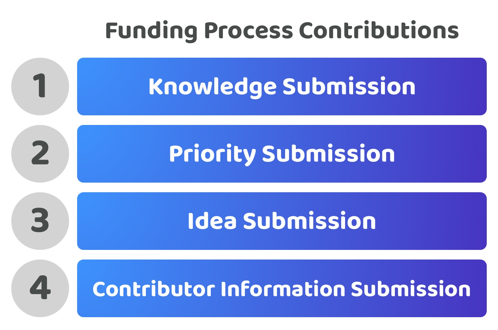

# Contribution approaches

<figure><figcaption></figcaption></figure>

Contribution towards the funding process concerns any suggestions contributors can make towards what knowledge, priorities, ideas and contributors could be promising or important for the community to consider. How information is submitted, stored and connected across the funding process can have a significant impact on how the funding process functions and scales.

<figure><figcaption></figcaption></figure>

1. **Submit Knowledge** - Contributors could share informational resources that could be useful for the ecosystem to consider. Some contributors may also submit their own research and analysis to help better inform the community on what is happening both inside and outside the ecosystem.
2. **Submit Priorities** - Contributors can contribute to ecosystem prioritisation by suggesting what the most important problems or opportunities are in the ecosystem that might be worth considering.
3. **Submit Ideas** - Contributors could suggest ideas which detail how a certain initiative could be executed and the potential value that initiative could generate for the ecosystem.
4. **Submit Contributor Information** - Contributors might want to help with the execution of ideas and start building a reputation in the ecosystem by submitting their personal and professional information and any contribution history for the community to then consider.

## Approaches for handling knowledge, priority, idea and contributor information submissions

The following are some example approaches that cover how submissions could be handled to enable contributors to make suggestions within a funding process:

* [**Fully combined submissions**](fully-combined-submission.md) - Suggestions cover information about any relevant knowledge, priorities, idea and contributors in a single submission.
* [**Idea & contributor combined submissions**](idea-and-contributor-combined-submissions.md) - Suggestions separate knowledge and priorities and then ideas and contributors into two separate submission processes.
* [**Independent submissions**](independent-submissions.md) - Suggestions for knowledge, priorities, ideas and contributors each have their own separate submission process.

To compare these decision approaches a number of [factors have been considered](contribution-factors-for-consideration.md) and then applied to each approach to try and determine any strengths and weaknesses of each one.

<figure><figcaption></figcaption></figure>

There are further ways you could group together the submission of knowledge, priority, idea and contributor information. However the above comparison helps to highlight that the most expressive, lowest complexity and lowest time required approach to participate in funding is best achieved by keeping the submission for these processes independent from one another.

**Contribution approaches analysis**


[contribution-factors-for-consideration.md](contribution-factors-for-consideration.md)



[fully-combined-submission.md](fully-combined-submission.md)



[idea-and-contributor-combined-submissions.md](idea-and-contributor-combined-submissions.md)



[independent-submissions.md](independent-submissions.md)


## Further advantages for an independent submissions approach

There are a number of further advantages for handling funding submissions separately that can be highlighted.

**Better data structure for increasing usability, composability, reusability & maintainability**


[disbursement-process-data-handling.md](disbursement-process-data-handling.md)


**High flexibility to experiment with funding decision approaches**

Keeping these submission processes separate means the funding process can compose this information into proposals for decisions in any way the community prefers. When information is initially submitted into the funding process it does not require a community decision. The composition of information to create a decision can happen at any point with a combination of the information that has been previously submitted. The benefits of being able to compose these decisions out of independent submissions is the community is able to change their mind on what decision approach they want to adopt. Alternatively they could also adopt multiple approaches to experiment with different approaches for different use cases.

**Opportunity to increase collaboration & feedback**

Allowing people to submit suggestions for any of the relevant funding areas independently and separately from decision making allows a community to have the maximum opportunity to engage and respond to the information that is submitted. Establishing community sentiment, feedback and team forming could all occur due to the submission of new information such as new ideas or contributors who are interested in getting involved in the ecosystem. The faster an ecosystem is able to view and respond to this information the faster that any collaboration and feedback can occur. Higher collaboration can lead to discovery of new approaches to solving important problems, better knowledge curation and a higher depth of information being shared which could help improve future funding decisions.

**Enabling contributor specialisation**

By giving contributors the full ability to submit suggestions in a way that they might want to, there is increased ability for contributors to specialise on the areas that they are most experienced or interested in. For instance by having an independent submission process for priorities a contributor who wants to specialise in understanding the knowledge available in an ecosystem and then translating that into important priorities could do so. Alternatively another contributor could just be a skilled software developer that wants to contribute to the ecosystem. That contributor might not have any ideas that they want to suggest to the ecosystem at the moment but they do want to join the existing efforts. This contributor could achieve that by submitting their contributor information with the indication that they are interested in working in the ecosystem. By keeping that process independent the community now can easily and more quickly respond and invite that person to collaborate with them on existing ideas if it made sense to do so. Keeping the funding process submissions independent helps to enable contributors to participate in the exact way they want to.

**Opportunity to increase information flow & response speed**

Keeping the submission of suggestions for knowledge, priorities, ideas and contributors separate allows contributors to submit this information more immediately than having to gather and collect multiple pieces of information about other processes if they were combined. This potential increase in the speed of information flow can help make the ecosystem more responsive to important and useful information. For knowledge submissions, this could mean some new insight or piece of data becomes available that completely changes the understanding of the current environment and what is and isn’t important for the ecosystem. For priorities this could mean the identification of a sudden critical issue that might have just emerged and it’s vital that this information propagates across the ecosystem and is resolved as fast as possible. For ideas this could mean getting feedback and starting team formation on promising ideas as soon as they are conceived as an idea rather than having to wait for a decision process or having to be more fully formed at the point of submission. For contributors this can mean being able to immediately indicate their willingness and capability to contribute to the ecosystem so that other community members can immediately see this and respond to that contributor.

**Opportunity for contributors to immediately start building reputation**

Contributors would be able to participate with more specific submissions that they believe add value to the ecosystem, this can help them with building a reputation in the ecosystem. If contributors were able to submit their personal information as a potential contributor they could also be enabled to submit contribution logs to showcase how they’ve been participating and working in the ecosystem. This allows them to build up evidence of why they are useful and impactful for the ecosystem. The community benefits from this as they can then consider that contributor as a potential candidate to receive compensation from the treasury in future funding decisions if they have evidence of their ongoing impact.
