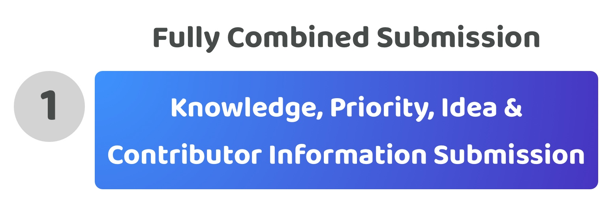

# Fully combined submission

<figure><figcaption></figcaption></figure>

**Overview**

A fully combined submission means that a contributor suggestion for the disbursement process will include any relevant knowledge, priority, idea and contributor information in the same submission.

<figure><figcaption></figcaption></figure>

**Very high contributor participation time required (Score - 1)**

For contributors to participate they have to spend the largest possible amount of time to create a suggestion. They will need to gather and submit relevant information that covers knowledge, priorities, idea information and contributors that could execute the idea in a single suggestion. The contributor would need to spend time doing all of the background research and analysis to understand the potential priorities that exist, suggest the most important priorities in their submission, think and decide on a suitable idea, and then finally find a team of other suitable contributors to work on this initiative. The time this would take would be very high, making it very difficult for many contributors to practically participate if this approach was adopted.

**Very high contribution complexity (Score - 1)**

Each disbursement process requires a mixture of different knowledge and skills. Combining these disbursement processes into a single submissions results in the contributor having to have a lot of knowledge about what is happening in the ecosystem and what problems and opportunities exist, they need to then have the skill to effectively to compare and understand which potential priorities might be the most important, then turn that priority into a suggested idea and finally articulate how it would be executed along with identifying any other community members that would be suitable and keen to support the execution of that idea. The approach could easily require research, analytical, marketing and recruitment skills in the same submission as well as some relevant domain expertise in the idea actually being suggested. Due to this combination of different factors this contribution approach is highly complex.

**Very low contribution expressiveness (Score - 1)**

If a contributor just wanted to suggest a piece of knowledge as relevant to an ecosystem or suggest that a new priority might be more important than the existing ones they would not be able to do so using a combined submission approach. Instead they would need to submit an entire proposal that covers every part of the process. This is the least expressive the system could be for enabling these different forms of contribution.

**Total score = 3 / 15**
