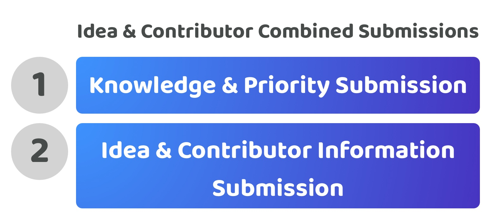

# Idea & contributor combined submissions

<figure><figcaption></figcaption></figure>

**Overview**

The idea and contributor combined submission approach separates the funding processes into a knowledge and priority submission and an idea and contributor submission. The submissions should be able to reference the submission data from other processes, for instance an idea and contributor combined submission should optionally be able to reference an existing knowledge and priority combined submission.

<figure><figcaption></figcaption></figure>

**Moderate contributor participation time required (Score - 3)**

Contributors are able to select which area of funding they want to contribute towards with more flexibility using a separated approach. Now contributors would only need to spend time submitting knowledge and priorities to make a submission or alternatively could look at suggesting ideas along with the contributors that could help with executing those ideas.

**Moderate contribution complexity (Score - 3)**

Not every piece of knowledge needs to be submitted with a priority and vice versa just like an idea doesn’t need to have contributors ready to execute it for it to start receiving feedback. Requiring this combined information in both these two submissions approaches increases the complexity for contributors to bring together the required information for them to participate instead of letting them contribute with only the relevant information that they wanted to provide.

**Moderate contribution expressiveness (Score - 3)**

Contributors can more easily suggest multiple different ideas to address the numerous priorities that could exist, however they are still limited in that they would need to define the contributors that would be working on those ideas.

**Total score = 9 / 15**
