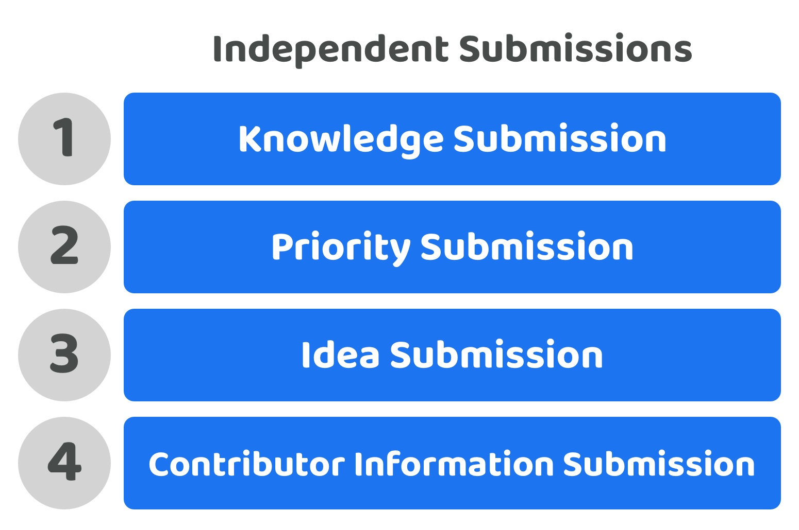

# Independent submissions

<figure><figcaption></figcaption></figure>

**Overview**

Independent submissions means that submitting suggestions for knowledge, priorities, ideas and contributor information are handled as independent submission processes. Submissions can happen independently and would not rely on other disbursement process submissions. The submissions should also be able to reference the submission data from other processes, for instance ideas should optionally be able to reference any existing priorities that have been submitted.

<figure><figcaption></figcaption></figure>

**Very low contributor participation time required (Score - 5)**

Contributors could create submissions in one or all of the disbursement processes whether that’s suggesting priorities or ideas or suggesting that they could be a potential contributor to help with execution. If a contributor only wanted to submit their own contributor information then they would be able to do so which reduces the time required to participate as they wouldn’t have to spend time on other processes in disbursement if they didn’t have anything valuable to suggest at that stage.

**Very low contribution complexity (Score - 5)**

The contributor who is submitting any suggestions for knowledge, priorities, ideas or their own contributor information only needs to understand the data and format required for that specific submission they are making. This reduces complexity to the minimum as contributions only need to understand and bring together the information required for that submission rather than multiple processes in a single submission.

**Very high contribution expressiveness (Score - 5)**

Contributors can make submissions in the exact processes they want to and do not need to spend time on areas they have less expertise in or that they aren’t interested in. One contributor could decide to spend all their time applying knowledge to create and improve priorities and then spend no time on suggesting ideas or finding contributors to execute those ideas. Contributors would be able to highly express their preferences on how they want to participate in supporting the disbursement process.

**Total score = 15 / 15**
