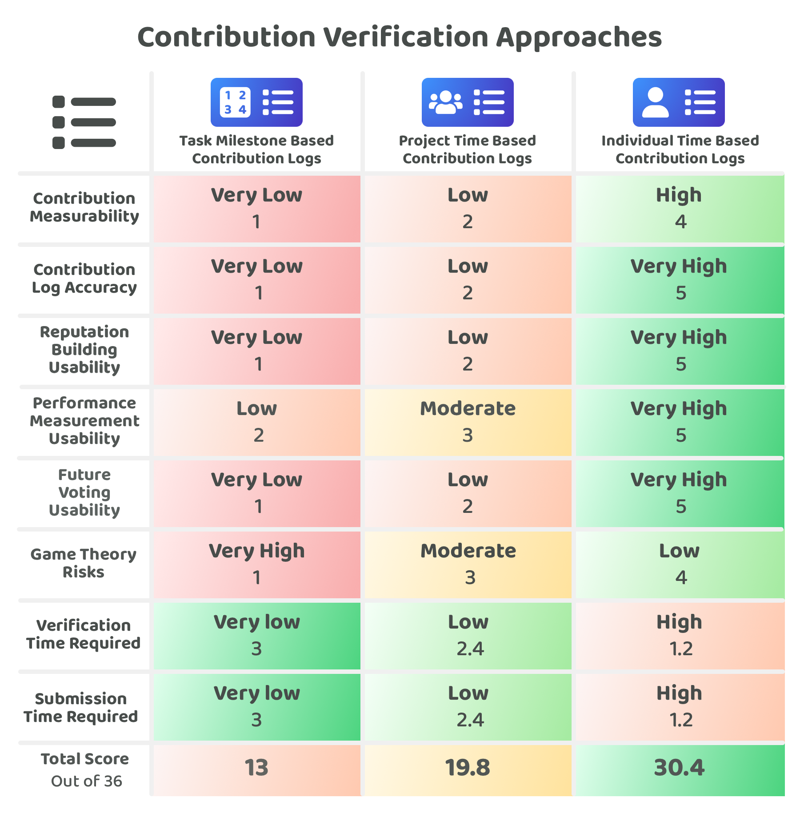

# Contribution verification approaches

<figure><figcaption></figcaption></figure>

Contribution verification is where contributors submit evidence about their contribution efforts and the community can then check and verify those outputs. Disbursement can benefit from having a verification process to reduce the risk of bad actors trying to steal community funds. Verification can also help future decision making if a community can more easily determine if the execution outputs made by different individuals and teams is sufficient for the compensation they are receiving.

The importance of contribution measurability is of high relevance for establishing a more scalable approach for verifying contribution efforts:


[importance-of-contribution-measurability.md](importance-of-contribution-measurability.md)


## Approaches for verifying contribution outputs

There are three main approaches that have been compared to consider how contributors could submit contribution logs to showcase their recent efforts:

* [**Task milestone based contribution logs**](task-milestone-based-contribution-logs.md) - A contribution log records the completion of the milestone tasks involved in a project.
* [**Project time based contribution logs**](project-time-based-contribution-logs.md) **-** A contribution log records a projects execution outputs after a set period of time.
* [**Individual time based contribution logs**](individual-time-based-contribution-logs.md) - A contribution log records an individuals execution outputs after a set period of time.

To compare these contribution verification approaches a number of [factors have been considered](contribution-verification-factors-for-consideration.md) and then applied to each approach to try and determine the strengths and weaknesses of each one.

<figure><figcaption></figcaption></figure>

**Key takeaways**

* **Automation of submission and verification** - The time it takes to submit contribution logs and verify the outputs should reduce over time due to new tools and processes becoming more available. This results in these two factors becoming increasingly less important over time as much of the data that would be added can be automatically verified when the right systems are in place. This means the ongoing important factors are around contribution measurability, accuracy of the information provided and reducing the ongoing game theory risks. All of the suggested approaches benefit from automating the submission and verification of different contribution outputs. For instance, code commits or document submissions and verifying who has made these contributions would be some examples areas that can be increasingly standardised and automated over time. This will make it simpler for contributors to automatically log their contribution efforts and for the community to be confident in who was responsible for different contributions.
* **Individual time based contribution logs approach is preferred** - Out of these three approaches the most effective approach for making it easy and scalable for community moderators to handle verification is the individual time based contribution logs approach. An ecosystem could also adopt either a task based milestone contribution log approach as well as an individual time based contribution log approach if they wanted. Due to the contribution logs being more standardised than the other approaches the individual contribution logs approach improves more quickly over time due to the data that is gathered being more easily comparable.

## Contribution verification analysis


[contribution-verification-factors-for-consideration.md](contribution-verification-factors-for-consideration.md)



[task-milestone-based-contribution-logs.md](task-milestone-based-contribution-logs.md)



[project-time-based-contribution-logs.md](project-time-based-contribution-logs.md)



[individual-time-based-contribution-logs.md](individual-time-based-contribution-logs.md)



[importance-of-contribution-measurability.md](importance-of-contribution-measurability.md)

