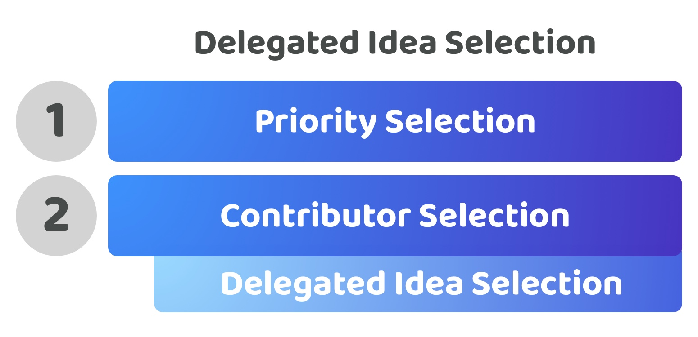

# Delegated idea selection

**Overview**

Delegated idea selection is where the actual voting power for selecting the ideas that get executed is given to the contributors who are selected by the voters. This means that community members would not directly have authority over which ideas must be executed. Instead they would have authority on which contributors they think will be most effective at addressing ecosystem priorities and selecting and working on the most promising ideas. The idea selection process itself can still be fully open, transparent and invite participation and voting from all of the community members. Community votes on the most promising ideas would provide invaluable information to the selected contributors on which ones they might decide to spend more time on. However the actual decision on which ideas get executed is left with the contributors. The contributors have a direct incentive to pick the most promising and impactful ideas as this will increase the chance that they are selected again in the future to contribute to the ecosystem. The main difference with this approach to a passive idea selection process is the contributors are who is responsible for selecting the ideas that get executed instead of the voters.

<figure><figcaption></figcaption></figure>

**Very low voter participation time required (Score - 5)**

Voters could participate in either priority or contributor selection. The voters are only responsible for determining what priorities and contributors are preferred and selected. Voters may optionally participate in the idea selection process however they would not have any voting power and would just be expressing their opinions and preferences that the contributors working in the ecosystem can then respond to and consider.

**Very low voter decision complexity (Score - 5)**

Each voter decision on priorities and contributors can be done so individually meaning voters only need to compare a limited amount of things when making each decision. This complexity is even further reduced with this approach as the idea selection process is delegated to the contributors who are selected. The voters could optionally participate in the idea generation and selection process though this wouldn’t be required.

**Very high voter expressiveness (Score - 5)**

Voters are able to share their exact preferences on the priorities, ideas and contributors they prefer by voting on them individually. Voters do not have to make any compromises when deciding what proposals and suggestions match their opinions and preferences. This approach still have a very high expressiveness as idea selection can still be fully open to the community so they can indicate their preferences through a vote. The key difference is those preferences don’t result in the voter having full control over the outcomes of the disbursement process.

**High disbursement outcome influence (Score - 4, Multiply by importance of 4/5 or 0.8, Final Score - 3.2)**

The voters decision will influence exactly what priorities and contributors are preferred which highly influence how contribution efforts are being directed as contributors would be responsible for executing ideas that help with addressing those priorities. Voters would still also be able to vote on what their preferred ideas are for addressing those priorities however the outcome of which ideas actually get executed will be left to the selected contributors to decide. If contributors ignore these suggestions completely without good reason they are likely to not be elected again in future rounds. This incentive structure results in voters still having a high influence in the disbursement outcome.

**Very low voter decision change complexity (Score - 5)**

Voters would be able to use the exact same decision processes for any future changes about which priorities and contributors are most important and suitable for the ecosystem. Voters indirectly have influence over the idea selection through the fact that if they change priorities the future ideas being selected should be targeted at addressing those priorities. Voters could also still indicate their changing preferences in the most promising ideas through a community voting process. Although that change in community preference can easily be recorded, the contributors are still who determine whether they will move their current contribution efforts to a new and emerging idea that is deemed more promising.

**Total score = 23.2 / 24**
