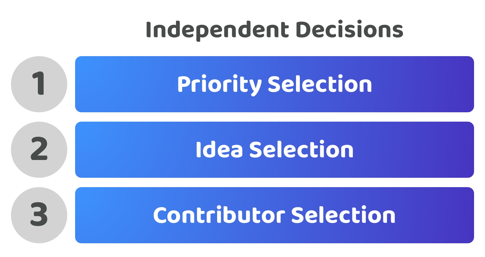

# Independent decisions

<figure><figcaption></figcaption></figure>

**Overview**

Independent decisions means that the selection of priorities, ideas and contributors all happen in separate processes. These independent decisions could happen periodically one after another or they could all be ongoing continuous processes.

<figure><figcaption></figcaption></figure>

**Moderate voter participation time required (Score - 3)**

Voters could participate in one or all of the disbursement decisions around selecting priorities, ideas and contributors. This approach gives the voter the full freedom to participate in whichever decisions they want to for the disbursement process. The reason this approach still has moderate complexity is due to the amount of time it would take for voters to understand and compare decisions across all of these processes. The idea selection process can easily be the most demanding in terms of time required to understand and analyse the ideas submitted. This high time requirement to compare ideas provides sufficient rationale why voters may potentially decide to disengage from the process as it scales in size due to the time it would take to cover and understand such a wider range of focus areas.

**Moderate voter decision complexity (Score - 3)**

Each voter can decide between the priorities, ideas and contributors individually. Voters only need to compare a limited amount of information for each separate decision rather than having to take into account all of these factors at once in different combinations. This approach helps remove the complexities that emerge from combining different processes together. The main complexity that remains is that voters will still need to actively look to understand and compare potentially complex ideas to properly participate in idea selection under this approach. This process can be time consuming and highly complex for people who may not have a matching skill set to fully understand the potential impact and feasibility of each of the ideas submitted.

**Very high voter expressiveness (Score - 5)**

Voters are able to select the exact priorities, ideas and contributors they prefer individually. Voters do not have to make any compromises when making decisions that match their opinions and preferences.

**Very high disbursement outcome influence (Score - 5, Multiply by importance of 4/5 or 0.8, Final Score - 4)**

The voters decision will influence exactly what priorities, ideas and contributors are preferred which will directly influence how contribution efforts are being directed through the selection of proposals in each process.

**Very low voter decision change complexity (Score - 5)**

Voters would be able to use the same decision processes with minimal modification for future decisions about making changes to which priorities, ideas or contributors are most important for the ecosystem. Contributors could make new suggestions for new priorities, ideas or contributors to help with executing those ideas at any point by operating these processes separately.

**Total score = 20 / 24**
