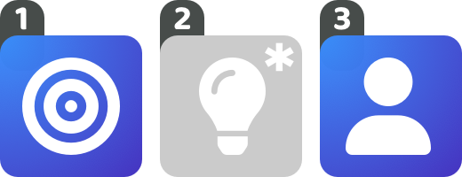
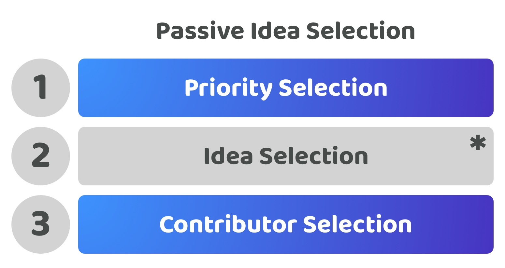

# Passive idea selection

<figure><figcaption></figcaption></figure>

**Overview**

This decision approach includes the same ability for voters to select priorities, ideas and contributors that the independent decision approach does. The main difference is that under this approach these is an acceptance that there is not a goal of continuously trying to increase voter participation in the idea selection process. Instead only priority and contributor selection is highly encouraged. Community members who have relevant skills or a particular interest in certain idea focus areas are left to participate in the idea process. The voters decision on which ideas are selected and executed is still authoritative with this approach, the voters decide on which ideas are executed.

<figure><figcaption></figcaption></figure>

**Low voter participation time required (Score - 4)**

Voters could participate in one or all of the different decisions involved with selecting priorities, ideas and contributors. This voter has the full freedom to participate in whichever decisions they want to for the funding process. The main areas that the ecosystem encourages is participation in priority selection and contributor selection which results in reducing the total average time required for voters to participate.

**Low voter decision complexity (Score - 4)**

Each voter can decide between the priorities, ideas and contributors individually. Voters are mainly just encouraged to try and vote on the priority and contributors being selected. This helps to reduce the overall decision complexity as if voters don’t feel the need to understand and compare every idea that gets suggested in the ecosystem they are more likely to just participate in areas they feel are either necessary to support or areas they are interested in or have expertise in that are relevant.

**Very high voter expressiveness (Score - 5)**

Voters are able to select the exact priorities, ideas and contributors they prefer individually. Voters do not have to make any compromises when making decisions that match their opinions and preferences.

**Very high funding outcome influence (Score - 5, Multiply by importance of 4/5 or 0.8, Final Score - 4)**

The voters decision will influence exactly what priorities, ideas and contributors are preferred which will directly influence how contribution efforts are being directed through the selection of proposals in each process. The only key difference in this approach is that voters are not actively encouraged or expected to vote on every idea, however as mentioned the outcome of any decision from voters is still authoritative on what ideas will actually be executed. This means this approach has a very high influence on the outcomes of funding.

**Very low voter decision change complexity (Score - 5)**

Voters would be able to use the same decision processes with minimal modification for future decisions about making changes to which priorities, ideas or contributors are most important for the ecosystem. Contributors could make new suggestions for new priorities, ideas or contributors to help with executing those ideas at any point by operating these processes separately.

**Total score = 22 / 24**
