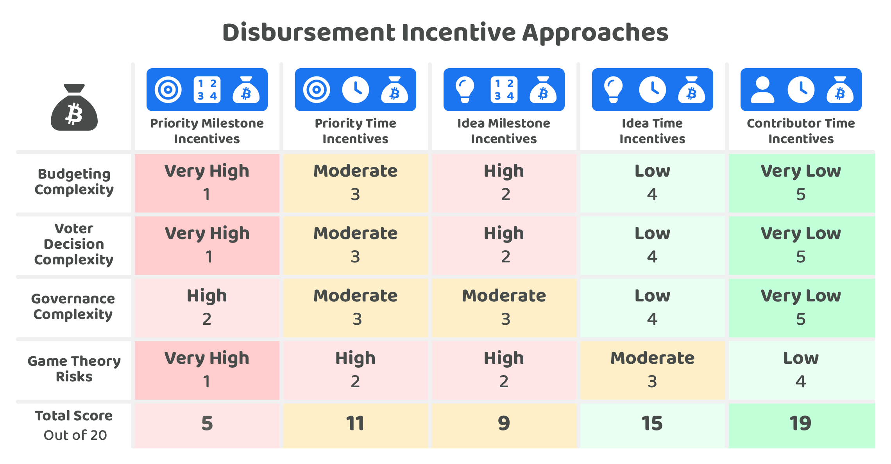

# Incentive approaches

<figure><figcaption></figcaption></figure>

Incentives could be attached to any of the disbursement processes during priority, idea or contributor selection. How these incentives get distributed across any of these processes can also be different. How incentives are handled in disbursement will have a direct impact on determining the budgeting, decision and governance complexities that emerge and each of these approaches will need to consider the game theory risks that could occur.

## Incentive approach criteria

The criteria for any approach in this comparison is that the incentive approach must be able to handle the bulk of the incentives being disbursed from an ecosystem's treasury. This means that the approach should be suitable and capable of handling 50% to 100% of the incentives that will be disbursed.

The execution incentive approaches that were not suitable for handling the majority of the incentives being disbursed have been identified with the applicable rationale:


[unsuitable-incentive-approaches.md](unsuitable-incentive-approaches.md)


Any of these incentive approaches can benefit from introducing other supplemental incentive approaches to enhance the effectiveness of that specific incentive approach. This comparison is only concerned with approaches that could handle a majority portion of the incentives for a growing ecosystem.

## Approaches for handling incentives in disbursement

The incentive approaches for comparison include:

* [**Priority milestone incentives**](priority-milestone-incentives.md) - Incentives are distributed to directly address priorities, how the priority will be addressed is broken down into milestones.
* [**Priority time incentives**](priority-time-incentives.md) - Incentives are distributed to directly address priorities, an amount of compensation is requested to pay for the time the contributors will allocate towards addressing that priority.
* [**Idea milestone incentives**](idea-milestone-incentives.md) - Incentives are distributed to execute ideas, how the idea gets executed is broken down into milestones.
* [**Idea time incentives**](idea-time-incentives.md) - Incentives are distributed to execute ideas, an amount of compensation is requested to pay for the time the contributors will spend on executing that idea.
* [**Contributor time incentives** ](contributor-time-incentives.md)- Incentives are distributed to pay for the time that contributors allocate to executing different ideas.

To compare these disbursement incentive approaches a number of [factors have been considered](incentive-factors-for-consideration.md) and then applied to each approach to try and determine the strengths and weaknesses of each one.

<figure><figcaption></figcaption></figure>

**Key takeaways**

* **Milestones increase budgeting complexity** - Contributors need to spend a far larger amount of time planning out the execution of an idea or the efforts involved to address a priority if the incentive has to be attached to milestones being completed. This incentive attachment to tasks increases the complexity of contributors needing to be accurate with their estimations. This is exceptionally difficult when those contributors might be working on novel ideas and research and the environment they are working in is constantly changing as well as external factors. Any mistake in the milestones can easily lead to under compensation or large delays in future payments which increases compensation tensions and can also lead to exploitation through unpaid contribution efforts.
* **Milestones increase voter complexity** - If the incentives are attached to priorities being addressed or ideas being executed there is an increased complexity for voters in determining whether those compensation requests are fair and reasonable. The reason for this is that each proposal can be focussing on different priorities and ideas and be executed very differently than other proposals. The result of this is that each milestone is unique and different from all others. This means that voters cannot easily compare and judge what is fair and reasonable based off one of their previous efforts to fully understand a proposal. Each time a voter wants to review a proposal they will need to understand the proposal more broadly and then specifically look at the milestones and scope in sufficient detail to make a judgement on each milestone. This is in contrast to time based incentives where the voters can instead learn the market data about what is fair and reasonable for different skills and roles and then apply this knowledge to compare every contributor that is requesting compensation.
* **Milestones increase game theory risks** - The more ability a disbursement process gives the contributor to self determine the tasks and budget the more the opportunity they give them to exaggerate and lie about what will be executed and how long it will take. As the scope of work increases the opportunity and ease of getting away with this only increases further due to the high complexity for the voter to accurately determine what is fair and reasonable. This means that the further away you move the incentives away from the contributors and towards high level priorities the riskier the incentives become for enabling bad actors. It is far more difficult to be malicious with contributor based compensation as the salary ranges and experience levels are not unique to each proposal and that information helps to keep any voters informed on whether someone is under or over requesting compensation.
* **Majority of incentives will go to contributors** - When you consider how the incentive is actually used within any of these incentive approaches a key thing to point out is that the majority of incentives will end up being used to pay for contributors and their execution efforts. This means that adding wrappers around how those incentives are distributed by attaching them to ideas or priorities simply means that the disbursement process is creating an intermediary step between how funding moves from the treasury to the contributors who will get paid for execution efforts.

**Additional approaches for consideration**

* **High level budgets** - An ecosystem could allocate budgets across different high level areas that are important to the ecosystem. Each of those budgeted areas could have the same or separate disbursement systems and processes which adopt any of the incentive approaches mentioned above. The important areas for an ecosystem could be broken down in a number of ways. One approach could be skill & responsibility based such as marketing or software development, another approach could be market based such as DeFi or AI.

**Decision approaches analysis**


[incentive-factors-for-consideration.md](incentive-factors-for-consideration.md)



[priority-milestone-incentives.md](priority-milestone-incentives.md)



[priority-time-incentives.md](priority-time-incentives.md)



[idea-milestone-incentives.md](idea-milestone-incentives.md)



[idea-time-incentives.md](idea-time-incentives.md)



[contributor-time-incentives.md](contributor-time-incentives.md)


## Idea cost approaches

The majority of funding for executing ideas is often used for compensating the contribution efforts that are made by the individuals involved in the execution of those ideas. Ideas can also require different assets, products or services to help with generating the intended outcome. These costs for the different assets, products or services will need to be handled by the disbursement process. There are a few approaches for how idea costs could be handled:


[idea-cost-approaches](../../approaches/incentive-approaches/idea-cost-approaches/)


## Considerations for incentivising the submission and maintenance of information

The majority of incentives will be used to help compensate for the contribution efforts made to execute different ideas. Incentives could also be useful for encouraging the submission of information such as proposals or they could also be used for compensating contributors to maintain information that is important to the ecosystem. Considerations for submission incentives and the maintenance of information can be found here:


[proposal-submission-incentives.md](proposal-submission-incentives.md)



[maintenance-of-information-incentives.md](maintenance-of-information-incentives.md)

