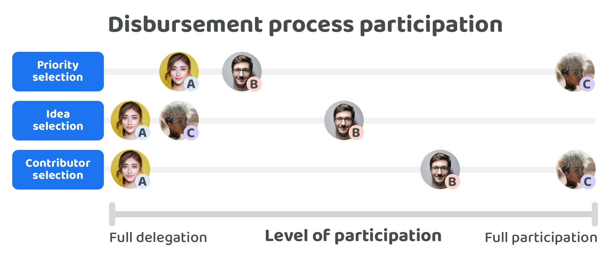

# Delegating process decisions

Understanding the importance of voting delegation is the acceptance that not everyone in an ecosystem has to fully participate in every decision that gets made. Delegation is an important part of giving voters a choice in how they want to participate and making it easier for complex ecosystems to scale through making it easier and more flexible to vote.

Community members should be able to participate in the areas they care about which could be areas they have are most interested in or that they have the most expertise or knowledge in. For areas that someone is less interested in, have less capacity for or don’t have the same levels of experience or knowledge those same community members may decide to delegate their vote to other people in the community.

You cannot prevent people from delegating their vote to other people as the ability to delegate could be achieved independent of any existing system or process. For instance, one community member may have a good understanding of finance and what is happening in that area of the ecosystem but have little understanding of what is happening in the gaming area of the market. In this event the community member may decide to simply identify anyone they trust or respect in the ecosystem and find out what their opinion online is or ask for it on how they would allocate their vote for gaming related disbursement decisions. This person would then vote for those options themselves, however the decision itself was actually delegated to someone else who helped them make it for them. A systemised version of delegation would instead allow the voter to delegate their voting power to these other peoples digital voting account or wallet. The benefit of this approach is then it is very clear how people are participating in the ecosystems governance and help highlight what percentage people are participating in the decisions made versus delegating them to other community members.

## Example differences in community member participation

<figure><figcaption></figcaption></figure>

The above example helps to illustrate how different people may want to participate in an ecosystems disbursement decisions:

* **Person A** - Person A has little capacity or interest in participating in the governance decisions needed for treasury asset disbursement. They have other interests and commitments outside of the ecosystem. They are part of the ecosystem and care about its future but simply don’t have the time available to commit to making well informed decisions. Person A does have some knowledge and opinions towards what priorities are most important for the ecosystem based on their own involvement and knowledge, these areas are all Person A votes on themself. For the remainder of the disbursement decisions person A prefers to delegate their vote to other community members whom they trust.
* **Person B** - Person B actively contributes to the ecosystem and because of this has a thorough understanding of what ideas are feasible and impactful for the areas of work they are contributing towards. They participate in some of the priority selection that is relevant to that work and delegate the rest to other people who they know have a good understanding of the other areas in the ecosystem. As Person B interacts with many of the contributors in the ecosystem they have experience working with many of them meaning they are well informed and like to participate in selecting which contributors are most suitable and effective for the ecosystem.
* **Person C** - Person C spends a lot of time understanding what is happening in the ecosystem and the key problems and opportunities that are emerging across the industry, in technology generally and within the ecosystem itself. They apply this depth of understanding to help with comparing and voting on every different suggested priority in the ecosystem and then spend the remainder of their time looking at which contributors would be the most suitable for achieving the priorities which are most important. Person C is not part of the execution itself and doesn’t currently have the capacity to fully understand the implications of each of the ideas that get presented. For any idea decision areas they have instead delegated most of that responsibility to the contributors that they identified and selected due to their skill sets and experience.

<figure><figcaption></figcaption></figure>

**What could be delegated?**

The knowledge available within an ecosystem is what will get used and applied by community members to all of the disbursement processes. On its own knowledge is not a process that is delegated. Instead it is more of a combination of delegating the process of understanding and applying an ecosystem's knowledge with one of the other disbursement processes of selecting and voting on which priorities, ideas or contributors are most important or suitable.

**Why might people delegate?**

It will be difficult to expect every person in an ecosystem to spend the time required to learn and apply all of the information available to make well informed decisions that cover the entire disbursement process. If people want to have more control and agency over how they use their time and how they want to participate it will make sense for those people to have the choice to delegate some or all of that responsibility of understanding different knowledge areas to apply to the disbursement process decisions to someone else when this is necessary.

**Who could people delegate to?**

Ecosystem members would be delegating their vote to other community members for situations where those community members can effectively help with selecting suitable priorities, ideas or contributors.

**Overall likelihood of delegation**

For larger ecosystems the likelihood of people needing to delegate their vote for some of the different areas of the ecosystem is very high due to the sheer amount of information they would have to consume and apply to understand what is happening in the wider ecosystem. Due to this high complexity it might be likely that people decide to delegate some or all of their vote towards people who can handle some or all of the priority, idea and contributor selection processes for certain knowledge areas they are less interested in or have less capacity to contribute towards.

<figure><figcaption></figcaption></figure>

**What could be delegated?**

Creating and selecting good priorities revolves around understanding and applying the available information in an ecosystem to make more informed decisions on what the most pressing problems and opportunities are for the ecosystem to address.

**Why might people delegate?**

A community member may decide to delegate some or all of this responsibility to someone else in the community due to their lack of time or experience in different areas of knowledge required. The reasons to delegate priority creation and selection would be because of the need to have a thorough understanding of different ecosystem areas to make well informed prioritisation decisions. Some people may want to participate in this entire process however others may only want to participate in a subset of areas that they want to allocate their time to due to their own personal interests or experience. Others may not be interested in participating at all but do have a preference on who is suitable for helping with setting priorities.

**Who could people delegate to?**

Community members would delegate their vote to other community members which are contributing towards priority creation and selection.

**Overall likelihood of delegation**

The larger and more complex an ecosystem becomes the more likely it will be that people do not have the full capacity or interest to fully understand the knowledge required to make well informed priority setting decisions that take into account the current situation across the wider ecosystem. In this scenario many voters may decide to delegate some or all of their vote to other individuals that can effectively handle the prioritisation process in each of these important areas.

<figure><figcaption></figcaption></figure>

**What could be delegated?**

Ideas are created to help address the different priorities. The process of creating ideas is already delegated to whomever decides to contribute towards creating solution ideas that could help with addressing any of the ecosystems current priorities. The selection of which ideas are the most promising would be the decisions that are potentially suitable for being delegated to someone else.

**Why might people delegate?**

The ideas generated to address priorities could cover a range of possible ideas. Each of these ideas could be applying a vast variety of skill sets, technology and approaches. Due to this there could be a moderate to high amount of complexity and depth of understanding required to actually understand whether an idea would actually work and how it would help the ecosystem. If someone has never created a software application before it would make it more difficult for them to assess the feasibility and quality of the technical aspects of these ideas. A skills or experience gap would be a key reason people might decide to delegate their vote to another community member who is more suitable to assess those types of idea.

**Who could people delegate to?**

Community members could delegate their vote to either other voting community members or to the contributors who are executing these ideas.

**Overall likelihood of delegation**

Ecosystems that have a higher complexity of ideas that go through the disbursement process could expect a larger need for voters to be able to delegate some or all of their vote to people that have the required expertise and knowledge to understand the potential impact and feasibility of those different ideas. Another reason for potential delegation is because of the sheer amount of ideas that could be suggested to address different priorities. In this event it would likely be that a high amount of participation would be needed to compare and understand the full potential of these ideas suggested. Either of these scenarios increases the likely need for delegation due to the scale of participation required or the overall complexity.

<figure><figcaption></figcaption></figure>

**What could be delegated?**

The execution of ideas is already delegated to contributors that get selected by the ecosystem. The main area of focus is whether the contributor selection process is delegated or not that determines which contributors are compensated to execute the most promising ideas.

**Why might people delegate?**

Community members need to understand the priorities that get selected, at least roughly understand the most promising ideas in the ecosystem and then also have a sufficient enough understanding of the skills and experience required in these different areas to make well informed decisions on which contributors would be most suitable. Community members may not have the capacity or interest in understanding the available knowledge, priorities and ideas enough to then select the right contributors for the ecosystem.

**Who could people delegate to?**

Community members may decide to delegate some or all of their vote to other community members to help with deciding who should be selected as a contributor.

**Overall likelihood of delegation**

Community members don’t necessarily need to have a large depth of understanding of the wider ecosystem knowledge to participate in contributor selection. If a community member is sufficiently happy with the execution of the priority setting process then they could simply decide to just participate in voting on which contributors would be suitable for addressing those priorities. The higher the complexity of the ideas required to address these priorities the more there would be a need for the voters involved to understand the surrounding knowledge and possible ideas so they can apply this knowledge more rigorously for determining which contributors would be effective at executing those more complex ideas.
