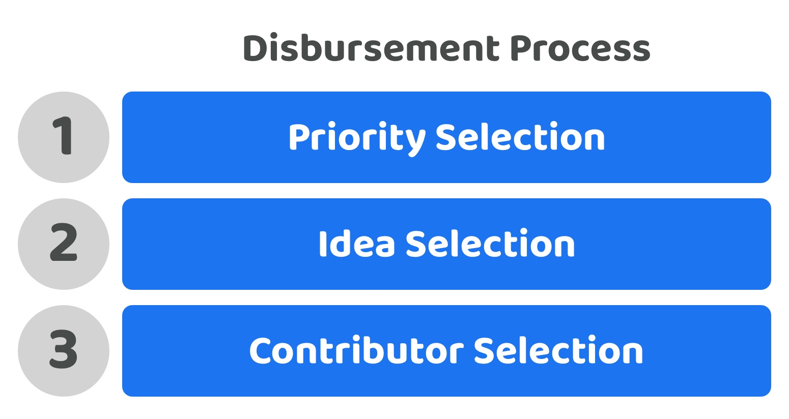
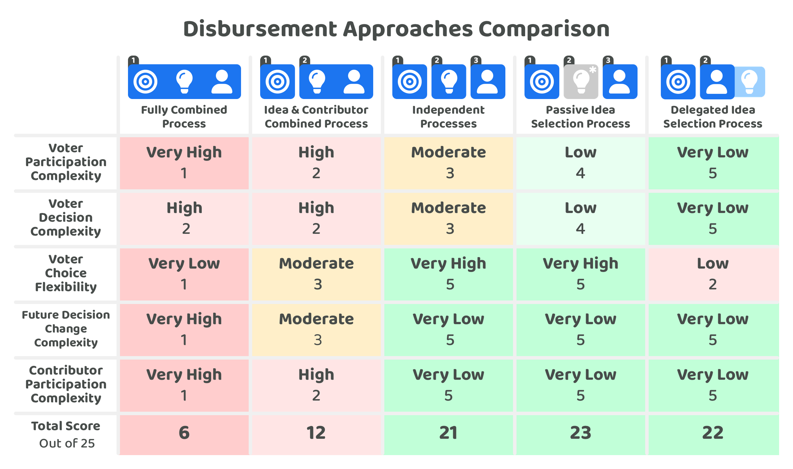

# Disbursement approaches

The disbursement of treasury assets is one effective approach for enabling an ecosystem to execute and generate desired outcomes.

A high level summary of a disbursement process could be that voters are tasked with digesting any relevant knowledge about an ecosystem before then selecting the most important priorities, ideas and contributors that could help with generating impactful outcomes.

<figure><figcaption></figcaption></figure>

1. **Digest Knowledge** - Available knowledge within an ecosystem will play an important part in all of the selection processes involved in disbursement. Both automated systems and one off pieces of research or analysis can help with creating useful sources of information for voters. Voters having more access to quality knowledge sources will help ensure that they are more well informed when making any disbursement decisions.
2. **Priority Selection** - Priorities help to highlight the most important problems and opportunities that exist in an ecosystem. Voters will apply their own understanding of the ecosystem and available knowledge to determine which priorities are the most important for the ecosystem at that moment in time. The selection of priorities can often influence which ideas and contributors get selected as the most promising and suitable for addressing those priorities.
3. **Idea Selection** - Ideas helps to articulate a solution which could be executed that would help with addressing one or multiple priorities. Voters could participate in selecting the most promising ideas that can help with addressing the existing priorities in an ecosystem. &#x20;
4. **Contributor Selection** - Contributors offer their time and skills to help with the execution of ideas. Voters could help with selecting the contributors that should be compensated and responsible for the execution of the most promising ideas.

How these different processes are composed together will greatly influence the level of complexity, flexibility and scalability of the overall disbursement process. These disbursement processes could be coupled together into a smaller number of processes or be handled separately.

## Approaches for handling priorities, ideas and contributors

A number of approaches could be used to decide and vote on which priorities, ideas and contributors are the most important or promising. A selection of those approaches include:

* [**Fully combined process**](fully-combined-process.md) - The selection of priorities, ideas and contributors all happens in the same selection process.
* [**Idea & contributor combined process**](idea-and-contributor-combined-process.md) - The selection of priorities happens independently and then the selection of ideas and contributors happens in the same process.
* [**Independent processes**](independent-processes.md) - The selection of priorities, ideas and contributors happen all in separate processes.
* [**Passive idea selection process**](passive-idea-selection-process.md) - The selection of priorities, ideas and contributors happen all in separate processes, the voters only participate in idea selection when they believe this is necessary.
* [**Delegated idea selection process**](../disbursement-operating-process/delegating-disbursement-process-decisions.md) - The selection of priorities, ideas and contributors happen all in separate processes, the contributors are delegated the full responsibility of selecting the most promising ideas to execute.

To compare these approaches a number of [factors have been considered](factors-for-consideration.md) and then applied to each approach to better determine the strengths and weaknesses of each one.

<figure><figcaption></figcaption></figure>

The most expressive, flexible and least complex of the approaches outlined above were those that adopted independent processes for selecting the most impactful priorities, ideas and contributors. It is also worth noting that an ecosystem would be able to use any mixture of these mentioned approaches above. Different disbursement processes for different purposes may provide a better long term solution for each ecosystem.

## Approaches for handling knowledge

At the point of making any disbursement decisions the voters involved will have some pre-existing knowledge based on their own experiences and skill sets and also have access to publicly available knowledge about different ecosystems and topic areas.

Voters will decide how much time they want to spend on identifying new knowledge that could help them with making more informed disbursement decisions. Voters may decide not to digest new information for a number of reasons. One could be because they don't trust the source of the new information. Another reason could be that they believe they already have enough knowledge to make informed decisions. Another reason could be they simply don't have enough time available to go through the knowledge sources.&#x20;

A disbursement process will benefit from making it easy to access knowledge that is relevant and accurate so that voters are able to make more well informed disbursement decisions. Some example potential areas of knowledge could be helping voters be able to easily find out what has been funded historically, what priorities or ideas have been completed and which ideas or contributors have been the most effective at generating impact for the ecosystem.

For more complex disbursement processes there could be value in exploring a knowledge selection process before voters are tasked with the selection of priorities, ideas and contributors. Voters may benefit from being able to share and vote on the relevance and accuracy of different sources of knowledge that have been presented to the ecosystem. The most important pieces of knowledge could then become more well known in the ecosystem prior to making any future disbursement decisions.

Knowledge can come from a number of sources and be created in a number of ways. We have covered some of the [approaches for developing knowledge](approaches-for-developing-knowledge-sources.md) separately.

## Prioritising certain disbursement outcomes

A key question to ask when adopting any of these different disbursement approaches is what types of outcomes are most important? What outcomes should the treasury disbursement process be optimising for? There could be many different outcomes that are important to each ecosystem, each of which those ecosystems may then want to quantify and optimise over time.

**Maximising decision involvement**

One potentially desirable outcome for an ecosystem could be that a treasury system maximises the involvement of voters in every disbursement decision. Achieving this outcome would mean the entire community will need to be able to vote on any part of the disbursement process and the systems and processes should help with actively encouraging voters to get involved in all available decisions. The independent processes approach could be one suitable way to achieve this type of outcome as voters would be encouraged to vote on everything and voters would also be able to vote on exactly what they want in each process without any compromise on their preferences. The reasons this property might not be desirable are that it might not be practical to try and expect or encourage voters to participate in every decision in the disbursement process. The larger the ecosystem is the harder this would be to achieve. This higher complexity at scale is a reason why approaches such as passive or delegated idea selection can be considered as alternatives.

**Maximising participation scalability**

Maximising the amount of participation in the disbursement process would mean making it easier and faster for voters to participate in the disbursement process. The easier and quicker it is for voters to participate in the disbursement process the more easy it will be for the disbursement process to scale the amount of participation to a larger audience. Optimising for this outcome will mean reducing the total time required and overall decision complexity as much as possible to achieve a higher amount of participation across a larger community. If this was the primary concern for a treasury system then considering the delegated idea selection approach could potentially be a suitable option. This reduces some of the required involvement from the voter and leans towards increasing the simplicity and speed of the disbursement decisions.

**Maximising both participation scalability and decision involvement**

Trying to get all community members to decide on every decision can be a difficult outcome when trying to scale the amount of participation to a larger audience. Time consuming disbursement decisions can easily lead to voter apathy and disengagement, a problem that can increase as an ecosystem tries to scale. One way an ecosystem could achieve a balance in achieving both these outcomes could be by adopting a passive idea selection process. Under this approach all voters could still participate in the different disbursement decisions however at a system and process level it is the priorities and contributor selection that are encouraged as the main decisions that should be made by the community. This then leaves the idea selection as optional, helping to reduce the complexity and time taken to participate which helps with increasing participation scalability whilst also allowing for full decision involvement.

## Disbursement approaches analysis


[factors-for-consideration.md](factors-for-consideration.md)



[fully-combined-process.md](fully-combined-process.md)



[idea-and-contributor-combined-process.md](idea-and-contributor-combined-process.md)



[independent-processes.md](independent-processes.md)



[passive-idea-selection-process.md](passive-idea-selection-process.md)



[delegated-idea-selection-process.md](delegated-idea-selection-process.md)



[approaches-for-developing-knowledge-sources.md](approaches-for-developing-knowledge-sources.md)

