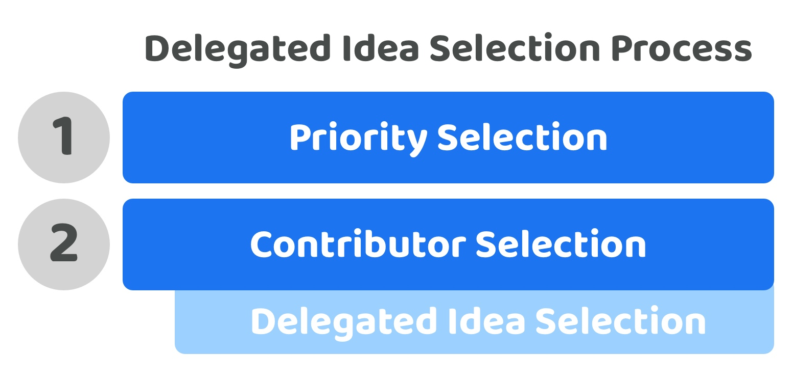

# Delegated idea selection process

**Overview**

A delegated idea selection process is where the actual voting power for selecting ideas which contributors execute is a responsibility left to the contributors who get selected. This means that community members will not vote on which ideas are the most promising. Instead they will vote on which contributors they think will be most effective at addressing ecosystem priorities and selecting and working on the most promising ideas. The idea selection process itself can still be fully open, transparent and invite participation from all of the community members. The key difference with this approach however is after all this feedback and participation the actual decision and any voting required to select the most promising ideas would be the responsibility of the selected contributors.

<figure><figcaption></figcaption></figure>

**Very low voter participation complexity (Score - 5)**

Voters could participate in either priority or contributor selection. To fully participate voters would only need to contribute to these two disbursement processes.

**Very low voter decision complexity (Score - 5)**

Each voter decision on priorities and contributors can be done so individually meaning voters only need to compare a limited amount of things when making each decision. This complexity is even further reduced with this approach as the idea selection process is delegated to the contributors who are selected. The voters could optionally participate in the idea generation and selection process though this wouldn’t be required.

**Low voter choice flexibility (Score - 2)**

Voters are able to select the exact priorities, ideas and contributors they prefer individually. Voters do not have to make any compromises with combinations of decisions they may not fully agree with.

**Very low future decision change complexity (Score - 5)**

Voters would be able to use the exact same decision processes for any future changes about which priorities and contributors are most important and suitable for the ecosystem. Voters indirectly have influence over the idea selection through the fact that if they change priorities the future ideas being selected should be targeted at addressing those priorities.

**Very low contributor participation complexity (Score - 5)**

Contributors could participate in one or all of the disbursement processes whether that’s suggesting priorities or proposing that they could be a potential contributor to help with execution. This level of involvement matches existing job based environments where people come forward and suggest themselves as suitable candidates to fulfil defined roles to help with the execution of work.

**Total score = 22 / 25**
