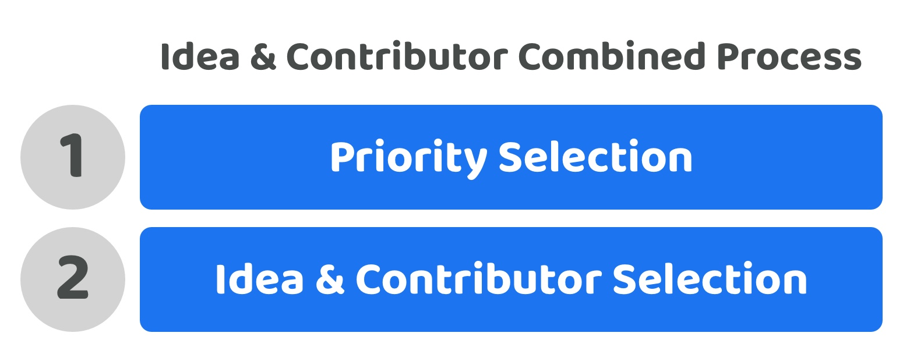

# Idea & contributor combined process

**What is it?**

An idea and contributor combined process means that selection of ideas and contributors happy in the same decision. Contributors would submit the idea and who is contributing to the idea at the same time for voters to decide between. The priority selection process would happen separately.

<figure><figcaption></figcaption></figure>

**High voter participation complexity (Score - 2)**

Voters are able to participate in the priority selection decision and ideas and contribution selection decision separately. This means they could decide to participate in just one of those votes instead of both. This reduces the amount of context and information required to participate in the disbursement process as they can decide where and how they participate. Some voters may only want to participate in voting on the priority setting process which would mean they don’t need to review all of the ideas and contributor combined proposals.

**High voter decision complexity (Score - 2)**

The number of potential ideas can often have the largest variety of options for voters to choose from. When combining this with the contributor selection the voter complexity is increased as voters now must both understand and compare the tradeoffs with each combination of idea and contributors with all of the others. This is instead of the more simpler separate decision of which ideas are the most promising and then separately which contributors are the most suited.

**Moderate voter choice flexibility (Score - 3)**

Voters would be able to select the exact priorities that they believe are the most important for the ecosystem. Voters would need to pick from the idea and contributor combinations presented to them meaning they would not be able to easily influence which ideas and contributors are selected individually. As the number of ideas and contributors would represent the larger part of the decision complexity this can limit the flexibility and options available to voters. Community members who wanted to contribute ideas but not execute them, and contributors who want to execute ideas but don’t have an existing idea, would both currently have a higher difficulty in participating with this approach. This increased difficulty can further limit the voters choices as some of these potential ideas and contributors might not get added for consideration.

**Moderate future decision change complexity (Score - 3)**

Voters can reuse the same system and process to vote on any of the priorities set and then vote again in the future to change those priorities using the same process. For updating which are the most promising ideas or contributors an ecosystem could reuse the same process and just update the idea or contributors as needed but this then adds bloat to the process due to the repeated information. Alternatively the ecosystem could introduce independent processes for updating the ideas or contributors however this then adds in more complexity by increasing the total amount of processes being used in the ecosystem to manage potential future changes.

**High contributor participation complexity (Score - 2)**

Contributors need to come up with the ideas and then also share information about themselves and any potential collaborators to provide evidence towards why they are suitable for executing those ideas when getting involved with contributing towards the ecosystem. These requirements are higher than other existing environments where most people will be applying to defined roles to offer their skill sets and experience to an ecosystem such as a corporation or nation state. More effort is required from a contributor with this approach to get involved in an ecosystem. Some contributors may only want to contribute towards ideas and improving existing ideas rather than being willing or fully capable of executing them. With a combined approach this makes it more difficult for people to contribute to the ecosystem as contributors suggesting ideas are also attaching who will be involved with them.

**Total score = 12 / 25**
