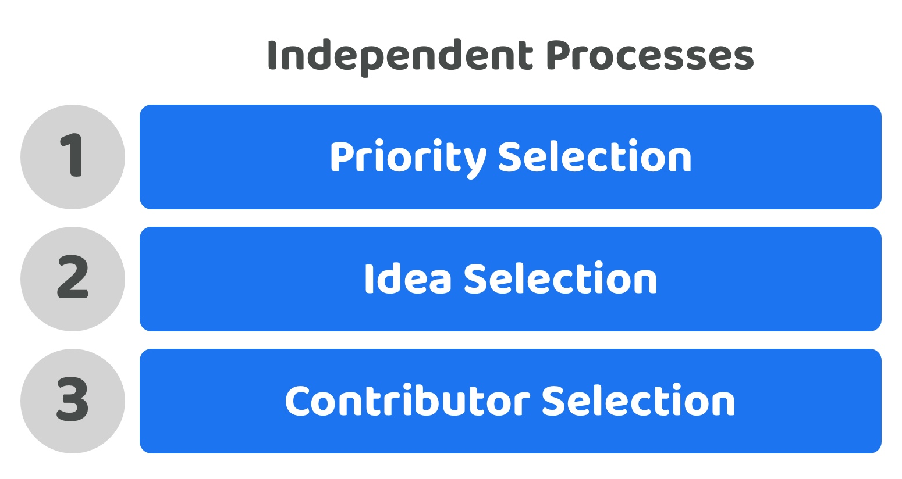

# Independent processes

**What is it?**

An independent decision process means that the selection of priorities, ideas and contributors all happen in separate processes. These independent processes could happen periodically one after another or they could all be ongoing continuous processes.

<figure><figcaption></figcaption></figure>

**Moderate voter participation complexity (Score - 3)**

Voters could participate in one or all of the disbursement decisions around selecting priorities, ideas and contributors. This approach gives the voter the full freedom to participate in whichever decisions they want to for the disbursement process. The reasons this still has moderate complexity are due to the amount of time it takes for voters to understand and compare all of these processes. The idea selection process can easily be the most demanding in terms of time required to understand and analyse the ideas submitted. This high time requirement to compare ideas provides a sufficient reason for voters to potentially disengage from this process as it scales in size and covers a wider range of focus areas.

**Moderate voter decision complexity (Score - 3)**

Each voter can decide between the priorities, ideas and contributors individually. Voters only need to compare a limited amount of information for each separate decision rather than having to take into account all of these factors at once in different combinations. This approach helps remove the complexities that emerge from combining different processes together. The main complexity the remains is that voters will still need to actively look to understand and compare potentially complex ideas to properly participate in idea selection under this approach. This process can be time consuming and highly complex for people who may not have a matching skill set to fully understand the potential impact and feasibility of each of the ideas submitted.

**Very high voter choice flexibility (Score - 5)**

Voters are able to select the exact priorities, ideas and contributors they prefer individually. Voters do not have to make any compromises when making decisions that match their opinions and preferences.

**Very low future decision change complexity (Score - 5)**

Voters would be able to use the same decision processes with minimal modification for future decisions about making changes to which priorities, ideas or contributors are most important for the ecosystem. Contributors could make new suggestions for new priorities, ideas or contributors to help with executing those ideas at any point by operating these processes separately.

**Very low contributor participation complexity (Score - 5)**

Contributors could participate in one or all of the disbursement processes whether that’s suggesting priorities or ideas or proposing that they could be a potential contributor to help with execution. This level of involvement better matches existing job based environments where people come forward and suggest themselves as suitable candidates to fulfil defined roles and then if selected help with the execution of ideas and useful areas of work.

**Total score = 21 / 25**
