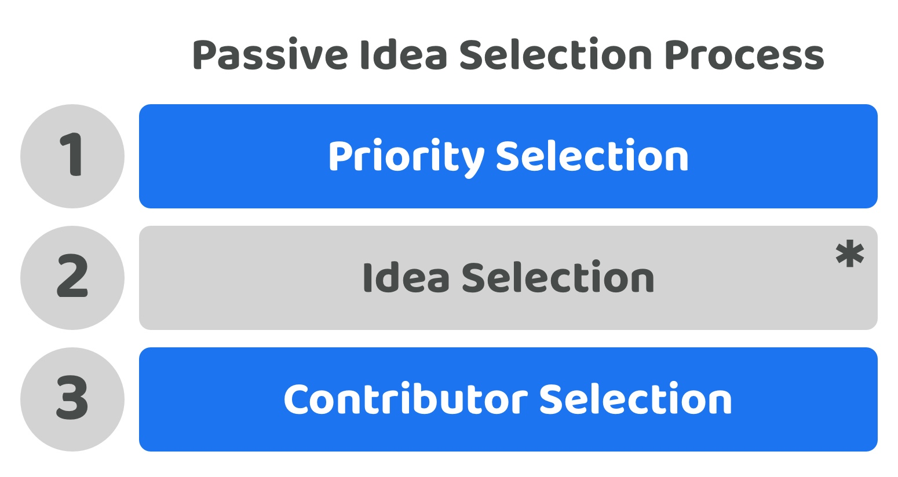

# Passive idea selection process

**Overview**

This approach would include having the same ability to select priorities, ideas and contributors that the independent processes approach does. The main difference is that under this approach these is an acceptance that there isn’t a goal of continuously increasing voter participation with the idea selection process. Instead this is mostly left to contributors and voters participate in this process when they feel they need to do so or are actively interested in that area. If an ecosystem believes the most important areas for the voters to handle are the priorities and contributors involved then the treasury systems and processes can be designed to focus on these areas.

<figure><figcaption></figcaption></figure>

**Low voter participation complexity (Score - 4)**

Voters could participate in one or all of the different decisions involved with selecting priorities, ideas and contributors. This voter the full freedom to participate in whichever decisions they want to for the disbursement process. The main areas that the ecosystem encourages is participation in priority selection and contributor selection which reduces the total time required to participate.

**Low voter decision complexity (Score - 4)**

Each voter can decide between the priorities, ideas and contributors individually. Voters are mainly just encouraged to try and vote on the priority and contributors being selected. This helps to reduce the overall disbursement complexity if voters don’t feel the need to understand and compare every idea that gets suggested in the ecosystem and to only participate when they feel is absolutely necessary.

**Very high voter choice flexibility (Score - 5)**

**Very low future decision change complexity (Score - 5)**

**Very low contributor participation complexity (Score - 5)**

The score and rationale for these three factors above is the same as the independent processes approach. Each process is independent and both voters and contributors can still participate in one or all of the disbursement processes.

**Total score = 23 / 25**
