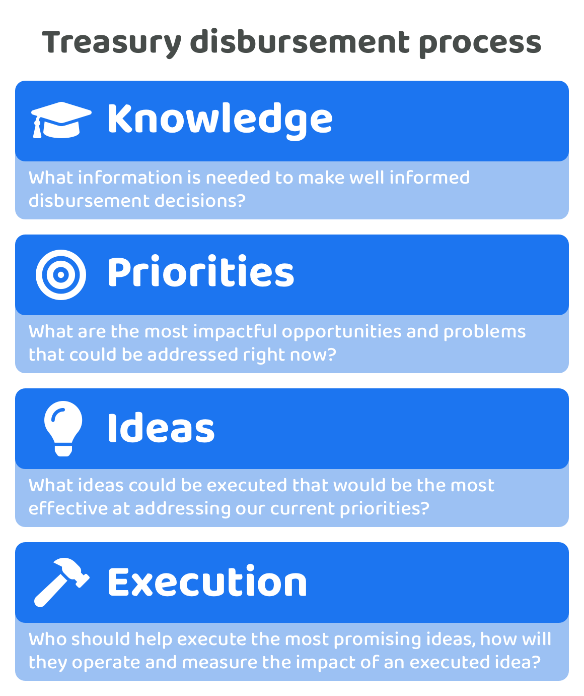

# Disbursement operating process

<figure><figcaption></figcaption></figure>

The [general purpose operating process](https://app.gitbook.com/s/qIN4B3DGHPqKOl7e6VuV/web3-treasuries/operating-process) can be applied more directly to the treasury disbursement process. Applying this process can help with thinking about how each of the processes involved in disbursement could be improved over time and how those processes play an important role in helping an ecosystem achieve its priorities.

<figure><figcaption></figcaption></figure>

**Process steps**

* **Aggregating information** - Collating information is the first main part of trying to effectively disburse assets as the people involved in voting for how assets are disbursed need to be informed on what problems and opportunities exist, what has been tried already, what’s working and isn’t and many other factors to make their decisions more informed. If there is no knowledge systems in place then this process is done at an individual level where the people involved in the disbursement process will themselves do any research they want to help with improving their own judgement.
* **Selecting information** - Once a person has aggregated the information they believe is relevant, or if this information is made available in another adopted system, the next step for participants in the process would be to determine the important of each piece of information and its relevance to upcoming decisions. The voters would be responsible for determining what is correct information or not and which information is currently the most relevant.

**Why it’s important**

An ecosystem wants to make informed decisions on where funds should be disbursed so that assets are effectively allocated towards initiatives that help with achieving any current priorities of the ecosystem. The more informed a community is about what is happening both inside and outside the ecosystem the better they will be able to decide what priorities, ideas and contributors will be most suitable to making impactful outcomes.

**What happens in existing systems**

For many nation states or corporations there may or may not be any official form of knowledge systems or processes in place. For both there will also be a mixture of informational sources that can influence decisions about how treasury funds are disbursed.

* **Nation states** - Nation state treasuries could be interested in information such as foreign policies, economic data, inflation data, cost of living data, geopolitical information and national and international banking data amongst many other areas.
* **Corporations** - Corporations could benefit from having information that ranges from market data, business metrics, competitors business performance, consumer trends, industry research and development insights and any economic data amongst many other areas.

**Challenges for Web3 ecosystems**

* **Complexity in aggregating information** - Existing nation state and corporation treasury systems that have fewer people involved in decision making can more easily adopt a manual process for individually aggregating information they think is important before making well informed decisions. If this knowledge needs to be distributed between a larger group of participants a manual approach becomes far most costly and difficult to scale. Web3 ecosystems will need to find efficient and effective ways to aggregate relevant information about the ecosystem for participants in the disbursement process to review and understand. Considerations will be needed on how information can be most effectively presented to communicate the key points quickly and correctly to make this process scalable. If the ecosystem is unable to get access to the right information when making disbursement decisions it will be more difficult to make well informed decisions. This factor is one reason why it is easier to centralise decision making in existing systems due to the need for those involved to be well informed on many different pieces of information to make more informed decisions.
* **Correctness of information** - As the scale and assets under management of Web3 ecosystems increase over time there is an increasing importance in making sure any information is correct. This information is what will be used by participants voting on how funds are disbursed. If the information is biased or incorrect this could influence the outcomes of any disbursement decision, meaning this is an attack vector that will need to be constantly considered so these issues can be prevented.
* **Time cost of learning & knowledge sharing** - It takes time for people to read and understand information shared to them and then more time to apply that knowledge to decisions about treasury disbursement. The more information there is available the more time it would take for each person that wants to participate. This factors makes it difficult to scale decentralized governance. One of the challenges for Web3 ecosystems is being able to identify what information is most important for the different decisions that exist in a treasuries disbursement process and how can that information can be most accurately and easily presented to participants when making voting decisions. Bringing the time cost down for sharing and understanding knowledge will make these emerging systems more easy to participate in scalable.

<figure><figcaption></figcaption></figure>

**Process steps**

* **Creating priorities** - Problems and opportunities can be identified through applying and analysing the information available in the ecosystem. A set of priorities can be created to better articulate those problems and opportunities that the voters should consider. Priorities could be created at a high level to help with communicating a preferred general direction an ecosystem wants to take. Priorities can also be lower level and more precise on what exact areas of the ecosystem could receive more attention and resources.
* **Priority** **selection decision** - Selecting priorities will have a big impact on the disbursement process as these preferences can heavily influence where funds get allocated. An ecosystem benefits from being able to communicate why certain preferences are important at the moment and then seeing the level of support those priorities receive over others from other community members of an ecosystem.

**Why it’s important**

Treasury funds could be disbursed to a wide range of different initiatives that each have their own opportunities and tradeoffs. Good prioritisation for an ecosystem can mean the difference between sustainability and growth over the long term over stagnation and decline. Ecosystem participants involved in any disbursement process decisions will want to apply the relevant knowledge about the ecosystem to better define and determine which problems and opportunities are the most important at any given moment in time.

**What happens in existing systems**

Inviting information, expertise and different perspectives from other employees in the organisation or from external consumers and citizens can be one way that both nation states and corporations try to increase the overall participation in setting organisation priorities.

* **Nation states** - Elected officials or employees helping to operate nation state treasuries would use any accumulated knowledge to suggest and select priorities that should be addressed based on the current problems or opportunities for the nation. If the nation states mandate is to help provide stability and growth for the nation using its economic policy then how treasury funds are used will likely be closely mapped to the selection of priorities that are most aligned with this mandate.
* **Corporations** - The leadership, management or board of directors of the corporation are the most likely to handle the setting of priorities and when doing so would be applying the knowledge they have to determine what problems and opportunities could most benefit the business over the short and long term.

**Challenges for Web3 ecosystems**

* **Increasing priority selection complexity** - As a Web3 ecosystem scale the complexity of selecting priorities could increase over time due to an increasingly diverse range of backgrounds, opinions and preferences in how the ecosystem should move forward. This increase in thought diversity will make priority selection more complex as there could be an increasing number of priorities to choose from and also even more participants that need to be well informed when voting on them.
* **Priority selection scope complexity** - Web3 ecosystems will need to become effective enough at determining what level of scope the ecosystem can feasibly handle. The community will not want to set too few priorities that are too easy to achieve and result in stagnation of potential change or progress but on the other side they also don’t want to be overly ambitious and set too many priorities that would not be feasible or practical in the short to medium time frame.
* **Maintaining overall mission and purpose** - Growing Web3 ecosystems will mean increasing the diversity of opinion and preferences in how that ecosystem evolves over time. If the ecosystem was setup for a particular purpose initially this initial mission and purpose could fade over time and be lost as the ecosystem scales. Ecosystems will need to determine whether this is important or not and if so how they can maintain the pursuit of achieving that initial mission over the long term. A constitution can be one way in which the mission and values of an ecosystem can be recorded, the [United States constitution](https://www.senate.gov/about/origins-foundations/senate-and-constitution/constitution.htm) being one example.

<figure><figcaption></figcaption></figure>

**Process steps**

* **Creating ideas** - Creating ideas requires a good understanding of the opportunity or problem being addressed and a sufficient skill set and description of the steps or items required for an idea to be taken through to execution. Contributors who are creating ideas will need to consider the complexity of the idea, how long it might take to execute, what evidence there is that it will be impactful in addressing the current priorities, what other skills are needed for the idea to be executed correctly and what amount of capital will be required to fully execute and measure the outcomes of that idea.
* **Idea selection decision** - There are many ideas that could help with addressing ecosystem priorities. A lot of effort is needed to effectively articulate and document how one idea could be effective for addressing certain priorities. Community members participating in selecting the most promising ideas will then need to then compare these suggested ideas against the priorities they are addressing and determine which ones are the most promising at that moment in time for creating impact in the ecosystem.

**Why it’s important**

Once an ecosystem has a clear understanding of what information is important and what they want to prioritise the most important next step will be the generation of ideas that could be suitable as potential solutions to address the selected priorities. Part of the idea generation process will be the application of knowledge the ecosystem has by considering what is happening in other ecosystems and markets to then create ideas which are both feasible and potentially highly impactful.

**What happens in existing systems**

Ideas could often be welcomed from a range of participants involved in either nation state or corporation treasury disbursement decisions. Ideas from those outside of the operation of these treasuries could come from sources such as feedback forms, interviews, polls and surveys. Employees involved in any organisation that has a treasury to manage could also often play an important role in idea generation thinking about how funds are disbursed within either of these environments. Employees can often be the most well informed on what is feasible and practical in terms of execution.

* **Nation states** - The range of ideas that a nation state treasury could pursue might be limited due to the mandate for the treasury - such as if it was ensuring the stability and growth of a nation. As well as this there could also likely be existing national departments setup to handle different key pieces of infrastructure or public service areas. Ideas for nation states could look at exploring what the treasury could do better to better achieve its priorities and overall mandate. This could include thinking about the impact of central bank interest rates moving forward, what total spending and borrowing amounts are suitable for that financial year and what budgets would be sensible for each of the national departments.
* **Corporations** - For corporations the diversity of ideas it may pursue could be vast as they corporations can sometimes be interested in operating in multiple different markets and be willing to provide a range of service or product offerings. Employees within corporations could help with idea generation by assessing how any existing services or products could be improved or updated to address the priorities set by the corporation or to better respond to consumer demand. In some cases a completely new product or service might be suggested. The teams and management involved in addressing any of the organisations priorities will need to select the ideas which appear to be most promising. These ideas then may need to to be communicated to others for wider approval. Some teams in corporate structures may be given the full responsibility and autonomy to lead both the idea generation and selection of the most promising ideas.

**Challenges for Web3 ecosystems**

* **Idea selection complexity** - As the number of ideas increase that each have different paths for addressing ecosystem priorities the complexity in choosing between those ideas can increase. This makes governance more complex and less scalable the more this number of ideas continue to grow. A disbursement process will benefit from trying to remove the duplication of ideas and finding ways to keep ideas concise for readability but still allow sufficient depth so voters have the capacity to read each idea and be informed about their decisions.
* **Need for flexibility to change ideas** - New information and knowledge or changing priorities can quickly influence whether an idea continues to make sense or not in the current environment. Reflection might be needed to think about how that idea may need to be updated to respond to this changing information or priorities. The more an ecosystem has a fast changing environment the more important it will be for existing ideas to be able to react to these changes and adapt, replace or remove these ideas as necessary.
* **Idea complexity** - Web3 technology is inherently complex due to the involvement of a multitude of disciplines such as cryptography, economics, governance and distributed software. This combination of complexities increases the difficulty in making scalable and decentralized infrastructure. A disbursement process will need to handle these types of complexity, where ideas will which require sufficient room for explanation and review. Disbursement processes will need to think about how these ideas can be more easily communicated in a way that a sufficiently wide audience can interpret and understand what is being suggested. Achieving this will be pivotal for voters to make their own informed decisions around where to disburse funds.

<figure><figcaption></figcaption></figure>

**Process steps**

* **Contributor selection decision** - The process for an ecosystem looking to select contributors would start with considering the educational and professional background of those who would like to contribute along with any information around their recent contributions or involvement in the ecosystem with any other relevant experience. Voters would then need to compare these contributors against the priorities and ideas currently preferred by the ecosystem and determine which of these contributors would be a good fit for helping to address the priorities and execute promising ideas.
* **Improving execution process** - The selected contributors will need to reflect and improve how they approach the execution of ideas on an ongoing basis. This can include reflecting on what the current best practices are, how to best communicate and coordinate with each other, how low level priorities and goals are set and how to mitigate potential future issues amongst numerous other considerations. Contributors will need to strike a balance between focussing on getting work done with updating their operating approach and following best practices.
* **Measuring outcomes** - Understanding what impact an executed idea has produced is inherently complicated due to the range of ways an idea could be executed and the range of variables that influence whether a solution has actually achieved the impactful outcomes or not. An ecosystem will want to get better at being able to measure the impact of outcomes they generate so that this information can be fed back into the disbursement process to improve future decision making and any subsequent execution of ideas.

**Why it’s important**

Achieving ecosystems priorities and creating impact is possible when the right ideas get executed. An ecosystem will need to decide how and who will execute the most promising ideas and then after execution then measure the outcome to determine whether the priorities are being addressed. Many funding processes will also adopt some form of verification process to ensure that progress is being made by the funded contributors working on these ideas. The outcomes from the execution process will help create more data and insights that can then be fed back into the ongoing disbursement process to help improve how future funds are allocated. The better that outcomes can be measured for the impact they generate the more that this new knowledge can influence and improve future decisions.

**What happens in existing systems**

* **Nation states** - The execution for treasury disbursement for nation states can often mean distributing a certain budget to different national departments, this funding then in turn gets used to pay for employees and operational costs. The nation state treasury in some cases could influence or be responsible for new policies that change what treasury income is received through taxation and also influence how funds are disbursed. Once any of these changes are made there will be more data made available over time that help with determining how those changes are performing against the priorities of the treasury. Other areas around data, insights and citizen sentiment could also become available and provide more information about the current stability and growth of the economy due to any changes made.
* **Corporations** - For corporations, treasury assets are often disbursed to employees or contractors to execute future work. With this disbursement structure in place the teams responsible for executing selected ideas can do so as soon as any ideas are selected. Ideas that require new teams to form before they can be executed could be achieved through hiring more staff. In terms of measuring outcomes corporations will often be focussed on the performance of the service or product and any relevant metrics to determine whether the right outcomes have been achieved. This data gives more indication about how an executed idea is performing financially and potentially the level of customer satisfaction with any of these changes or new products and services.

**Challenges for Web3 ecosystems**

* **Need for flexibility to change execution** - New information and knowledge or changing priorities and ideas could occur at anytime during the execution of an idea. In fast changing environments such as Web3 ecosystems the contributors who are executing ideas will need to be responsive to the changing environment and needs of an ecosystem to better align their efforts with creating impactful outcomes. Web3 ecosystems will need to consider how they can be most efficient in allowing execution efforts to respond to many factors so treasury funds are not wasted on low impact outcomes.
* **Measuring impact complexity** - When ideas are executed the actual impact generated by that initiative can be difficult to track due to the amount of factors involved. A range of data and information could be relevant for determining whether any priorities are being addressed and whether any impact was actually generated.
