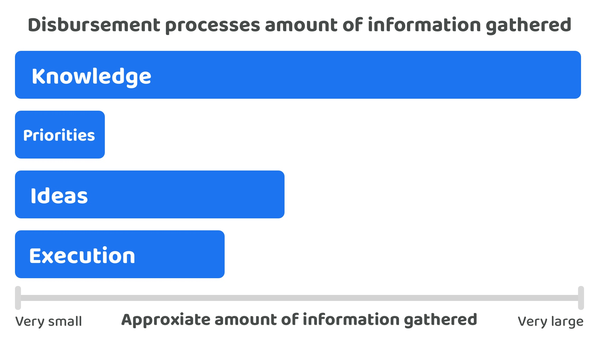

# Process information

A lot of information will often be needed to effectively operate a disbursement process. Voters need to be well informed when making decisions on how to effectively disburse treasury assets to generate impactful outcomes. A variety of different information is needed across each step of the disbursement process, voters will need to review this information to be sufficiently informed when making any decisions.

<figure><figcaption></figcaption></figure>

There is a vast amount of information that can be gathered prior to making any disbursement decisions. It is the application of this information that will heavily influence an ecosystems decision on what to prioritise, which ideas are the most promising and which contributors should help execute those ideas. Ideas will also include a wide range of information, a sufficient level of depth will often be needed to properly articulate how any suggested solution idea can effectively address a priority. The amount of information needed to understand the skills and experience of a contributor is also fairly sizeable, along with the ongoing information gathered about how those contributors operate together and the measured outcomes from executed ideas. Priorities may not require the same quantity of information as some of the other disbursement steps, but priorities could still see a moderate amount of information being gathered, this could come in the form of community responses that help highlight overall sentiment and feedback about the current priorities as they are being addressed over time.

<figure><figcaption></figcaption></figure>

**Potential information gathered in this process**

Any information relevant to the ecosystem that could help with making more well informed disbursement decisions could be included in this process of aggregating information for the ecosystem to consider.

* **Current state of an ecosystem** - On-chain data covering usage and performance, historical funded initiative performance and impact generated, security audits covering ecosystem protocols and applications, current user sentiment and feedback, SDKs, tools and libraries available for software development, available products & services in the ecosystem with their current usage, adoption, problems and opportunities and performance and metrics for current execution approach.
* **External ecosystem information** - Competitor on-chain data covering usage and performance, other approaches used for technical infrastructure, protocol design or security audits, products and services launched in other ecosystems, latest industry technical advancements along with any reports and insights, industry overall sentiment and adoption data, economic data with any current forecasts and any regulatory changes.

**Other information relevant to this process**

* **Execution** - Any progress or outcomes generated from the execution of ideas will help to create new information that can be fed back into the disbursement process as new knowledge. Measuring the impact of outcomes generated will an important approach for improving future prioritisation, idea selection and the approaches that get adopted for executing those ideas.

<figure><figcaption></figcaption></figure>

**Potential information gathered in this process**

* **Priority information:**
  * Title - Short sentence outlining the priority.
  * Description - The rationale behind why the priority is important and which of the relevant information made available has led to the suggestion of the priority.
  * Relevant knowledge - List of the relevant pieces of information that support why this priority is important at the moment.
  * Authors - Who created the priority, this could be a person, wallet address or it could be untracked and remain anonymous.
  * Community feedback & comments - Any feedback or comments provided by the community towards how the priority could be improved and what information might be missing or lacking to properly justify why the priority is important at the moment.
  * Voter sentiment - Community responses about the priority which could be around urgency or any other opportunities and concerns.
  * Current progress - Evidence of any current progress in achieving the priority or community responses indicating how much progress they believe has been made towards addressing the priority. Progress responses could help with identifying when priorities have already been addressed or when they are becoming less relevant or redundant.
  * Metadata - Date when the priority was submitted and any other dates and related information.

**Other information relevant to this process**

* **Knowledge** - The priority setting process benefits from participants knowing as much of the information as possible that came out of the knowledge aggregation process. The more information that participants have about the ecosystem the more they are able to effectively analyse it and apply that information when thinking about what the current problems and opportunities are. The application of ecosystem knowledge will lead to thinking about many areas of the ecosystem before then trying to determine which areas may create the most impact if they were to receive more resources and attention. Some example areas and leading questions might include:
  * Protocols & infrastructure - Are they any flaws in the current system design? How is it currently scaling against competition? Are more security audits needed? Should any recent advancements in cryptography or available software libraries be integrated?
  * Applications & services - What are the missing applications and services in the ecosystem that can be found elsewhere? What feature sets are missing in any of the existing applications? Can the amount of interoperability be increased to accommodate other ecosystems? What applications or services will help increase overall adoption?
  * Software libraries - Are there any missing software SDKs, frameworks, libraries or scripts that would make it easier for developers to create solutions? Is there anything that can be improved with the existing libraries? Do any of these need better security guarantees? Should any of them be rewritten in other programming languages?
  * Ecosystem education - Do people understand how to participate and use all of the solutions and tools made available? Are any of the applications, services, libraries or pieces of infrastructure too difficult to understand for their intended audience? Are resources available in enough languages to increase the diversity of participation in the ecosystem?

<figure><figcaption></figcaption></figure>

**Potential information gathered in this process**

* **Idea information:**
  * Title - Short name for the idea.
  * Summary - Brief overview of what the idea is about.
  * Relevant priorities - List of the priorities the idea would help with addressing.
  * Goals & objectives - Intended scope of idea outlining what outcomes the idea could help with for addressing ecosystem priorities.
  * Plan for measuring outcomes - What existing or new approach could be used to measure the outcomes of the executed idea when measuring the impact it generated.
  * Research & analysis - Any supporting evidence for why the idea could be effective at addressing the relevant priorities
  * Detailed description - A full breakdown of what the idea is including how it would operate, how it could be made (e.g. tech stack), what’s included in the idea (e.g. list of application features).
  * Technical & non-technical requirements - Breakdown of the requirements involved for the idea to be executed as intended.
  * Existing solution comparison - List of any existing similar ideas that have been executed and the similarities and differences this idea has with those other ideas. Rationale provided towards why the idea being suggested is relevant and useful compared to the alternatives that have been identified.
  * Opportunities & risks - The opportunities and risks that may emerge or that already exist when executing the idea.
  * Dependencies - List of any external dependencies that the idea relies on for it to be effectively executed.
  * Authors - Who created the idea.
  * Execution breakdown & milestones - A breakdown of the tasks involved in executing the idea which could be grouped by skill or task. Milestone based groupings could be made to better identify when key parts of an idea will be executed that can help with demonstrating progress.
  * Total cost - A break down of the total cost to execute the idea based on the execution breakdown and milestones. Costings would only be needed if the disbursement decisions for idea selection are the point where compensation is awarded.
  * Voter sentiment - Community responses to an idea that help to highlight any concerns, problems or opportunities worth consideration.
  * Community feedback & comments - Any feedback or comments provided by the community towards how an idea could be improved or requests for further clarification about certain areas.
  * Tags & categorisations - Tags or categorisations that make it easier to traverse and find this idea when it is amongst many others.
  * Metadata - Date the idea was created or updated along with any other relevant information.
  * Resources - Links to external resources that are relevant for helping explain the idea further or for justifying the ideas potential to address ecosystem priorities.

**Other information relevant to this process**

* **Knowledge** - All of the available knowledge in the ecosystem could be useful for thinking about how ideas are created and selected. Some example areas for consideration would include whether that idea has been executed inside or outside the ecosystem before? If it has, was it executed fully, what impact did it make and what risks or opportunities might exist for executing that idea based on the historical evidence?
* **Priorities** - When ideas are created they will need to articulate what priorities the idea is addressing, is it a problem in the ecosystem or an opportunity to improve something or try something new? Is this idea currently a priority set by the ecosystem or is it a completely new priority that the author is suddenly suggesting? An understanding of the current priorities can help with inspiring people to think about what ideas might be suitable to help address them.

<figure><figcaption></figcaption></figure>

**Potential information gathered in this process**

* **Contributor information**:
  * Personal information - Full name, nationality, date of birth, wallet address, proof of being human, national identity. Some or most of this information such as full name, date of birth or nationality may not be required for many ecosystems, however in certain circumstances it may be useful or required.
  * Passions & preferences - Details about what the contributor is passionate about working on and what their current preferences are in terms of how they work and focus areas. This could also include why they might want to work in certain environments and ecosystems.
  * Compensation request - The expected amount of compensation that contributor is looking for when working in the ecosystem. This may also include some justifications and rationale towards why this compensation value is reasonable.
  * Education - A list of any educational credentials from schools, colleges, universities or online educational platforms. This could also include any other relevant forms of education such as from internships or apprenticeships.
  * Professional background - The roles and responsibilities a contributor has previously had in other organisations and ecosystems. This could include their responsibilities, any achievements whilst in the role and the total amount of time they were working there for.
  * Historical contributions - Evidence of any previous contributions made to different ecosystems that are relevant.
  * Historical participation - Evidence of where a contributor has participated previously such as events, conferences, hackathons or anything else that might be relevant.
  * Resources - Links to any resources that help provide more evidence about a contributors background, participation, contributions, skills and experience.
  * Community feedback & comments - Any feedback or comments provided by the community towards how a contributor could improve the information provided or requests to further clarify certain areas.
* **Operating process information** - When executing ideas a group of contributors can gather a range of information when using tools and adopting different processes.
  * Collaboration tools - Any tools being used to collaborate, schedule and organise a group of contributors execution efforts can help with creating insights and information that could be useful for making considerations about how to improve future execution efforts.
  * Progress and audit data - Any tools used to track progress and completion can help with creating insights and information about how well execution efforts are going and also help with providing auditable information that ecosystem members can consider in future decisions.
* **Impact measuring information** - The outcomes from executed ideas can be recorded and analysed to better understand what impact is being generated. Data could include usage and system metrics or qualitative feedback about peoples experience when using or participating in the events, resources, applications or any other executed outcome.

**Other information relevant to this process**

* **Knowledge** - Understanding how different ecosystems are executing their own ideas, operating as a group of contributors and measuring their own outcomes will provide useful information that existing contributors can reflect on when improving their own processes. Changes in technology, security best practices and the available software and libraries are all example areas of new information that could benefit future execution efforts, contributors could consider and integrate any of this emerging information into how they operate in the future.
* **Priorities** - Understanding the current priorities will help with thinking about what range of skills and experience might be useful to effectively help address those priorities during execution.
* **Ideas** - Suggesting or understanding the current ideas preferred by an ecosystem will give a better indication of the exact skills and experience required to execute them. The more complex an idea is the more important it will be that the contributors involved in execution have the relevant skills and experience.
