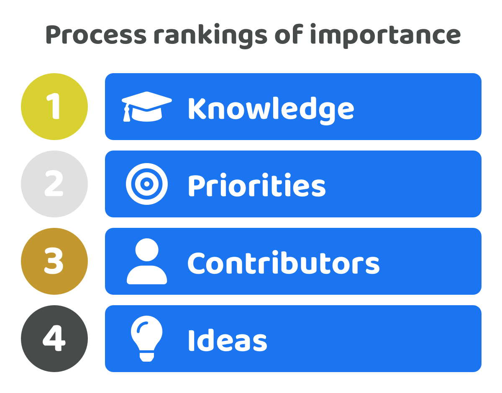

# Process rankings of importance

<figure><figcaption></figcaption></figure>

Knowledge is the most important part of the funding process as it influences every single other process and how effectively decisions are made in those processes. Making good priorities are also fundamental for an ecosystem so they can create achievable and impactful outcomes. Poor prioritisation can reduce the probability that contributors generate impactful outcomes if they are not executing the most important and promising. The contributors involved in the execution of any ideas will directly determine the actual outcomes that are generated. Ideas are also important for the process however there can be many ideas that are relevant and effective for addressing ecosystem priorities. The execution of those ideas and what gets learnt whilst executing them will generate more learnings to improve any of the initial ideas that get selected. The quality and speed of the operating process for executing ideas along with how the ongoing progress is measured and reviewed will create new learnings that can be highly insightful and important for updating any existing ideas or introducing new ones. A group of contributors will apply those ongoing learnings to help with better addressing an ecosystem's priorities over time.

<figure><figcaption></figcaption></figure>

**Impact on other processes**

* **Priorities** - The more well informed an ecosystem is with any relevant information about what they’re trying to achieve the more accurately they will be able to create sensible priorities that are impactful and achievable. Knowledge such as products and services available in the market, competitor performance, feasibility of ideas, adoption and usage data, economic and market trends, user sentiments and preferences and many other relevant forms of information would all help to influence what priorities might be the most suitable for an ecosystem to focus on.
* **Ideas** - Knowledge helps an ecosystem with better understanding how solutions could be created to address an ecosystem's priorities. Information such as available products & services in the market, competitor adoption and usage data, available software and libraries, industry technical advancements and progress and many other relevant areas will help to improve the overall quality of ideas.
* **Execution** - Knowledge will help with identifying what working processes and best practices, skills, working structures, incentive models and other areas of relevant information can be used to help improving how a group of contributors operates to work on the most promising ideas and also help with the making decisions on which contributors are most suitable to help with execution.

**Overall importance**

Knowledge has a monumental impact on every part of the funding process. Due to this it can be seen as one of the processes with the highest importance for an ecosystem to constantly reflect on and improve over time. Improving the correctness of information and accessibility to any knowledge in an ecosystem along with making that knowledge easy to understand and digest will directly help with improving the funding process such as the priorities and ideas being created and selected. Quality knowledge will also help with selecting which contributors will be the most effective for addressing any priorities and executing the most promising ideas.

<figure><figcaption></figcaption></figure>

**Impact on other processes**

* **Ideas** - The priorities selected will directly influence and help determine which ideas get generated and which ones are selected as the most promising. Ideas will rely on having well set priorities so that executing those ideas can help with achieving high impact for the ecosystem.
* **Execution** - Priorities will heavily influence what skills and experience is needed for addressing those priorities effectively. For instance if an ecosystem's priority was to give users more self sovereign control and access to their identity data then this could influence the need for more professionals that understand self sovereign identity technology and that can help with generating or contributing towards any promising ideas.

**Overall importance**

Good prioritisation will play a vital role in which ecosystems stagnate or thrive over the long term. An ecosystem can have fantastic ideas and highly professional and capable contributors but if they are addressing low impact priorities then their chance of success decreases. Good prioritisation will be an essential part of an ecosystem executing the right ideas and making a high impact.

<figure><figcaption></figcaption></figure>

**Impact on other processes**

* **Execution** - Ideas will influence which contributors are suitable for the execution of those ideas. For example if an idea is about creating a software application then finding software developers and product designers would be a sensible outcome. Changing ideas only requires new contributors for execution if the scope of the idea changes significantly enough. If an idea was changed from being about executing a new application to running a community event then the skills needed for that idea would have changed who is likely most suitable for executing the idea. However if it was an idea for an application that changes its intended feature set then the contributors needed would likely remain the same, unless the skill sets required for those features were significantly different enough than the existing contributors skill sets.

**Overall importance**

Generating and selecting the right ideas is an important part of being able to address ecosystem priorities. Although ideas are important it must be noted there can be many ideas and variations of ideas that all can help with addressing the priorities of an ecosystem. Some will be more effective than others and some will have trade offs between one approach and another. The potential impact of executing ideas is highly influenced by impactful and achievable priorities that are influenced by the knowledge an ecosystem applies.

<figure><figcaption></figcaption></figure>

**Impact on other processes**

* **Knowledge** - The execution of a solution idea leads to creating an ongoing amount of new insights, data and new information which can then be fed back into the funding process as new knowledge. For example, on-chain adoption data for a recently launched application would create useful knowledge for an ecosystem to consider about how it is performing and how it could be potentially improved in the future by comparing it with other similar applications elsewhere. Another area of new information could come from during any execution where it becomes more clear that the complexity to execute a certain idea is higher than expected. This insight and new knowledge about the higher complexity for execution can then feed into the other processes and improve decision making around how the idea could evolve and improve or how the execution approach could be changed to better resolve this complexity.
* **Ideas** - As contributors continue to execute ideas they will continuously learn where improvements can be made and how they can better execute the idea through that experience. This outcome emerges due to the execution improving the available knowledge the ecosystem has which then informs improvements to the solution idea itself.

**Overall importance**

The execution of promising ideas is the primary way an ecosystem will be able to address its priorities. The skill level and quality of the contributions involved in any of the execution of these ideas will be of paramount importance to ensure the ideas are executed as planned and to a high quality. The outcomes of high quality execution will lead to more insightful information that can be fed back into the funding process as new knowledge. This knowledge will influence existing and future priorities, ideas and execution. Bringing together and incentivising skilful and competent teams that can consistently execute is difficult and requires ongoing commitment and contribution. Generating good ideas for what solutions could help to address the priorities can be achieved with far less time than the time required to fully execute an idea. Due to this the importance of having the right contributors in place to support an ecosystem will be of higher importance than the initial ideas that they start executing. High quality contributors will be more easily able to identify and update ideas that are not working through the learning process of executing any ideas. It won’t matter how good the ideas are in an ecosystem if those ideas don’t have a sufficient amount of quality contributors to execute them that can learn and evolve those ideas over time during execution.
