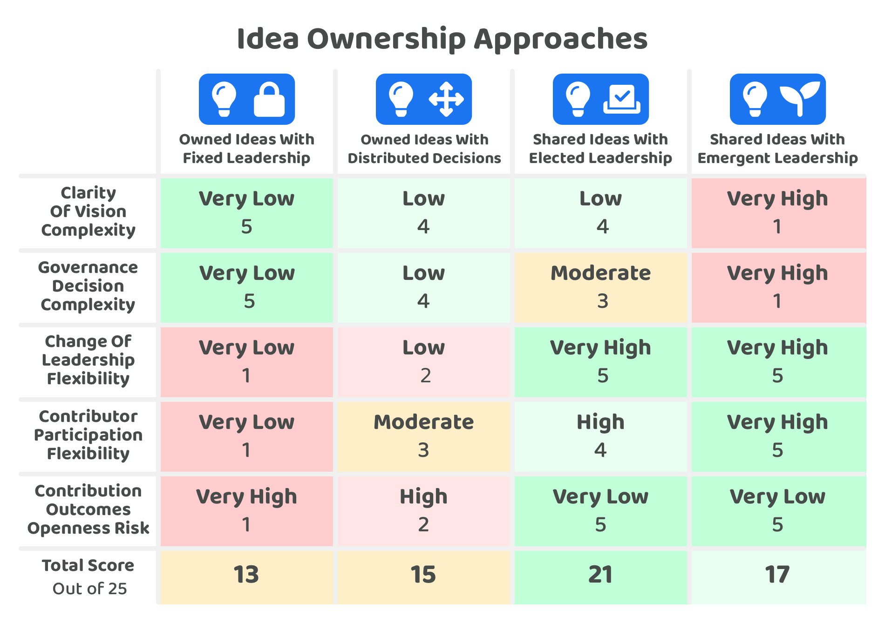

# Idea ownership approaches

The ownership of ideas can heavily influence how they will be governed, executed, changed and supported over time.

Some of these different idea ownership approaches include:

* [**Owned ideas with fixed leadership**](owned-ideas-with-fixed-leadership.md) - An idea is owned by a group of individuals and they make most or all of the decisions.
* [**Owned ideas with distributed decisions**](owned-ideas-with-distributed-decisions.md) - An idea is owned by some individuals but some decisions get distributed between other contributors or community members.
* [**Shared ideas with elected leadership**](shared-ideas-with-elected-leadership.md) - The idea is owned by the community and any leadership gets elected by the community.
* [**Shared ideas with emergent leadership**](shared-ideas-with-emergent-leadership.md) - The idea is owned by the community and any leadership is an emergent outcome that changes as needed.

To compare these approaches a number of [factors have been considered](factors-for-consideration.md) and then applied to each approach to better understand the potential advantages and drawbacks of each approach.

<figure><figcaption></figcaption></figure>

**Idea ownership approach analysis**


[factors-for-consideration.md](factors-for-consideration.md)



[owned-ideas-with-fixed-leadership.md](owned-ideas-with-fixed-leadership.md)



[owned-ideas-with-distributed-decisions.md](owned-ideas-with-distributed-decisions.md)



[shared-ideas-with-elected-leadership.md](shared-ideas-with-elected-leadership.md)



[shared-ideas-with-emergent-leadership.md](shared-ideas-with-emergent-leadership.md)


## The importance of idea leadership

**Handling complex ideas**

The more complex an idea is, the more likely it is that strong leadership could be beneficial to take that idea from inception through to execution. As ideas grow in complexity the number of factors for consideration increase, factors that each need to be considered when making informed decisions. The larger the amount of variables for consideration the more difficult it can become for leadership to be distributed amongst a large group of people due to the complexity and amount of information each participant would need to digest and then apply to make their own informed decisions.

**Ideas that require highly specialised skill sets**

Some ideas require highly specialised skills to effectively execute an idea. Finding people who have these specialised skill sets can be difficult. Leadership which is highly informed around the ideas topic area can be important in these scenarios for helping create a suitable team that can execute the idea as intended.

**Choosing the right leadership is hard**

Selecting leadership is difficult irregardless of whether it is an owned or shared idea. An ecosystem would need to select the leadership either through selecting owned ideas which have the leadership predetermined or select the leadership for any already shared idea. Some difficulties around choosing leadership include:

* **Limited knowledge** - The voters who are selecting ideas with predetermined leadership or selecting the leadership for shared ideas will only have so much knowledge around the topic area for the idea. Voters can easily be lacking information that could help with more fully understanding whether the leadership is in fact suitable for executing a certain idea.
* **Interpersonal skills** - The voters may only see a small part of how the leadership interacts with the community and other contributors. It can be difficult to know ahead of time which leadership will interact and collaborate with other contributors and community members most effectively.
* **Fast changing environments** - An ecosystem itself can change rapidly, resulting in changing requirements in what will create impact for the ecosystem. Voters will often not know ahead of time how effective the leadership will be in being able to respond and handle these quickly changing factors.

## Owned ideas

<figure><figcaption></figcaption></figure>

**Advantages of idea ownership**

* **Decreases vision complexity** - Having a smaller number of owners responsible for an idea will help reduce the complexity in achieving clarity of vision for an idea as less people are involved in the decision making.
* **Decreases governance complexity** - A smaller number of owners for executing an idea can help with increasing the speed in which governance decisions are made as less people are participating that each need to be well informed to make decisions.

**Drawbacks of idea ownership**

* **Decreases change of leadership flexibility** - The owners of the idea cannot be changed by the community. The community would need to execute a similar idea with different leadership if they wanted to support other leadership or the existing leadership would need to voluntarily give ownership to other people themselves. An issue with this lack of flexibility is that as an idea is executed and grows into a more mature solution over time the requirements and skills needed to operate and keep improving that solution can change. A community would not be able to respond to these changing requirements and elect new leadership and instead would be reliant on the existing leadership involved being able to adapt to a changing environment and requirements.
* **Decreases contributor participation flexibility** - The owners of the idea will determine or at least highly influence who is involved in the execution of the idea. This could limit the amount of participation in the execution of an idea and the diversity of experimentation and thought involved.
* **Increases contribution outcome openness risks** - If owned ideas are competing for business opportunities there is a higher risk and likelihood that not all contribution outcomes such as software or other intellectual property is fully open sourced and made freely available. Owned ideas can encourage more competition over collaboration as sharing contributions outcomes publicly could likely reduce their competitive advantage.

**Other potentially emergent outcomes from funding contributor owned ideas**

* **Increased execution speed** - Handling the vision and governance decisions quickly can mean a higher focus of time is directed towards the execution of an idea and creating a solution. For some ideas the speed of execution could play an important role in determining whether a solution gains significant traction or not compared to alternative competing solutions.

**Why idea ownership might be preferred**

* **Business opportunities** - Having idea ownership can be effective when people want to address a business opportunity. A business opportunity could benefit from quicker decision making and a high clarity of vision so their executed solution can effectively fill the identified gap in the market.

## Shared ideas

<figure><figcaption></figcaption></figure>

**Advantages of shared idea ownership**

* **Increases change of leadership flexibility** - Shared ideas either have elected or emergent leadership meaning that it is easy for a community to decide on the leadership involved when it is needed. This helps prevent any centralising control of influence over the execution of ideas.
* **Increases contributor participation flexibility** - Shared ideas aren’t owned by a small group of individuals and any execution outcomes would be made fully open and public. Due to this there is much higher flexibility for contributors to participate in existing efforts on these shared ideas and also can easily work on their own variations and experiments by building upon existing work.
* **Removes contribution outcome openness risks** - Any contribution outcomes from shared ideas would be open source by default which removes the risk of different parts of the execution being centrally controlled and hidden from the rest of the ecosystem. A key benefit to this outcome is that it should help reduce duplication of efforts, any teams wanting to work on that topic area would be able continue and iterate on the work that has already been executed rather than having to do similar work themselves.

**Drawbacks of shared idea ownership**

* **Increases vision complexity** - Shared ideas increase the amount of community participation in governance of the execution of an idea, setting a clear vision can become more complex due to this increase of opinions and wider input. This could be problematic for more complex ideas where strong leadership can be beneficial if they have a strong grasp of the problems or opportunities they are addressing and have the right skills to help with effectively executing a solution. The importance of idea leadership is a reason why elected leadership for shared ideas can be considered as an important approach. Giving contributors some stewardship over important ideas can help with ensuring those ideas get executed more effectively.
* **Increases governance complexity** - The more that people are involved in the governance of the execution of an idea the more complex the decisions can become in handling the diversity of opinion and preferences. These scaling amounts of differences can make it more difficult to achieve alignment for the direction an idea should be taken when being executed.

**Other potentially emergent outcomes from funding contributors for shared ideas**

* **Increasing collaboration** - Shared ideas are owned by the community over a small number of individuals. This can help increase collaboration as the outcomes of any contribution efforts are publicly available for other people to iterate on and improve. Many people benefiting from the outcomes from contributing towards shared ideas can help with increasing the likelihood that those beneficiaries also support the execution of that idea as it is in their self interests to do so if they are also adopting those outcomes. Increasing the number of contributors involved in thinking about and supporting an idea could help increase the speed of problem solving, increase the diversity of thought and skills involved and also could be effective for encouraging continuous feedback.
* **Increasing solution approach diversity** - Execution outcomes such as source code being made publicly available will help with enabling any contributor in an ecosystem to create variations of that work to experiment with new solution approaches. Making these experiments easier to execute will create more data points and insights for the ecosystem to consider and respond to. More experimentation can help with more quickly finding the most optimum solution approaches.
* **Increase contributors flexibility to help with multiple ideas** - Contributing towards a more collaborative effort to execute different shared ideas could help with boosting individual motivation and morale due to a shared feeling of ownership and achievement for creating impactful outcomes. The flexibility for contributors to support the execution of one or many shared ideas could also help with enabling them to more quickly generate impactful outcomes by being able to allocate their time to where they are most needed in the ecosystem.

**When sharing the idea may be preferred**

* **Open source software** - Protocols, tooling and infrastructure that is openly available for other developers to use in an ecosystem can be massively valuable in making it easier for anyone to experiment with new ideas and improve their existing solutions. Teams that are considering whether to adopt certain software will often have a higher level of confidence in adopting software solutions that are fully open sourced and that are being actively contributed to by a wide number of community members.
* **Public goods** - Shared ideas provide an effective approach for creating public goods due to the lack of central ownership of the ideas being executed. Instead any value generated from the execution of a shared idea would be available for anyone in the ecosystem to benefit from. Openly available education, research, analysis and software are all potential example public goods that a treasury could support through funding.

## Preferred outcomes for Web3 ecosystems

**Importance of open source protocols, tooling & infrastructure**

Open source software plays an important role in Web3 ecosystems in allowing people to verify, trust and audit the code they are running. For this approach of open source software to scale there will be a need for emerging solutions to eventually turn themselves into fully open source projects. This factor means most ideas will need to migrate to a shared idea ownership model where there are no controlling owners that can conceal or revoke access to software or information that is relevant to the operation of the application, protocol, tooling or infrastructure that has been produced.

**Removing centralised control**

Another key trend in the Web3 movement is the empowerment of individuals to own their own money, data and digital identities rather than a small handful of corporate owners. These centralised actors are currently a potential point of failure. The leadership could become corrupt, malicious or incompetent over time. Mitigating these issues around centralised control will mean that any executed ideas will eventually need to change to become shared ideas that are owned by the community rather than a handful of individuals.
