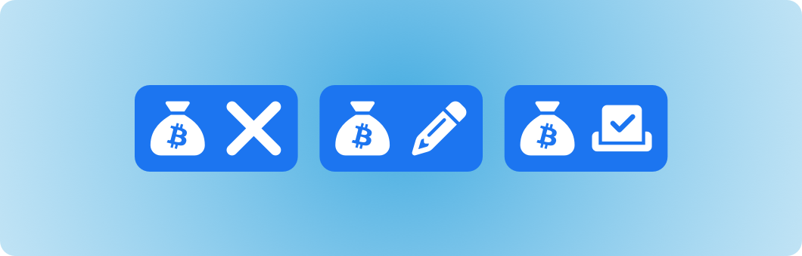

# Proposal submission incentive approaches

<figure><figcaption></figcaption></figure>

A proposal process can use incentives to help encourage the submission of proposals that can help with the different processes involved in treasury disbursement. Proposal submissions could be relevant for any of the knowledge, priorities, ideas or execution process steps. Each of these disbursement processes have a number of differences in the types of proposal information that could be collected, discussed, compared and then voted on.

These incentives only cover how people could be encouraged to participate in a proposal process with their own suggestions. The incentives that help with the execution of proposals are covered separately. Incentives that cover the operation of the disbursement process itself would also be covered elsewhere in some separate treasury operation analysis.

## Proposal incentive concerns

The following are some general concerns worth considering about the influence that incentives could have on a proposal submission process.

**Minimising submission bloat and duplication**

Allocating most of the incentive to the author of a suggested proposal creates a high risk of increasing the duplication of similar submissions. If it is only the author of a submission that gets sufficiently compensated there would be a reduced incentive for further collaboration on existing proposals. Due to this misalignment people may decide to duplicate the most promising submissions in an attempt to get their own version to become the selected proposal that then receives compensation. The complexity that emerges from trying to tackle this problem is determining the value of contributions from other people who provide feedback, discussion and supporting or conflicting evidence about a given proposal.

**Encouraging** **quality over quantity**

The incentives introduced into a proposal process can have a big impact on how people end up contributing. One ongoing concern will be to think about how any suggested incentive structure incentivises quantity or quality. For processes that are trying to scale to many participants the focus will often benefit from leaning towards incentives that promote more quality submissions over a higher quantity of submissions. This is because when you increase the number of people that are participating in a process the cost of having too many submissions becomes even greater as the number of either proposal submissions or participants scale. Adopting an approach that incentivises a high quantity of submissions should be well justified due to this scaling cost. In most cases the incentive approach should preferably help with encouraging higher quality submissions.

**Depth of thought & discussion**

Many Web3 ecosystems are trying to tackle big societal problems that cover important areas such as money, financial services and governance amongst many other areas. Creating effective processes for disbursement will mean making considerations towards how any suggested incentive approaches can help with encouraging more depth of thought and discussion. The better this is achieved the more well informed the wider community can become on the nuances of different topics and potential decisions. Some of the complexity with this area of incentivisation is that each person can contribute vastly different amounts of value and allocate different amounts of time when making their own contributions and sharing their opinions.

**Supporting evidence for submissions**

A lot of effort and time can be needed to create and maintain resources that get used as evidence for supporting why a proposal is important. The incentives introduced to any disbursement processes will need to factor in how they are effective in encouraging the authors of a proposal to provide sufficient evidence to support their submission. This incentive could also extend to encouraging those authors or other contributors to keep the resources and any information up to date so that community members are kept well informed about the ongoing importance of a proposal over time.

## **No incentives**

Not adding an incentive to the proposal submission process means there would be no financial compensation for making proposal submissions. The incentive to encourage submissions is either dealt with elsewhere or relies on other forms of incentives.

**Reasons to adopt this approach**

* **Outcome based incentive** - Suggesting and supporting proposal submissions can be an impactful contribution to an ecosystem. Community members may not expect a financial incentive if they already have other intrinsic incentives that encourage them to contribute towards making positive change. The more complex a submission process is or the more that there is ongoing work involved in maintaining a proposal the more difficult it could become to attract many willing contributors without a sufficient incentive to support those contributions.
* **Simplicity** - Not introducing a direct incentive for submissions can help with simplifying the proposal process. This would mean the process is either relying on execution incentives for people to make the submissions or that other incentives exist. For some proposal processes having no incentive around the submission of proposals could be the simpler and more effective approach.

**Concerns for this approach**

* **Low incentive for complex submissions** - Not introducing any incentives to encourage proposal submissions or for handling the maintenance of existing proposals could lead to a lack of depth in the submissions being made. Proposals could end up lacking enough supporting evidence, critical thinking, research or analysis due to the lack of incentive. Under a no proposal submission incentive approach any incentive for supporting complex submissions would need to be handled elsewhere through other incentives.
* **Low incentive to maintain existing submissions** - No incentive for proposal submissions means community members would not have any direct incentive to maintain and improve existing proposals. This could be a problem if new information or factors become relevant for an existing proposal. An ecosystem can benefit from having the latest information connected to proposals so that they are able to make more informed decisions about the importance of a different proposal submission against alternatives.
* **Risk of under submission** - Having no incentives means the process is reliant on other forms of incentives existing that are effective for encouraging submissions. Execution based incentives would likely be one of the most prominent of these incentives to encourage a sufficient amount of submissions.
* **Contributor influence risks** - Having no incentives for submission means that there is less incentive for unpaid community members to submit their own proposals. If there are existing execution incentives that pay for contributors to support an ecosystem there is a risk that this lack of incentive for submission gives an increasing amount of influence to existing contributors. This would be due to the fact they might have more capacity to participate in a proposal process than other community members because they are already receiving compensation elsewhere.

## Submission incentives

Providing submission incentives means compensation is rewarded at the point of proposal submission. A verification process could also be part of this approach that determines whether a proposal submission meets a certain quality threshold before it gets accepted.

**Reasons to adopt this approach**

* **Incentivises a diversity of submissions** - Incentives at the point of submission could help with encouraging many members of a community to make a range of different proposals for that process. This could be effective for discovering the wide range of ideas and opinions that exist in the community.

**Concerns for this approach**

* **Risk of over submission** - There is a high risk that this incentive leads to encouraging contributors to suggest many variations of similar proposals as they would be compensated for doing so. This type of incentive could easily be abused as it could lead to low effort submissions that are suggested regardless of whether the contributor actually thought the proposal was important or not. Adopting a process for removing duplicated entries and ensuring quality thresholds are met could help to resolve this but could mean introducing an expensive moderation process.
* **Risk of duplication** - If the incentive is attached to submission there is a higher risk that people end up submitting variations of similar proposals instead of trying to improve existing ones. This could mean many existing proposals get duplicated with slight variation instead of those same contributors helping to improve existing proposals.

## Selection incentives

Incentives at the point of proposal selection means that compensation for making a proposal submission would only occur if that proposal is selected through voting. The voting process itself could operate in many forms such as confidence voting, preference rankings, yes / no outcomes or using numerous other potential voting approaches.

**Reasons to adopt this approach**

* **Aligned incentive for creating quality submissions** - If the only way to be compensated for a submission is through the proposal being selected by the voters there is a higher alignment for contributors to create quality proposals that are important and that would have higher chance of being selected.
* **Aligned incentive to handle complex submissions** - Spreading the available incentive amongst the winning proposals means there could be more of an incentive available to help ensure the complexities involved in a proposal are sufficiently covered with any supporting evidence.
* **Opportunity to help incentivise wider contribution** - Some proposals will be suggesting things that require a certain amount of contribution effort. The authors that submit a proposal do not have to be the same people that execute the proposal. This can be beneficial for increasing the amount of contribution involved as now the author doesn’t have to be responsible for executing the proposal. Instead they may only have the capacity and willingness to make good suggestions that they think are important. This is a lower threshold of required contribution which could help with increasing the amount of contribution across a community due to this separation of proposal incentives and execution incentives.

**Concerns for this approach**

* **Risk of over submission** - If there is an incentive rewarded at the point of selection there is still a risk of over submission of proposals as it might not take much effort to submit a proposal. The larger the incentive the higher the risk that this occurs. Some contributors may decide to make a wide range of proposal submissions to increase their chances of their proposals getting selected and then receiving some compensation.
* **Risk of duplication** - An incentive provided at the point of proposal selection instead of submission will still mean there is a risk that people suggest variations of similar proposals instead of making contributions towards improving existing ones. This could easily lead to higher levels of duplication where many variants of similar proposals get submitted.
