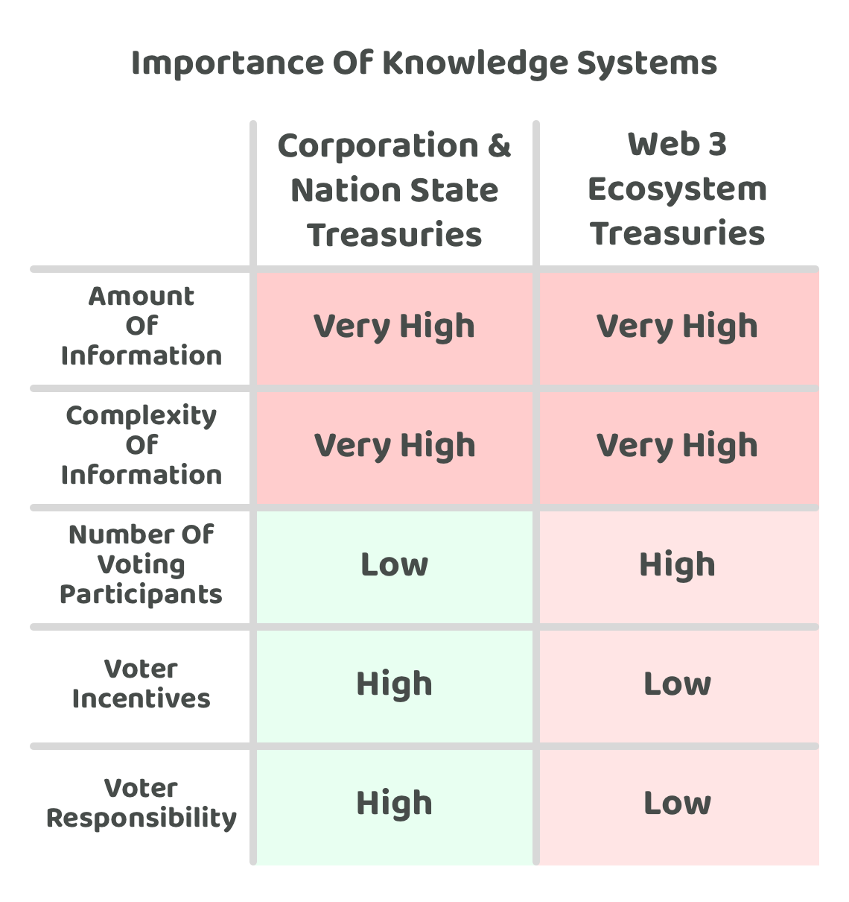

# Adoption of knowledge systems

<figure><figcaption></figcaption></figure>

Knowledge systems can help with the gathering, verification and presenting of important information relevant to an ecosystem and its governance decisions. There are number of reasons that are covered below that help to suggest why the adoption of knowledge systems might be inevitable for Web 3 ecosystems to more effectively scale and decentralise their governance processes.

## Similarities & d**ifferences between existing systems and Web 3 ecosystems**

**Similarities**

* **Complexity of information** - Nation states, corporations and Web 3 ecosystems all have complex information that is relevant for improving their ability to make good disbursement decisions. Examples areas could include internal operating data, industry and economic data and consumer trends data amongst other areas.
* **Amount of information** - Nation states, corporations and Web 3 ecosystems all have a vast amount of information that is relevant and that can be useful to consider when trying to make informed disbursement decisions. This is covered already in [disbursement process information](../disbursement-process/disbursement-operating-process/disbursement-process-information.md).

**Differences**

* **Number of participants** - The number of decision makers involved in disbursement decisions for nation states and corporations can often be limited to the leadership roles involved in either types of these organisations. Some organisations may decide to include a larger number of employees for some or all of their decision making. This level of participation can often be lower than a number of emerging Web 3 ecosystems that are looking to increase community participation in disbursement decisions. Increasing the number of people involved helps to make a more democratic and inclusive system however this comes at the cost of the total time it takes for each of those participants to become well informed and then vote on important disbursement decisions.
* **Decision making process** - Internal decisions within nation states and corporations could be potentially achieved in a shorter time period due to the smaller number of voting participants and if they aren’t under the same scrutiny as publicly facing systems and processes. Many Web 3 ecosystems make their systems and processes fully public with decisions going through a certain amount of community review. Voting on these decisions can also often be different where Web 3 ecosystems often choose to cast their votes on-chain using a distributed ledger. This approach is useful for creating a transparent process using an immutable, verifiable and auditable result however this also means that a secure and scalable ledger is required that can handle the network load and attacks from malicious actors as well as provide a sufficient amount of time for the community to engage in the process before voting.
* **Voters involved** - Decisions in nation states and corporations can often be influenced by leadership roles that exist in the organisation. This could be founders or the board of directors in corporations or elected officials and employees in leadership roles in nation states. For many Web 3 ecosystems there is often a longer term goal of distributing more decision making across the wider community. The voters involved in Web 3 ecosystems will often be community members that are involved and participating in the network. For foundations the voters involved are often the members of the foundation who help to operate the ecosystems community treasury.
* **Voter responsibility** - For nation states and corporations the decision makers involved often have a high level of responsibility to make good decisions for their organisations - they are usually fully compensated to do so. These decision makers are responsible to the shareholders in corporations and to the public in nation states. In Web 3 ecosystems voters often do not have any contractual or even social agreement with the network that they have any responsibility to vote in a way that is in best interests of the wider community. Voters will usually represent their own interests and preferences in their decisions, and would not be personally responsible for any negative outcomes that arise due to their voting choices. Higher amounts of voter responsibility is a potentially effective way for the voters involved to put more time and consideration into ensuring they are making optimal and well informed decisions.
* **Voter incentives** - The leadership involved in making decisions across nation state and corporation treasuries will do so often in a fully compensated position for a full time position. This helps give them more capacity with aligned incentives to effectively contribute towards making well informed decisions. In Web 3 ecosystems there sometimes can be an incentive for voters to participate in these governance decisions, however it is rare for this equate to compensation representative or even near a full time salary. This difference in incentive is important as it influences how much time and willingness many people will have to participate in complex and time consuming governance decisions. This difference in incentives emphasises the importance of developing simple and efficient governance process to help make it easier for people to participate in important ecosystem decisions.

**Importance of knowledge systems**

<figure><figcaption></figcaption></figure>

Nation states, corporations and growing Web 3 ecosystems all have a similar problem of having a large amount of complex information which is relevant and useful for making important treasury disbursement decisions. Nation states and corporations often have a smaller amount of voting participants which are selected through the different leadership roles that exist. Each of these participants have a large incentive and higher levels of responsibility to make well informed decisions. The growing problem for Web 3 ecosystems is that they are often trying to grow the amount of voter participation but then also have smaller incentives and where voters also have lower levels of responsibility when making important disbursement decisions. This is a significant issue for these growing Web 3 ecosystems as the amount and complexity of the information required to effectively make well informed decisions is already high, and this complexity will likely continue to increase over time.

If voters are not well informed when making important disbursement decisions this can easily lead to suboptimal decision making. Emerging Web 3 ecosystems may end up making worse decisions than a more centralised approach due to this. This problem could be reduced through the usage of knowledge systems that provide voters easier access to insightful and relevant information.

Knowledge systems would not prevent the need or benefit from adopting other approaches such as delegated voting to other community members which can help with scaling decentralised governance. However knowledge systems do represent one contributing solution for addressing the growing problem around the scale and complexity of the information involved in making well informed disbursement decisions. Knowledge systems would help to aggregate and present the relevant information about an ecosystem to its community members. The more easy it is for important information to be located and understood by voters the easier it will be for community members to properly participate in important decisions. Quality knowledge systems could become an important tool for making it easier to participate in governance decisions. An outcome which could help with further decentralising these emerging networks and their governance processes.

## Knowledge systems

The adoption and usage of knowledge systems presents an opportunity to create solutions that help to tackle the emerging challenge of handling complex information that is relevant to decision making. For an ecosystems decision making to truly scale to a wider audience it will be important for voters to be able to access and easily digest important information to make well informed governance decisions.

**Creating knowledge systems**

A high level process for introducing knowledge systems into a treasuries disbursement process could be achieved through the following:

1. Identify the most relevant areas of information that an ecosystem may benefit from knowing about when making disbursement decisions.
2. Group this information together based on what sources it comes from. An example grouping could be on-chain data, this would then include any information that can be retrieved directly from public ledgers and blockchains.
3. Create systems and processes that help to collect and verify these different sources of information. These systems will ideally be open sourced and publicly verifiable to improve the trust that end users have in the information being gathered and presented.
4. Identify ways to present this data in a way that provides more insights and utility to the end user. For instance seeing the amount of wallets created and used in a graph format or the daily amount of transactions with a breakdown of how the ledger is actually being used.
5. Create a list of these knowledge systems that exist under a single source and provide this resource to voters so they can learn about the different areas of information relevant to the ecosystem.

**Advantages of adopting knowledge systems**

* **Verifiable information** - Providing that these knowledge systems are open source, easy to access and verifiable the members of an ecosystem will be able to more easily verify that the information coming out of these systems is correct and trustworthy. Factual areas of information like on-chain data or statistics can all have their sources made public and verifiable. Making it easier for voters to determine what information is fact and opinion means voters will have an enhanced ability to decide which pieces of information they believe are the most important and useful when making any future decisions.
* **Voters become more well informed** - Comprehensive knowledge systems that cover the different areas in an ecosystem will help voters become more well informed about what is happening inside and outside the ecosystem and more generally for different topic areas. This increased depth of knowledge can help improve a voters decision making ability.
* **Reduce time required for voters** - The better that information is structured and presented the less time it should take for voters to become well informed on different topic areas. Achieving this outcome can help with making governance processes more scalable as more voters will be able to quickly learn about the relevant information and then participate in governance decisions.
* **Reduce information complexity** - The quantity and depth of information relevant to these growing Web 3 ecosystems is vast, often meaning it can be difficult to understand enough of the information available to be well informed. Knowledge systems could help with how information is presented and structured to pull out the most important facts and insights. Achieving this will make it more simple for people to understand and apply the most useful information.
* **Scalable solution to inform voters** - Creating systems and processes to better aggregate and present information relevant about an ecosystem is a more scalable solution than voters trying to each do this work themselves independently.
* **Increased transparency & awareness** - Information that may have otherwise been difficult to find or locate could now be made more publicly available through the usage of knowledge systems that help to aggregate and present a diversity of relevant information. This transparency and awareness of the available information can help with an increase of trust in the ecosystem and help increase the ability of community members to respond to new and important information.
* **Decreases the time for new information to propagate** - Many knowledge systems could have live data being fed into them which could then be immediately consumed and used by a community. A blockchain explorer that lists all the recent transactions is a good example of this type of real time information. The more that these services are made available and easy to use the faster a community will be able to receive and respond to new information.
* **Automation opportunities** - A knowledge system could be useful for any other system that wants to rely on factual data sources for it’s own functionality. Smart contracts could be one example where certain rule sets could be involved that enable to disable certain future transactions based on the values that come out of these different data sources.
* **Integration opportunities** - Knowledge systems could be integrated into a range of different systems and processes. For instance, solutions building with AI technology could integrate the information provided by knowledge systems to then analyse or combine that information with other relevant information to generate an improved understanding or insight.

**Concerns when adopting knowledge systems**

* **Ongoing attack vector** - There would be an ongoing risk that malicious actors try to maliciously influence different knowledge systems to achieve personal gain or to compromise a system and its governance processes. These actors could try to insert biased or incorrect information into these systems in a multitude of ways. These systems will need to have an ongoing process that helps to review how these systems are changing over time and where attack vectors may have been introduced or where they already exist.
* **Dependency risks** - The more that knowledge systems emerge which are effective at gathering and presenting information the more there is a risk that governance processes become over reliant and dependent on these systems. Having alternative options will be one approach to help address this risk. Adopting a mission critical mindset in designing how these systems and processes are deployed and maintained will be another approach to try and reduce this risk further.
* **Centralisation risks** - Not all information gathered will come from informational systems, meaning not all information can be easily verified and audited. A lot of information relevant to ecosystems can come from analytical sources and be generated through the application of trying to better understand the existing information available. This creates an ongoing risk where a centralised group of actors could become the main contributors towards thought leadership and analysis. The larger their influence becomes the more problematic this could be if their influence was used to mislead people or used solely for personal gain.
* **Incorrect information** - The larger and more important that knowledge systems become in gathering and presenting information for supporting governance decisions the more important it will be that the information is verifiably correct and the sources well known. How these systems are updated, what processes are used to change information and how sources can be verified will be an ongoing concern to ensure the correctness and relevance of information being presented. Incorrect information can easily lead to poor governance decisions from the people who might be relying on these systems.
