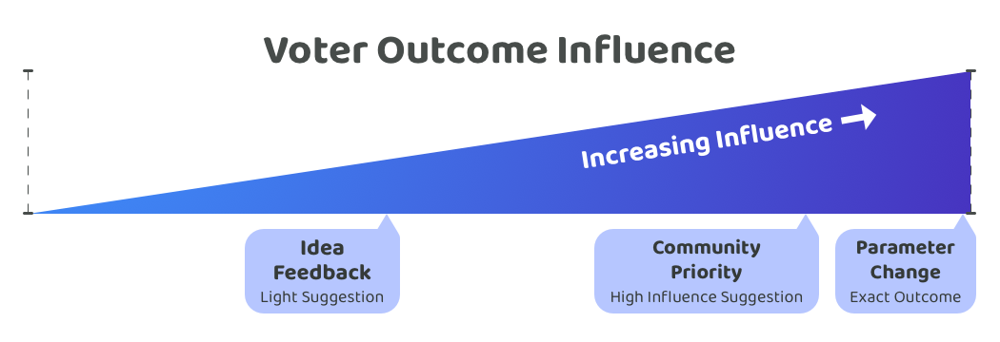

# Voter outcome influence

Voter outcome influence means determining what amount of influence should the voters have on the outcome of something. This could influence over the voting outcome or influence in changing how something is being approached through sharing feedback and preferences.

The influence that voters have on any specific outcome could sit anywhere along a range of low influence to high influence depending on how the disbursement systems and processes have been designed.

The more influence that the voter is given over the outcomes of planning, decisions and execution the more responsibility they are being given to make optimal decisions by keeping themselves well informed. A disbursement process can provide different levels of influence to voters for different processes and use cases.

Voter influence could range from being a light suggestion that is meant to be listened to and interpreted but isn’t enforced towards a more high influence situation where an exact outcome achieved after a decision is made.

<figure><figcaption></figcaption></figure>

Some potential examples of different levels of influence a voter could have over different outcomes:

* **Light suggestion** - The voters are not expecting a specific response or outcome. A voter who is leaving feedback on a submitted idea could be an example situation where a specific response or outcome is not expected and the feedback is merely trying to be informative and helpful.
* **High influence suggestion** - The voters are expecting an aligned response based off the voting outcomes. A priority being selected by the community would be an example where the voters would expect the contributors who are being compensated in the ecosystem to respond to this outcome and align their contribution efforts with addressing those priorities.
* **Exact outcome** - The voters are expecting an exact outcome. A system level parameter change would be a vote where an exact outcome is expected.

The more influence the voter is given on the outcome the more responsibility they are being given to determine what disbursement submissions could help create the most impactful outcomes for the ecosystem. Voters will only have so much capacity and willingness to participate in voting. One key comparison that could be made with this in mind is which processes are of the highest importance that the voter has the highest level of influence over the outcomes and where is this less essential for the disbursement process. Achieving this will make a more scalable disbursement process as voters limited time and capacity needs to be focussed on the highest impact areas that voters both can and want to influence.

AI will become an increasingly important factor that could change how both voters and contributors participate in governance decisions. Voters or contributors may decide to delegate some or all of their voting responsibilities to an AI when tasked with certain decisions. Voters could still personally each have the same influence over the outcome of these different decisions however the approach they use to arrive at that decision could change drastically over time.

## Priorities outcome influence

**Influence importance**

High. When voters express themselves and help to suggest and select the most important problems and opportunities that exist in the ecosystem they will be expecting that the priorities that are most well supported will get addressed over time. The question then is should the outcome be a high influence suggestion or an exact outcome? Priorities being high influence suggestions instead of an exact outcome make sense for a number of reasons:

* **Prioritisation inaccuracies** - Priorities set by the community might not be accurate in understanding the underlying reasons why a certain desired outcome might have a different root cause. People who have higher levels of experience and expertise should be able to interpret and analyse these priorities to better determine what other areas of focus might address these priorities more effectively.
* **Highly restrictive** - If an exact outcome approach was used it would mean contributors would only be able to contribute to things that have been approved by the entire community. This can easily lead to situations where innovation is stifled. Novel but less well known areas of impactful contribution could be forgotten and prevented by this approach. Relying fully on the voters removes the agency and autonomy of a skilled and experienced contributor from being able to use there best judgement to identify how they can best generate high impact.
* **Execution uncertainty** - There is no absolute certainty that any priority set by the community is feasible. Some of those priorities may also take a longer time to be addressed if they are of higher complexity or contribution effort required.

**High importance environments**

If the incentives from disbursement are attached to the priorities being selected then the outcome of those decisions become of very high importance and mean a more exact outcome is needed. If the incentive is attached to ideas or contributors then the importance of voter influence could become a high influence suggestion as suggested above.

## Ideas outcome influence

**Influence importance**

Low. Voters highly benefit from being able to express their preferences and opinions about what ideas they believe are most promising. However the actual selection of ideas does not have to be determined by voters. Instead it could be decided by the contributors who are selected to help with execution. Some separate analysis has been added to compare the factors for utilising either contributors or voters for idea selection:


[contributor-vs-voter-idea-selection.md](contributor-vs-voter-idea-selection.md)


**High importance environments**

If the incentives available in disbursement are attached to the priorities or ideas being selected then the outcome of those decisions become of very high importance and mean a more exact outcome is needed. If the incentive is attached to contributors then the importance of voter influence could be low as highlighted above and a light suggestion approach could be adopted.

## Contributors outcome influence

**Influence importance**

Very high. The contributors can’t select themselves! The community itself will need to be responsible for selecting the most potentially impactful contributors that can be compensated to work in the ecosystem. An exact outcome is needed to determine who will and will not receive compensation from the treasury to execute different ideas.

**High importance environments**

The selection of contributors is always of high importance as if the incentives are attached to priorities or ideas the incentive still mostly ends up being distributed to the contributors that execute those proposals. Voters will select contributors during disbursement whether or not the ideas or priorities are attached to that same decision. Contributors receive the bulk of the disbursement incentives to help with generating impactful outcomes. It is always of high importance that the voters can directly influence how those incentives as disbursed.
