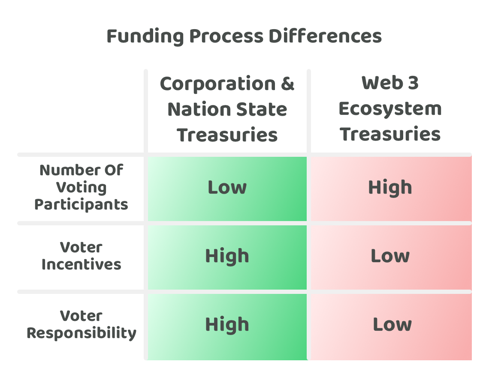

# Funding process differences

<figure><figcaption></figcaption></figure>

There are a number of similarities and differences between corporation and nation state funding processes with Web3 ecosystem funding processes. Some of the key differences that have an impact on the whole process is that Web3 funding processes will often have a higher number of voting participants, a lower amount of incentives to reward voters and a lower amount of voter responsibility.

Many Web3 ecosystems still have the founding entities, often in the form of a foundation, that help with managing an ecosystem's treasury. These foundations are often able to make unilateral decisions about what should be prioritised in the ecosystem when deciding how to disburse treasury assets. This has the obvious issue that it is more centralised in decision making and not necessarily representative of what the communities preferences currently are. Although this structure may have been an easier and quicker starting point for many Web3 ecosystems to start with, it is often not a preferred long term solution. Much of the appeal of the cryptocurrency movement is the idea that centralised actors with too much influence and power can be removed through the adoption of blockchain and distributed ledger technology. To fully remove middlemen and centralised actors it will be important for Web3 ecosystems to develop treasury systems and processes that help with migrating the voting power and influence over treasury funding towards the entire community.

\

**Number of participants**

Decisions in nation states and corporations can often be influenced and limited by leadership roles that exist in the organisation. This could be founders or the board of directors in corporations or elected officials and employees in leadership roles in nation states. Some organisations may decide to include a larger number of employees for some or all of their decision making. The amount of governance participation can often be lower in corporations and nation states than some of the emerging Web3 ecosystems due to the fact most Web3 ecosystems are actively looking to increase community participation across the funding decisions over the long term. Increasing the number of people involved in funding decisions can help with making a more inclusive and representative process however this comes at the cost of the total time it takes for an ecosystem to become well informed when making funding decisions. Increasing the number of participants for making decisions also means that a sufficient amount of time will need to be provided to these voters so they have enough time to vote on any decisions. In contrast when the number of voting participants is small these decisions could occur more quickly such as in face to face meetings.

**Voter responsibility**

For nation states and corporations the decision makers involved often have a high level of responsibility to make optimal decisions for their organisations - these stakeholders are usually fully compensated to do so. These decision makers are responsible to the shareholders in corporations and to the public in nation states. In Web3 ecosystems voters often do not have any contractual or even social agreement with the network that they have any responsibility to vote in a way that is in the best interests of the wider community. Voters will usually represent their own interests and preferences when making their own decisions, and would not be personally held accountable for any negative outcomes that arise due to their voting choices. Trying to increase the amount of voter responsibility in Web3 ecosystems could be a potentially effective way for encouraging voters to put more time and consideration into ensuring they are making optimal and well informed decisions.

**Voter incentives**

The leadership involved in making decisions across nation state and corporation treasuries will do so often in a fully compensated position and work full time for the organisation. This helps give them more capacity to make well informed decisions and better aligns the incentives with making optimal decisions. Some Web3 ecosystems might offer an incentive for voters to participate in the funding decisions, however it is rare for this compensation to equate to anything that representative or even near a full time salary equivalent. This difference in incentive is important as it can influence how much time people are willing to use for participating in complex and time consuming governance decisions. This difference in incentives emphasises the importance of developing simple and efficient governance processes that help to make it easier for people to participate in important ecosystem decisions.

## Considerations for Web3 funding processes

The number of community members involved in Web3 ecosystems could eventually represent numbers that match and exceed existing nation state populations. This factor poses a growing problem for Web3 ecosystems in determining how its treasury funding processes will be able to handle this growing scale of voter participation. The complexity involved in handling this scale is increased due to lower incentives and the low responsibility that voters have to make well informed decisions. Taking these factors into account some considerations can be made about what potential factors will be most important for creating effective Web3 funding processes that can effectively scale and generate consistent impact.

**Simple governance decisions**

For Web3 treasury funding to scale and handle a growing number of voting participants it will need to be extremely selective on what governance decisions it requests the community to have responsibility over. It will be difficult to expect a large population of voters to spend a meaningful amount of their spare time on becoming well informed about many complex governance decisions if they are not properly compensated for that effort. Treasury funding processes will need to determine exactly what decisions and areas are essential for voters to allocate their time towards and what decisions and areas are less important. The less important decisions and areas will be the suitable candidates to become delegated responsibilities that other people in those ecosystems could handle. Streamlining and simplifying treasury funding governance will be an area of paramount importance if Web3 ecosystems want to scale their treasury systems to handle millions of users.

**Automated systems & processes**

A number of systems and processes will be needed to operate a Web3 treasury at scale. These systems and processes could see an increasing amount of information complexity and participation that they need to handle. Contribution efforts will be needed to automate these systems wherever possible to reduce the time it takes to participate in funding and to reduce the complexity so that a larger number of community members can feasibly participate. One area that will likely grow in relevance is the application of AI to support ecosystems in their decision making ability and handling large volumes of information.

**Delegated responsibilities**

Large communities will often need to accept the fact that every community member does not have to or need to participate in every possible voting decision there is within the community. Web3 ecosystems will want to determine how a voter is able to delegate responsibility and voting power to other individuals or groups of individuals when they feel this is appropriate. An important outcome that Web3 ecosystems may want to achieve is that community members are given the ability to express their exact preferences and opinions in any of the funding decisions and that they can easily participate in the exact areas that interest them or that they have expertise in.

**Increasing voter commitment**

An emerging issue for Web3 ecosystems is how easily it is for community members to financially leave one ecosystem and join another by simply selling and buying two different assets. This is a risk for treasury funding as voters could be deciding where large sums of incentives are being directed. Voters that are able to vote on these outcomes but then can immediately sell their assets creates an attack vector that the ecosystem will need to consider. Web3 ecosystems will need to consider solutions such as lock-up periods or other mechanisms that help to minimise or prevent the risks around malicious actors with low commitment to the ecosystem trying to waste or misuse an ecosystem's treasury assets that get released through funding.

**Reducing attack vectors**

Web3 treasuries could eventually be disbursing vast amounts of incentives to help with improving and operating the network at scale. Bad actors will look for ways to exploit the incentives that are being offered. For Web3 ecosystems that want to grow and handle a large scale of participants and incentives. Treasury systems will need to be self correcting where possible to prevent bad actors from repeatedly exploiting the funding process. Incentives will need to be highly aligned so that it makes more sense for actors to act in a rational and positive way rather than to try and game the system. Technology such as self sovereign identity (SSI) and reputation systems will become an increasing part of the solution for identifying and preventing bad actors from abusing the funding process.
