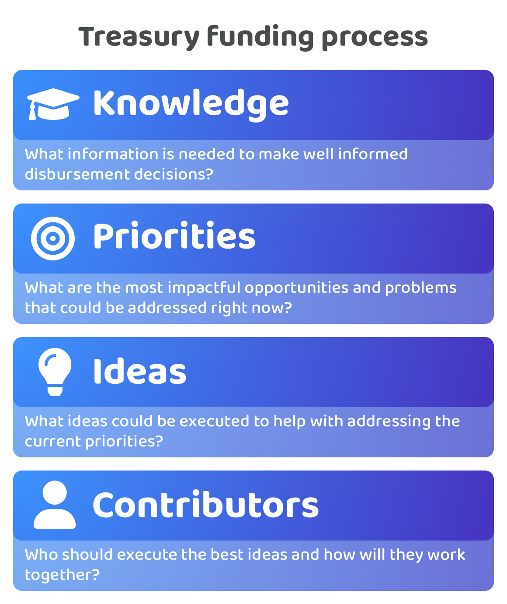

# Funding process

<figure><figcaption></figcaption></figure>

The [general purpose operating process](https://app.gitbook.com/s/qIN4B3DGHPqKOl7e6VuV/web3-treasuries/operating-process) can be applied more directly to the treasury funding process. Applying this process can help with thinking about how each of the processes involved in funding could be improved over time and how funding and each of its processes can play an important role in helping an ecosystem achieve its priorities and generate impact for the ecosystem.

Each of the funding processes are covered in more detail in the following documentation:


[adoption-of-knowledge-systems.md](../../knowledge/adoption-of-knowledge-systems.md)



[independent-priority-process.md](../../priorities/independent-priority-process.md)



[idea-process.md](../../ideas/idea-process.md)



[independent-contributor-process.md](../../contributors/independent-contributor-process.md)


## **Funding process comparisons**

Each of the funding processes can be compared with each other to better understand the amount of information that is involved, theirs rate of change, how important each one is for funding, how responsibilities could be delegated in each of the processes and the overall complexity of each process:&#x20;


[process-information.md](process-information.md)



[process-rate-of-change.md](process-rate-of-change.md)



[process-rankings-of-importance.md](process-rankings-of-importance.md)



[delegating-process-decisions.md](delegating-process-decisions.md)



[process-complexity.md](process-complexity.md)

