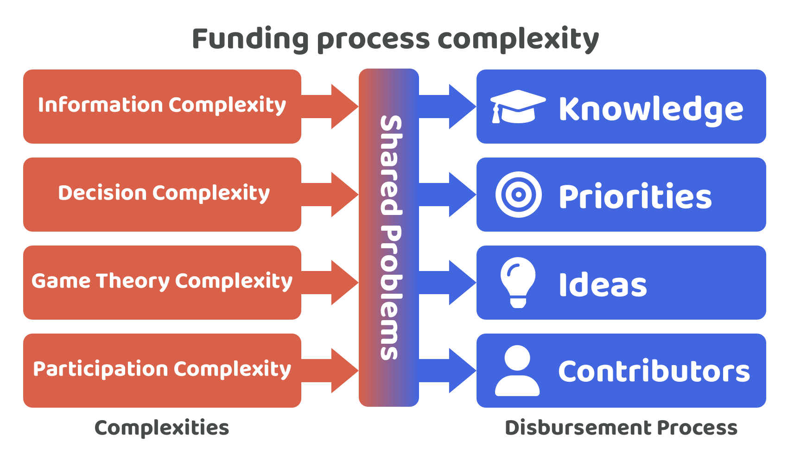

# Process complexity

Disbursing treasury assets to create impactful outcomes is a complex task that has a number of processes and factors to consider at each stage of the process. The pace in which Web3 ecosystems change, such as how they operate or what applications and services are available, only increases the complexity of treasury funding further due to the fact that each process will need to be able to respond and react to these constantly changing environments.

<figure><figcaption></figcaption></figure>

Each of the knowledge, priority, idea and execution steps involved in the funding process share a number of complexities that make it more difficult to allocate treasury assets and scale the process:

* **Information complexity** - Each part of the process highly benefits from participants having a strong grasp of the relevant information in the ecosystem to make informed decisions. Learning this information and handling the quantity of information that is available makes for a highly complex process to scale due to the time commitment that would be required by many community members. The more time it takes for community members to participate in a funding process the more you could expect to see voter apathy or disengagement in the process due to the high complexity and time commitment.
* **Decision complexity** - The funding process requires voters to make a number of important decisions around selecting priorities, ideas and contributors which each will influence the resulting impact achieved by the treasury funding process. Each of these process decisions can have multiple options each with different opportunities and tradeoffs. The depth of information required to make well informed decisions only increases this complexity further.
* **Game theory complexity** - When funding is being disbursed to help operate the treasury and fund different initiatives there is usually an incentive to try and game the system for personal gain. This complexity exists for any part of the funding process. Bad actors may try to introduce information that negatively influences the available knowledge in an ecosystem with incorrect, misleading or exaggerated information to support their own narrative. The incentives available can also influence community members to make priorities and ideas that aren’t in the best interest of the ecosystem. They may also try to select contributors that benefit themselves or their own agenda more than it benefits the wider ecosystem. The systems and processes used for treasury funding will need to take into account the incentives that exist in these systems and try to understand and prevent the potential negative outcomes those systems could produce where possible.
* **Participation complexity** - Without enough direct incentives to participate it might be difficult to achieve sufficiently high participation for important ecosystem decisions. The questions that will need to be answered are how much participation is needed to be representative of the communities preferences? What level of participation or delegation from the community is realistic and achievable? What is the total time cost for each individual to participate in each of the funding processes?

<figure><figcaption></figcaption></figure>

**Complexities**

* **Information complexity** - An ecosystem will need to be able to aggregate a vast amount of information and think about its importance when going through the funding process. As an ecosystem grows the amount of available information only continues to grow with it. There is complexity in being able to understand and apply all of this information through the funding process and also difficulty in determining the correctness of every source and how relevant that information is. Another complexity around the scale of the information involved is how to easily present all of this information so that it is easy to understand and digest. Some of this complexity could be reduced through automation such as with software that brings together on-chain data about how an ecosystem is currently being used or for other competing ecosystems.
* **Decision complexity** - Community members who participate in the funding process must determine which information they believe is the most important and relevant for any upcoming decisions. The quality of this information will often become the foundational part of many funding decisions. Deciding which areas of the available knowledge are the most important will take time to determine. Many funding processes might be operating on the fact that most voters will only know a fraction of the potential information required to make informed decisions. The issue with this situation is that it means that voters involved in making funding decisions are doing so based on potentially very limited information.
* **Game theory complexity** - If an ecosystem is using a range of informational sources to help make better funding decisions then there is an incentive for people to try and game that system by creating information sources which are incorrect, exaggerated or misleading. These information sources could benefit themselves in some way or simply be added with malicious intent.
* **Participation complexity** - The sheer amount of information that a community member would need to learn about to be well informed in an ecosystem could take a considerable amount of time. This tie commitment would also be ongoing due to how fast information can change in an ecosystem. The level of commitment required to be well informed is a complex problem to solve. This complexity could easily lead to increases in voter apathy and disengagement. A lack of sufficient understanding is a key reason some community members may choose to delegate their decision making to other people who have presented a sufficiently informed opinion and rationale. Some community members may ultimately lack the capacity or interest to understand and apply all of the available information to make funding decisions.

<figure><figcaption></figcaption></figure>

**Complexities**

* **Information complexity** - Voting community members will need to read and understand a diversity of priorities and any evidence and rationale that supports those priorities. The complexity for priority setting is that voters need to have a sufficient understanding of the available knowledge in the ecosystem about what is currently happening and then also have the complex task of applying that information to think about what problems and opportunities exist.
* **Decision complexity** - The decision complexity for priority setting is determining which of the identified problems and opportunities are the most important for an ecosystem at that given point in time. This means voters need to take into account the current state of the ecosystem, how that priority might be impactful now and what knock on effects it may have compared to selecting other potential priorities.
* **Game theory complexity** - Bad actors are incentivised to make priorities that mislead an ecosystem to areas that are less impactful or towards priorities that are directed towards their own self interest over the interests of the wider community.
* **Participation complexity** - The amount of ecosystem knowledge that community members need to know about to make informed decisions for the priority setting could make it increasingly difficult to get a large amount of participation as an ecosystem scale.

<figure><figcaption></figcaption></figure>

**Complexities**

* **Information complexity** - Articulating an idea with why it is potentially impactful and feasible, how it would work and roughly how long it might take is a time consuming task that can result in a moderate to high amount of information for voters to review. As the number of ideas increase the information complexity will also keep increasing. This amount of information makes it more difficult for voters to have sufficient time to understand all of the ideas being presented to them.
* **Decision complexity** - Assessing ideas that are addressing ecosystem priorities requires a sufficient level of understanding of the implications involved in the idea and whether it is truly feasible or impactful. Voters then need to compare the diversity of ideas presented to them to then make a decision on which ones are the most promising. There are many variables that will influence whether an idea will become impactful or not such as market timing, current technical limitations and any existing user behaviours. All of these areas contribute towards increasing the overall decision complexity of selecting promising ideas.
* **Game theory complexity** - Bad actors that are looking to direct more effort and resources to bad ideas or ones that are not beneficial to the ecosystem could create ideas with this bad intent. Those same bad actors could also try to discredit other ideas to better benefit the chances of their own.
* **Participation complexity** - Understanding, comparing and voting on the most promising ideas would be very time consuming. This complexity could limit the willingness and capability of community members to participate in the process. Voters may want or need to delegate some of this responsibility to others to make it more manageable and feasible to participate.

<figure><figcaption></figcaption></figure>

**Complexities**

* **Information complexity** - The amount of information that gets included about each contributor would add to the overall information complexity that voters would need to be able to handle. Voters need to be able to determine the correctness of the information being presented to them such as whether the education and professional background is correct and relevant to their area of focus. Historical participation in different ecosystems along with any contributions they have made would be other areas that voters will also need to spend time on to be well informed.
* **Decision complexity** - Voters are challenged with looking at the potential contributors willing to help the ecosystem and comparing those contributors with each other to make informed decisions when selecting suitable contributors. Voters need to take into account the current priorities and ideas within the ecosystem and whether any of the potential contributors are well suited.
* **Game theory complexity** - There is an incentive for people to lie about their educational and professional background to gain an advantage in being selected in the process so they can receive compensation for working in the ecosystem. Bad actors may look to discredit other contributors with false accusations or misleading statements.
* **Participation complexity** - Voters will need to spend a sufficient amount of time to compare and consider the implications of selecting different people to contribute towards the ecosystem. Contributors would be committing large amounts of time to actually execute some of the ideas being suggested in the community. Ongoing effort might be needed to verify the claims of contributors to ensure the voting process is not too time consuming for voters. For contributors the incentives involved will need to be reviewed and adjusted to ensure that competent and quality contributors actively want to participate in the ecosystem.

## Approaches for reducing complexity

**Improving system and process design**

The most obvious way that complexity can be reduced for the funding processes is by constantly improving and iterating each of the processes and systems involved. Improving these processes will mean thinking about what data must or could be included, how people will interact with each other during these processes, what decisions are required and what area of governance can be removed, how information can be easily presented to voters and how incentives could be better aligned with creating impactful outcomes. All these areas amongst others will need ongoing reflection and improvement to help make an effective treasury funding process.

**Expert insight & analysis contributions**

Inviting and incentivising experts to contribute towards the different funding processes within an ecosystem can make it easier for other community members to learn about the most important factors and nuances that help them make more well informed decisions. Expert analysis could include reports covering the different problems or opportunities that exist for an ecosystem, reports on what is happening across the industry, or analysis that provides insights and data points around what is actually happening on-chain across different ecosystems. These are just some examples of how experts could effectively apply and analyse the available information in an ecosystem to make useful insights that help make voters more informed when making different decisions.

**Process delegation**

Delegating the responsibility of decision making for some of the funding process is another way that complexity could be reduced. This could be achieved in a few ways. Some people may delegate one or multiple of the priority, idea or contribution selection process steps to another person. Others may delegate all of the process steps to another person, but only do this for a certain focus area such as gaming or finance. These might be areas they don’t fully understand or that they don’t have time to spend on. Delegation could also be a blend between these two different approaches depending on how a community member wants to participate in any of the funding processes.
